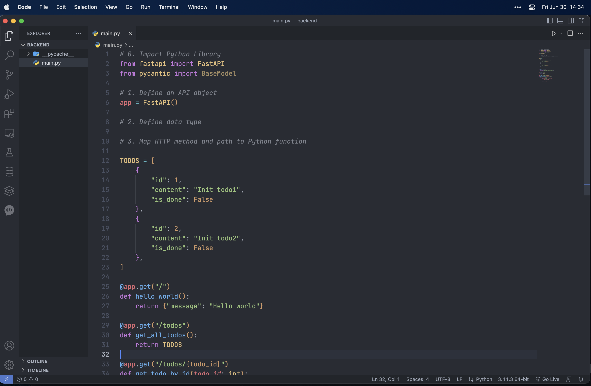
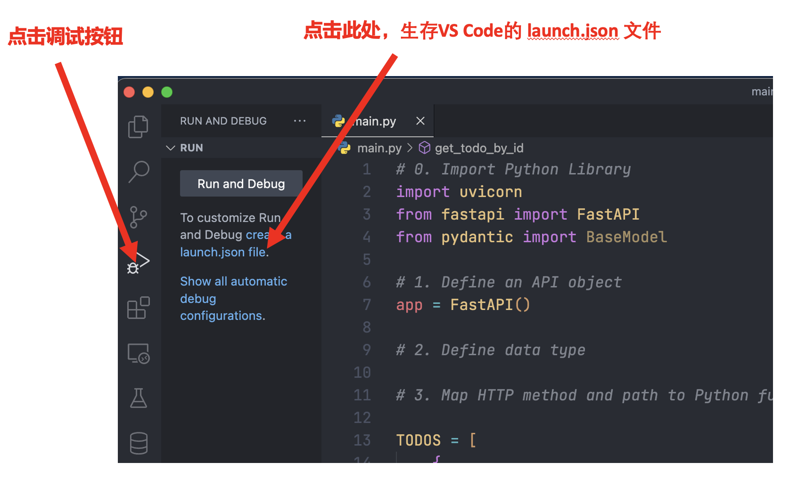
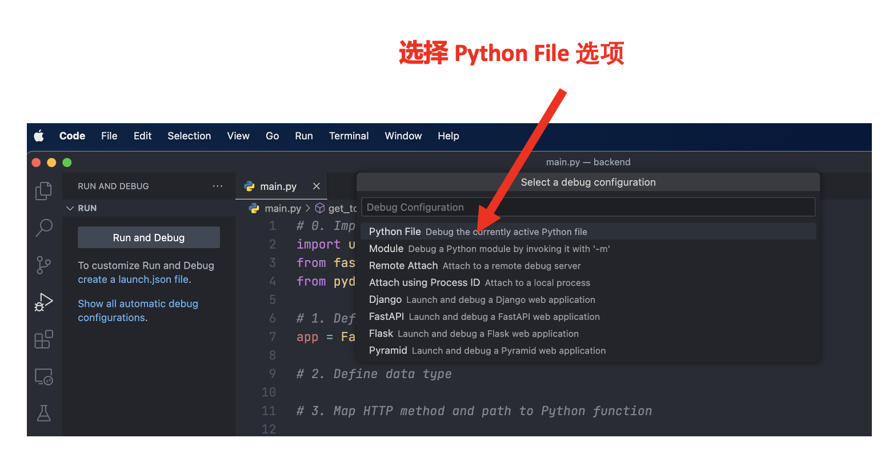
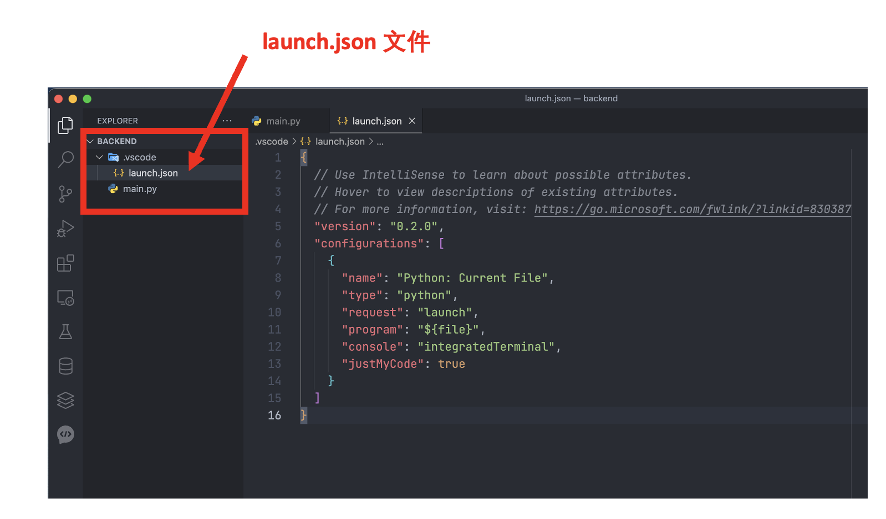
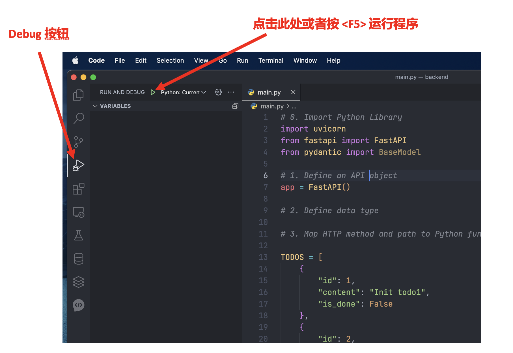
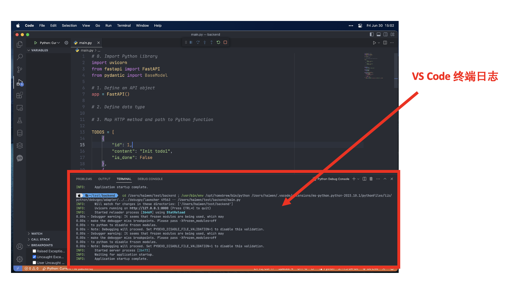
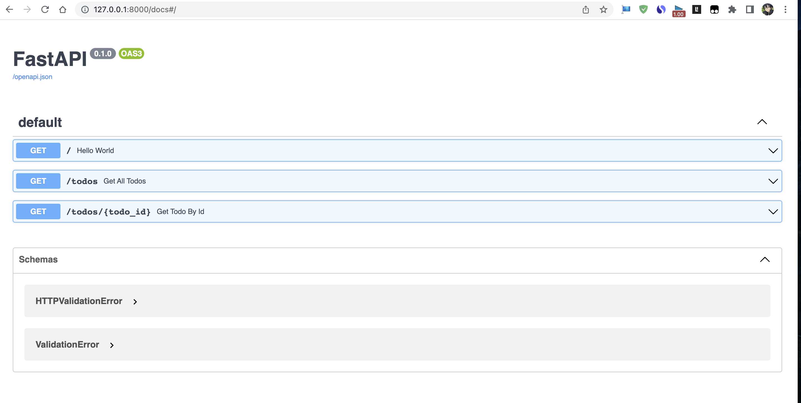
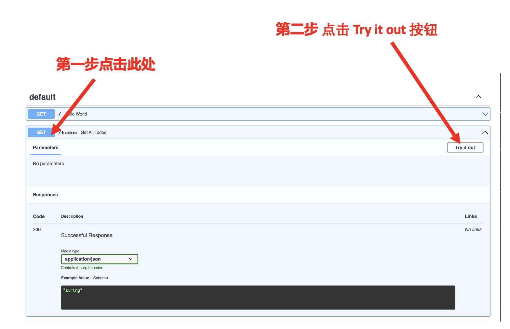
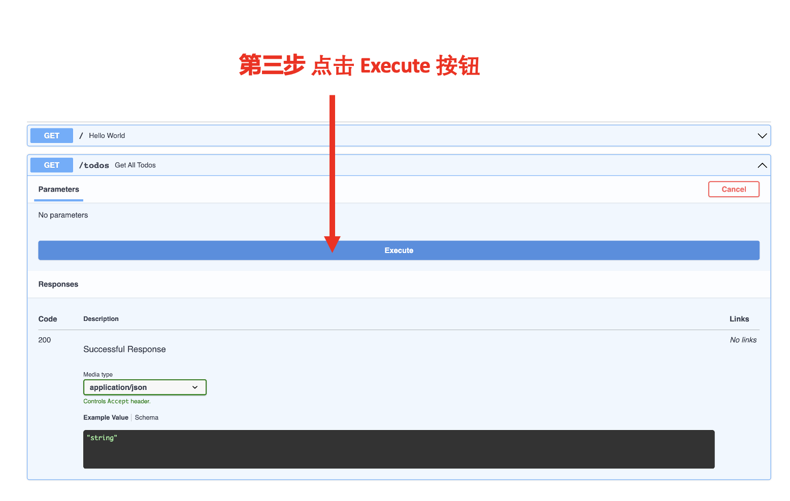
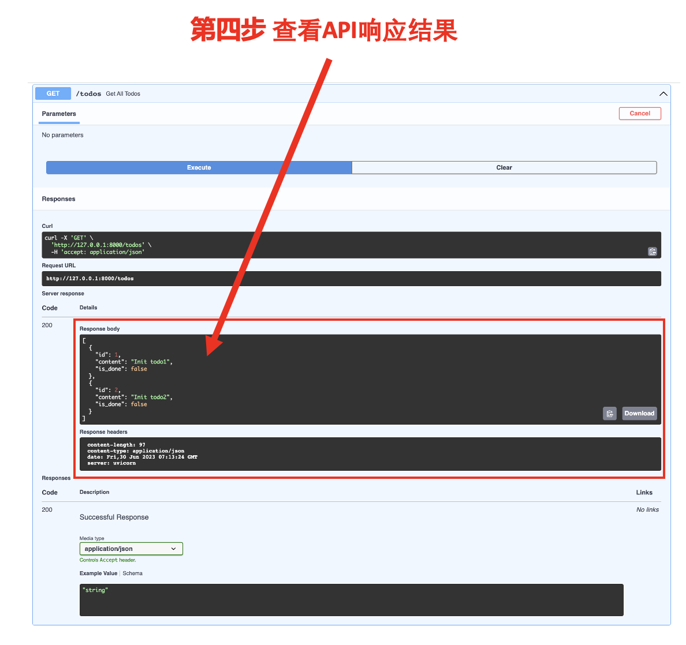

# Web后端：一个简单的FastAPI案例

:::tip

本课程网站内容请仔细阅读后再进行实操。因未仔细阅读内容，出现任何错误后果自负（逃～～～逃～～～逃


**所有的代码请不要复制粘贴，请手敲每一行代码。复制粘贴不会让你动脑子，而手敲每一个行代码会让你自然而然地去动脑子会想每一行代码的含义和原理**

:::

在设置一文中，我们实现了第一个FastAPI的API应用，接下来开始实现一个比前面复杂的FastAPI应用程序。

```python showLineNumbers
# 0. Import Python Library
import uvicorn
from fastapi import FastAPI
from pydantic import BaseModel

# 1. Define an API object
app = FastAPI()

# 2. Define data type

# 3. Map HTTP method and path to Python function

TODOS = [
    {
        "id": 1,
        "content": "Init todo1",
        "is_done": False
    },
    {
        "id": 2,
        "content": "Init todo2",
        "is_done": False
    },
]


@app.get("/")
def hello_world():
    return {"message": "Hello world"}


@app.get("/todos")
def get_all_todos():
    return TODOS


@app.get("/todos/{todo_id}")
def get_todo_by_id(todo_id: int):
    result = None
    for todo in TODOS:
        if todo["id"] == todo_id:
            result = todo

    if result:
        return result

if __name__ == "__main__":
    uvicorn.run("main:app", reload=True, host="127.0.0.1", port=8000)
```

## 用VS Code运行代码

### 主入口函数

首先我们来看这段代码：

```python
if __name__ == "__main__":
    uvicorn.run("main:app", reload=True, host="127.0.0.1", port=8000)
```

:::tip `if __name__ == "__main__"`

在Python中，if __name__ == "__main__"是一种常用的模块检查机制。

在Python中，每个模块都有一个内置的特殊变量__name__。当你直接运行一个Python脚本（例如python script.py）时，这个脚本的__name__变量被设置为"__main__"。

但如果你导入这个脚本作为一个模块（例如import script），那么script模块的__name__变量则会被设置为模块的名字（在这个例子中就是"script"）。

因此，if __name__ == "__main__"这行代码的作用就是检查这个脚本是被直接运行还是被导入作为模块。如果是被直接运行，那么__name__的值就会是"__main__"，这行代码下面的代码块就会被执行。

因此你可以理解为使用 `python script.py` 命令运行 `script.py` 的 Python 代码文件时, `if __name__ == "__main__"` Python 代码的入口，类似于 C 语言中的 `main` 函数。

:::

`uvicorn.run("main:app", reload=True, host="127.0.0.1", port=8000)` 是用于启动一个基于ASGI（异步服务器网关接口）的Web服务器。它使用了uvicorn库，并传入了参数"main:app"，表示主模块是"main.py"且应用对象为"app"。其他函数参数意思如下：

- `reload=True`： 当你的代码发生更改时，Uvicorn将自动重新启动你的FastAPI应用。这在开发阶段非常有用，因为你只需保存更改，服务器就会自动重载你的应用，而不必每次都手动停止并重启服务器。
- `host="127.0.0.1"`：这个选项设置了服务器监听的IP地址。在这个例子中，服务器将只监听来自本地计算机的连接。如果你希望你的应用能够从任何地方访问，你可以将其设置为`0.0.0.0`。
- `port=8000`：这个选项设置了服务器监听的端口号。在这个例子中，服务器将在8000端口监听连接。你可以根据需要将其更改为其他任何有效的端口号。

这些参数允许你自定义如何运行你的FastAPI应用，以适应不同的使用场景和环境。例如，你可能希望在开发环境中启用代码重载，但在生产环境中关闭它。你可能还希望在生产环境中更改监听的IP地址和端口，以适应你的网络配置和安全需求。

:::note

为什么要使用如下代码的原因，是为了后面方便用 VS Code Debug FastAPI 的 Python 代码。

```python
if __name__ == "__main__":
    uvicorn.run("main:app", reload=True, host="127.0.0.1", port=8000)
```

:::

### 新建Web后端工程项目

- 请在磁盘中新建一个名叫 `backend` 的目录（**请保证该目录的完整路径中不要包含中文**， **请保证该目录的完整路径中不要包含中文**， **请保证该目录的完整路径中不要包含中文**）。
- 用 VS Code 打开 `backend` 目录。
- 用 VS Code 新建一个 `main.py` 文件。
- 将上述案例中的完整代码复制到 `main.py` 文件中。

最终结果截图如下：




### 运行代码

- 点击 VS Code 的 Debug 按钮。
- 生成 VS Code 的 launch.json 文件。



- 选择 Python File 的选项。
  


- 于是你就可以在 `backend` 文件夹下面的`.vscode` 目录中看到 `launch.json` 文件。



- 将下列代码覆盖掉 `launch.json` 文件中的内容。

```json
{
  // Use IntelliSense to learn about possible attributes.
  // Hover to view descriptions of existing attributes.
  // For more information, visit: https://go.microsoft.com/fwlink/?linkid=830387
  "version": "0.2.0",
  "configurations": [
    {
      "name": "Python: Current File",
      "type": "python",
      "request": "launch",
      "program": "${workspaceFolder}/main.py",
      "console": "integratedTerminal",
      "justMyCode": true
    }
  ]
}
```
:::note

与 VS Code 默认生成的代码唯一的区别是 `"program": "${workspaceFolder}/main.py"`,具体区别如下：

- TODO
- TODO
:::

- 按 `<F5>` 键或者 Debug 按钮运行代码



- VS Code 的终端中出现如下日志，说明将程序运行起来了。



:::tip

更多关于 VS Code Debug 的资料请查阅如下链接：

* https://code.visualstudio.com/docs/python/debugging

VS Code Debug FastAPI 应用程序的教程请查阅如下链接：

* 

:::

## 测试 API 

当我们的FastAPI程序正确运行的，可以使用浏览器打开如下 URL: `http://127.0.0.1:8000/docs`，便可看到如下页面：



:::note `Swagger UI`

Swagger UI 是一个开源工具，用于可视化和交互式地测试和文档化 RESTful Web API。它通过解析 API 的 Swagger 或 OpenAPI 规范（两者是同一概念的不同版本），生成一个动态的用户界面，显示 API 的终端点、请求参数、响应内容以及其他相关信息。

Swagger UI 利用 Swagger 规范中的信息，将 API 的文档内容以交互式的方式呈现给开发者。它提供了一个易于浏览和测试 API 的界面，包括 API 的终端点列表、每个终端点支持的 HTTP 方法、请求参数和响应示例等等。开发者可以直接在 Swagger UI 中执行 API 请求，并查看请求的结果和响应的内容。

:::

### 测试 get todos API




看到如下结果，说明 `get todos` 这个 API 的代码实现是正确的。

