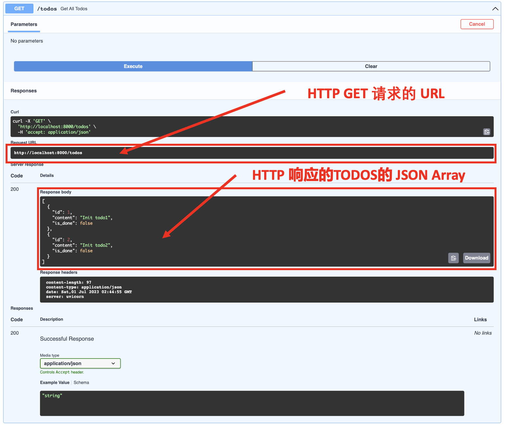
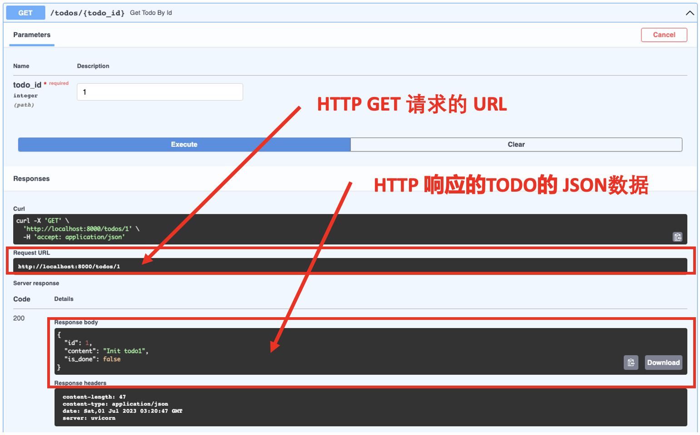
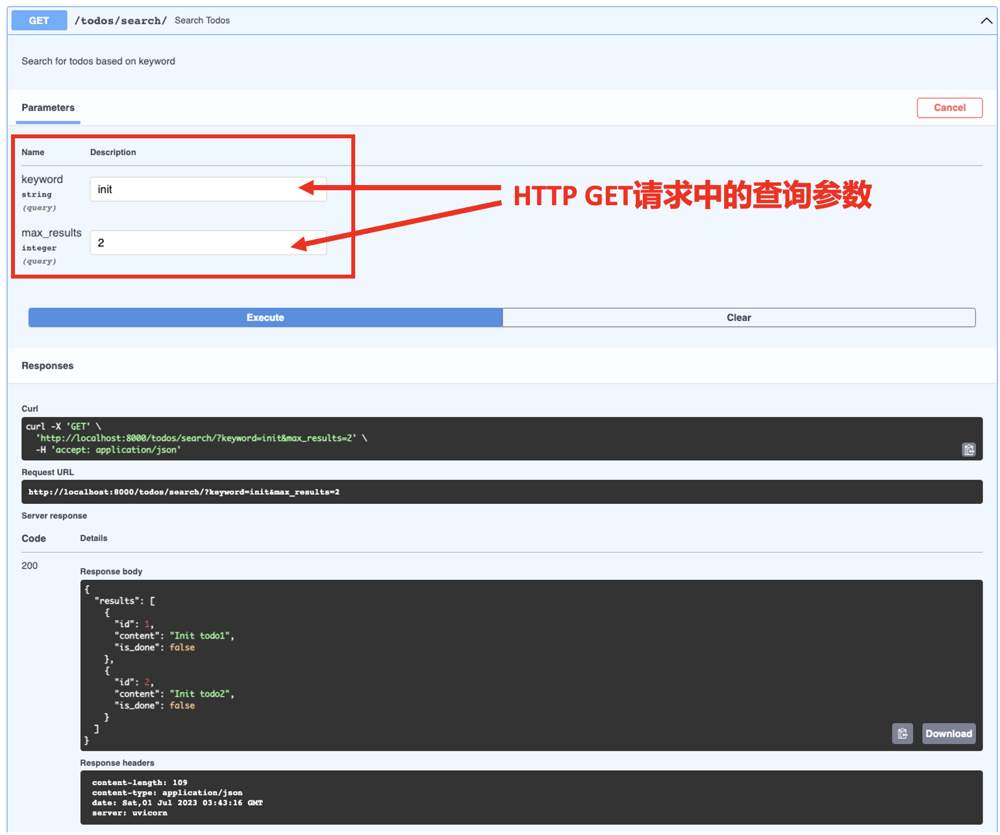

# Web后端：HTTP GET 请求

:::tip

本课程网站内容请仔细阅读后再进行实操。因未仔细阅读内容，出现任何错误后果自负（逃～～～逃～～～逃


**所有的代码请不要复制粘贴，请手敲每一行代码。复制粘贴不会让你动脑子，而手敲每一个行代码会让你自然而然地去动脑子会想每一行代码的含义和原理**
:::

`HTTP GET` 请求是一种用于从服务器获取数据的方法。它是 HTTP 协议中的一种请求方法，用于向服务器请求特定资源的数据。

`GET` 请求的特点如下：

- 数据传输通过 URL 的查询参数进行，以键值对的形式附加在 URL 末尾。
- `GET` 请求通常用于获取数据，而不对服务器端的数据进行修改。
- `GET` 请求是幂等的，即多次重复相同的 `GET` 请求不会对服务器端的数据产生影响，只是获取相同的响应结果。
- `GET` 请求的数据通常会被缓存，以提高性能和效率。
- 当客户端发送 `GET` 请求时，会在请求头中指定请求的目标 URL，以及其他必要的头部信息，如 Host（指定服务器的域名或 IP 地址）、User-Agent（指定客户端的信息）等。

客户端可以在 URL 中使用查询参数，通过键值对的方式传递额外的数据，例如 `?key1=value1&key2=value2`。服务器端可以根据这些查询参数的值来返回相应的数据。`GET` 请求通常用于获取特定资源的信息，例如获取文章列表、获取用户信息等。

## 最简单的 `HTTP GET` 请求

让我们来看一下这段代码：

```python
from fastapi import FastAPI

# skipping...

TODOS = [
    {
        "id": 1,
        "content": "Init todo1",
        "is_done": False
    },
    {
        "id": 2,
        "content": "Init todo2",
        "is_done": False
    },
]

# skipping...

@app.get("/todos")
def get_all_todos():
    return TODOS

```
让我们解释这段代码：

- 我们在一个字典列表的 TODOS 中创建了一些示例的代办清单数据。目前，这些数据很基础和简单，但对于学习来说已经足够。在教程系列的后面，我们将扩展这个数据集并将其存储在一个MySQL的数据库中。（*后续内容将不在解释这段代码*）

- `@app.get` 是 FastAPI 框架中的一个装饰器，用于定义一个 `HTTP GET` 请求的处理器函数。而在上面的例子中，当你发送一个 `GET` 请求到 `/todos` 路径时，FastAPI 将调用 `get_all_todos` 函数，并返回一个包含所有 TODOS 数据序列化后的JSON Array 的响应。

结下来让我们用浏览器打开URL `http://localhost:8000/docs`(**打开 URL 前请确保我们的FastAPI 应用是运行起来的**)，开始做一个实验，看看这个API 返回的数据是不是一组 TODOS 的 JSON Array。(相关操作请参考 [一个简单的FastAPI案例](./demo.md) 中的测试 API 内容)。

如下是 FastAPI 的Swagger UI 中的实验结果：



通过实验结果我们可以知，通过上述代码我们实现了一个 `HTTP GET` 请求的API，该API的 URL 是：`http://localhost:8000/todos`。只要往该API发送 `HTTP GET` 请求， 便可得到一组 TODO 的 JSON Array。

## 一个带有路径参数的URL

有时候我们不想得到所有的 TODOS ，而是只想得到具体某一个 TODO 的所有信息，那么有没有办法在发送 `HTTP GET` 的时候告诉 FastAPI Web 后端应用程序想要哪一个 TODO 。答案是有这样的解决方案，接下来让我们看一下如何在URL里面加入路径参数。

```python
from fastapi import FastAPI

# skipping...

TODOS = [
    {
        "id": 1,
        "content": "Init todo1",
        "is_done": False
    },
    {
        "id": 2,
        "content": "Init todo2",
        "is_done": False
    },
]

# skipping...

@app.get("/todos/{todo_id}")
def get_todo_by_id(todo_id: int):
    result = None
    for todo in TODOS:
        if todo["id"] == todo_id:
            result = todo

    if result:
        return result

```

让我们解释这段代码：

- 我们创建了一个新的 `GET` API, 其路径是：`/todos/{todo_id}`。这里的花括号表示参数值，它需要与端点函数 `get_todo_by_id` 接受的参数之一匹配，也就是说两处地方的名字都得一样，示例代码中就是 `todo_id`。
- 函数定义了API的逻辑。函数参数的类型提示与 URL 路径参数匹配，FastAPI 使用它们来执行自动验证和转换，我们不需要关系URL 路径参数中的 `todo_id` 如何转换成函数 `get_todo_by_id` 中参数 `todo_id`的。当然如果你实在是想知道转化的原理，可以去看 FastAPI 的源代码。（*这就是开源社区的好处，只要是开源的项目，我们都可以通过阅读源代码知道其底层实现的原理，同时我们也可以学习世界上最好的程序员之一是如何写代码的*）
- 我们通过一个简单的for循环和一个 ID 条件检查来模拟从数据库按 ID 获取数据的过程。然后，FastAPI 将数据序列化并以 JSON 格式返回。

浏览器打开：`http://localhost:8000/docs`(**打开 URL 前请确保我们的FastAPI 应用是运行起来的**)

- 通过点击对应的按钮，展开 `GET /todos/{todo_id}` API；
  
- 点击 `Try it Out` 按钮;
- 在 `todo_id` 里输入值: 1;
- 点击大大的 `Execute` 按钮；
- 点击小的 `Execute` 按钮可以重复实验；



可以看到我们的 `GET` 请求的 URL 变成了 `http://localhost:8000/todos/1`，你可以做一个实验把输入的值变成 `2`, 这样 URL 会变成 `http://localhost:8000/todos/2`。 完美！！！通过这样的方式我们就可以把我们想要的具体某一个 TODO 通过URL中传入它的 ID 方法实现。 (**此处采用传入ID的方式，是因为一般我们会让每个TODO的ID是全局唯一，不会出现两个TODO的ID是一样的**)

## URL中包含查询参数

除了上述我们想获取一个具体TODO的详细信息的需求，我们可能还会搜索包含某一个关键字的Todo。这该如何实现呢，请看如下代码。

```python showLineNumbers
# 0. Import Python Library
import uvicorn
from fastapi import FastAPI
from pydantic import BaseModel

from typing import Optional

# 1. Define an API object
app = FastAPI()

# 2. Define data type

# 3. Map HTTP method and path to Python function

TODOS = [
    {
        "id": 1,
        "content": "Init todo1",
        "is_done": False
    },
    {
        "id": 2,
        "content": "Init todo2",
        "is_done": False
    },
    {
        "id": 3,
        "content": "Test Search",
        "is_done": False
    },
]

@app.get("/")
def hello_world():
    return {"message": "Hello world"}

@app.get("/todos")
def get_all_todos():
    return TODOS

@app.get("/todos/{todo_id}")
def get_todo_by_id(todo_id: int):
    result = None
    for todo in TODOS:
        if todo["id"] == todo_id:
            result = todo

    if result:
        return result
    
@app.get("/todos/search/")
def search_todos(
    keyword: Optional[str] = None, max_results: Optional[int] = 10  
) -> dict:
    """
    Search for todos based on keyword
    """
    if not keyword:
        # we use Python list slicing to limit results
        # based on the max_results query parameter
        return {"results": TODOS[:max_results]} 

    results = filter(lambda todo: keyword.lower() in todo["content"].lower(), TODOS)  
    return {"results": list(results)[:max_results]}

if __name__ == "__main__":
    uvicorn.run("main:app", reload=True, host="127.0.0.1", port=8000)
```

可以看到新增代码的主要是如下部分：

```python
@app.get("/todos/search/")
def search_todos(
    keyword: Optional[str] = None, max_results: Optional[int] = 10  
):
    """
    Search for todos based on keyword
    """
    if not keyword:
        # we use Python list slicing to limit results
        # based on the max_results query parameter
        return {"results": TODOS[:max_results]} 

    results = filter(lambda todo: keyword.lower() in todo["content"].lower(), TODOS)  
    return {"results": list(results)[:max_results]}
```

让我们解释这段代码：

- 我们新建了一个 `GET` API，它的路径是：`/todos/search`。请注意这是一个不带路径参数的URL。
- search_todos 函数定义了新API 的逻辑。它的参数表示端点的查询参数。有两个参数：keyword 和 max_results。这意味着使用这两个查询参数的查询可能如下所示：`http://localhost:8000/todos/search/?keyword=init&max_results=3`
- 请注意，对于每个参数，我们指定了它的类型和默认值。这两者都是 Optional，来自于 Python 标准库的 typing 模块。FastAPI 能够使用这些原生的 Python 类型声明来理解参数不需要被设置（如果我们希望参数是必需的，我们将省略 Optional）。
- 这两个参数还有一个默认值，通过 = 符号指定。例如，max_result 查询参数的默认值是 10。如果请求中没有指定这些参数，将使用默认值。
- 我们使用 Python 的列表切片功能来实现一些基本的搜索功能，限制结果数量。
- 我们使用 Python 的过滤器功能在我们的示例数据集上进行了一个非常基本的关键字搜索。搜索完成后，数据由框架序列化为 JSON。

接下来是实验阶段，请用浏览器打开 `http://localhost:8000/docs`(**打开 URL 前请确保我们的FastAPI 应用是运行起来的**)



请求返回了两个内容中包含 "init" 的todo。再次尝试使用关键词 "test" 来查看返回的内容包含 "test"的 todo。然后尝试调整 max_results 参数。