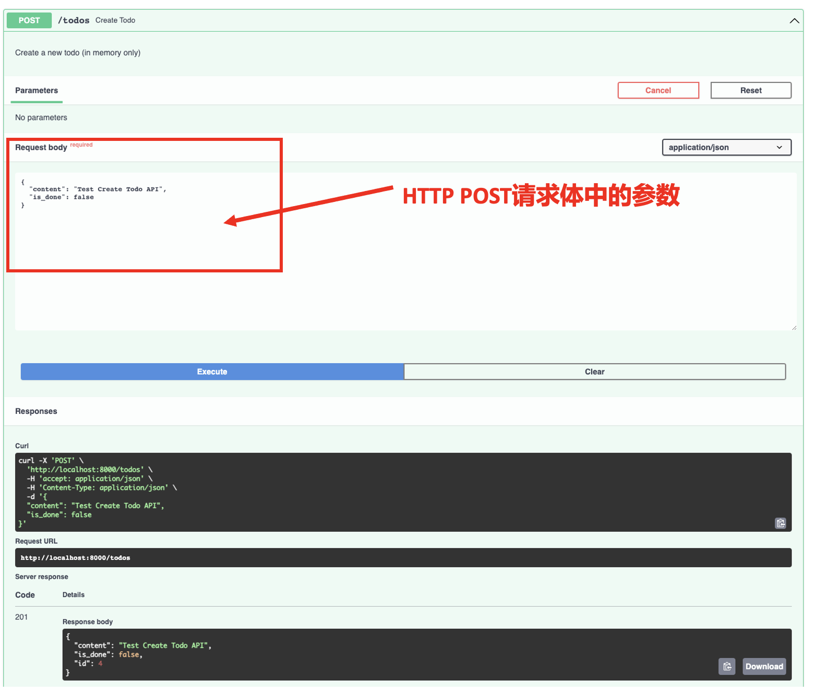
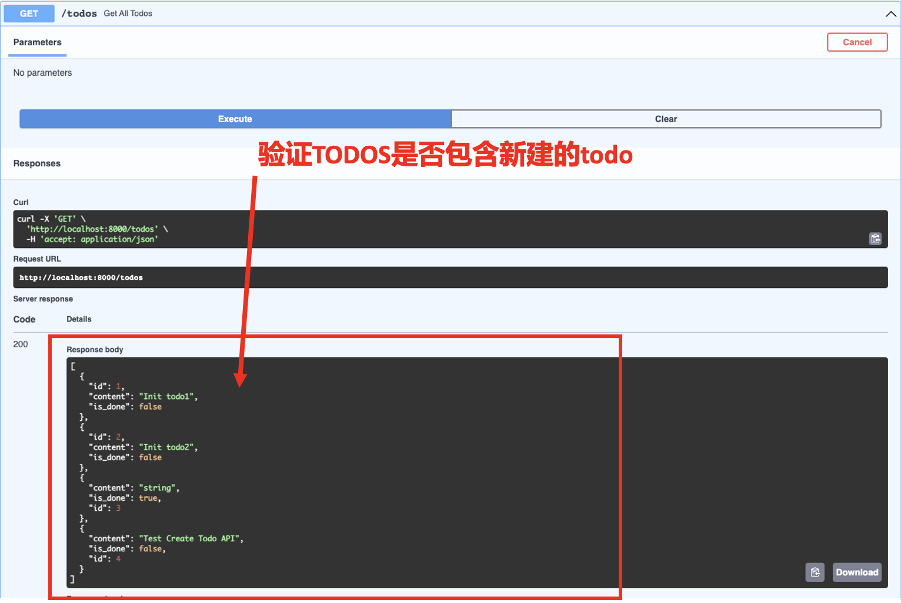

# Web后端：HTTP POST 请求

:::tip

本课程网站内容请仔细阅读后再进行实操。因未仔细阅读内容，出现任何错误后果自负（逃～～～逃～～～逃


**所有的代码请不要复制粘贴，请手敲每一行代码。复制粘贴不会让你动脑子，而手敲每一个行代码会让你自然而然地去动脑子会想每一行代码的含义和原理**
:::

`HTTP POST `请求是一种在客户端和服务器之间进行数据传输的方法。它是 HTTP 协议中的一种请求方法，用于将数据发送到服务器以进行处理或存储。

与 `HTTP GET` 请求不同，`POST` 请求通常用于创建、更新或提交数据到服务器端，而不仅仅是获取数据。通过 `POST` 请求，客户端可以将数据作为请求体的一部分发送给服务器。

`POST `请求的特点如下：

- 数据传输通过请求体（request body）进行，而不是像 `GET` 请求那样通过 URL 参数。
- `POST` 请求可以传输更大量的数据，因为请求体的容量通常比 URL 限制更大。
- `POST` 请求的操作可能会对服务器端的数据进行更改、创建新的资源或执行其他需要的操作。
- `POST` 请求对于敏感或私密的数据更安全，因为请求的数据不会被暴露在 URL 中。

## POST 请求案例

```python showLineNumbers
# 0. Import Python Library
import uvicorn
from fastapi import FastAPI
from pydantic import BaseModel

from typing import Optional

# 1. Define an API object
app = FastAPI()

# 2. Define data 

class TodoCreate(BaseModel):
    content: str
    is_done: bool

class Todo(TodoCreate):
    id: int

# 3. Map HTTP method and path to Python function

TODOS = [
    {
        "id": 1,
        "content": "Init todo1",
        "is_done": False
    },
    {
        "id": 2,
        "content": "Init todo2",
        "is_done": False
    },
]

@app.get("/")
def hello_world():
    return {"message": "Hello world"}

@app.get("/todos")
def get_all_todos():
    return TODOS

@app.get("/todos/{todo_id}")
def get_todo_by_id(todo_id: int):
    result = None
    for todo in TODOS:
        if todo["id"] == todo_id:
            result = todo

    if result:
        return result
    
@app.get("/todos/search/")
def search_todos(
    keyword: Optional[str] = None, max_results: Optional[int] = 10  
):
    """
    Search for todos based on keyword
    """
    if not keyword:
        # we use Python list slicing to limit results
        # based on the max_results query parameter
        return {"results": TODOS[:max_results]} 

    results = filter(lambda todo: keyword.lower() in todo["content"].lower(), TODOS)  
    return {"results": list(results)[:max_results]}

@app.post("/todos", response_model=Todo)
def create_todo(todo_in: TodoCreate): 
    """
    Create a new todo (in memory only)
    """
    new_entry_id = len(TODOS) + 1
    todo_entry = Todo(
        id=new_entry_id,
        content=todo_in.content,
        is_done=todo_in.is_done
    )
    TODOS.append(todo_entry.dict())

    return todo_entry

if __name__ == "__main__":
    uvicorn.run("main:app", reload=True, host="127.0.0.1", port=8000)
```

相比于之前 `GET` 请求部分的代码，我们引入了 Pydantic 包，进行数据的校验。因此在运行上述代码前，请安装好 Pydantic 的包。

```bash
pip install pydantic
```

让我们来解释如下代码：

```python
from pydantic import BaseModel

# skipping...

# 2. Define data 

class TodoCreate(BaseModel):
    content: str
    is_done: bool

class Todo(TodoCreate):
    id: int

# skipping...
```
`TodoCreate` 类继承 pydantic 中的 `BaseModel` 类，它包含 `str` 类型的 content 属性和 `bool` 类型的 is_done 属性。而 `Todo` 类从 `TodoCreate` 类继承，并且增加了 `int` 类型的 id 属性。为什么要这么设计呢？是因为我们的 id 是由 Fast API Web 后端程序自动生成的，因此当通过API 传输过来的信息中不需要包含 id 属性。而后端程序返回值中需要包含 id 这个属性。 那么使用 Pydantic 模式提供的类有什么好处呢？Pydantic 模式可以快速的帮我们把数据转换成对应类的实例，并且如果对应类的属性在HTTP请求体中没有的话便会返回错误信息，并且不执行后续业务逻辑代码，达到数据校验的效果。

估计你可能有点晕，那接下来我们看一下如下代码：

```python

@app.post("/todos", response_model=Todo)
def create_todo(todo_in: TodoCreate):
    """
    Create a new todo (in memory only)
    """
    new_entry_id = len(TODOS) + 1
    todo_entry = Todo(
        id=new_entry_id,
        content=todo_in.content,
        is_done=todo_in.is_done
    )
    TODOS.append(todo_entry.dict())

    return todo_entry
```

- `@app.post` 是 FastAPI 框架中的一个装饰器，用于定义一个 `HTTP POST` 请求的处理器函数。而在上面的例子中，当你发送一个 `POST` 请求到 `/todos` 路径时，FastAPI 将调用 `create_todo` 函数。
- `response_model=Todo` 定义了HTTP响应返回的数据格式，该数据格式是 Pydantic 模式中的 `Todo` 类中定义。
- `todo_in: TodoCreate` 定义了`HTTP POST` 请求的请求体类型是Pydantic模式中的 `TodoCreate` 类。

接下来是实验阶段，请用浏览器打开 `http://localhost:8000/docs`(**打开 URL 前请确保我们的FastAPI 应用是运行起来的**)



请务必进行多次尝试，新建多个todo，同时你可以用之前实现的 `GET /todos` 来验证内存里的 `TODOS` 变量是否包含你新建的todo。



## 改造GET请求的代码

为了实现数据校验，我们需要在之前GET请求代码中加入 Pydantic 模式的类。修改后的代码如下所示：

```python showLineNumbers
# 0. Import Python Library
import uvicorn
from fastapi import FastAPI
from pydantic import BaseModel

from typing import Optional

# 1. Define an API object
app = FastAPI()

# 2. Define data 

class TodoCreate(BaseModel):
    content: str
    is_done: bool

class Todo(TodoCreate):
    id: int

# 3. Map HTTP method and path to Python function

TODOS = [
    {
        "id": 1,
        "content": "Init todo1",
        "is_done": False
    },
    {
        "id": 2,
        "content": "Init todo2",
        "is_done": False
    },
]


@app.get("/")
def hello_world():
    return {"message": "Hello world"}


@app.get("/todos", response_model=list[Todo])
def get_all_todos():
    return TODOS


@app.get("/todos/{todo_id}", response_model=Todo)
def get_todo_by_id(todo_id: int):
    result = None
    for todo in TODOS:
        if todo["id"] == todo_id:
            result = todo

    if result:
        return result
    
@app.get("/todos/search/",  response_model=list[Todo])
def search_todos(
    keyword: Optional[str] = None, max_results: Optional[int] = 10  
):
    """
    Search for todos based on keyword
    """
    if not keyword:
        # we use Python list slicing to limit results
        # based on the max_results query parameter
        return {"results": TODOS[:max_results]} 

    results = filter(lambda todo: keyword.lower() in todo["content"].lower(), TODOS)  
    return {"results": list(results)[:max_results]}

@app.post("/todos", response_model=Todo)
def create_todo(*, todo_in: TodoCreate):  # 2
    """
    Create a new todo (in memory only)
    """
    new_entry_id = len(TODOS) + 1
    todo_entry = Todo(
        id=new_entry_id,
        content=todo_in.content,
        is_done=todo_in.is_done
    )
    TODOS.append(todo_entry.dict())  # 3

    return todo_entry

if __name__ == "__main__":
    uvicorn.run("main:app", reload=True, host="127.0.0.1", port=8000)
```
