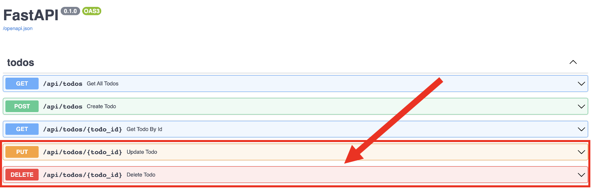

# Web后端：HTTP PUT 和 DELETE 请求

:::tip

本课程网站内容请仔细阅读后再进行实操。因未仔细阅读内容，出现任何错误后果自负（逃～～～逃～～～逃

请切换到 `backend_put_delete_start` 分支，开始此教程代码的编写。

**所有的代码请不要复制粘贴，请手敲每一行代码。复制粘贴不会让你动脑子，而手敲每一个行代码会让你自然而然地去动脑子会想每一行代码的含义和原理**

:::


前面我们已经实现了 TODO 的获取和增加API，接下来我们需要实现 TODO 的修改和删除 API。

用 VS Code 打开 `api/todos.py` 文件，将代码更改成如下代码：

```python showLineNumbers
from fastapi import APIRouter, Depends, HTTPException
from sqlalchemy.orm import Session

from api import deps
from crud import crud_todo
from schemas import todo as schemas_todo

router = APIRouter()

@router.get("/todos", response_model=list[schemas_todo.TodoInDB])
def get_all_todos(
    db: Session = Depends(deps.get_db)
):
    todos = crud_todo.get_all(db=db)
    return todos

@router.get("/todos/{todo_id}", response_model=schemas_todo.TodoInDB)
def get_todo_by_id( 
    todo_id: int,
    db: Session = Depends(deps.get_db)
):
    todo = crud_todo.get_by_id(db=db, id=todo_id)
    return todo
    
@router.post("/todos", response_model=schemas_todo.TodoInDB)
def create_todo(
    todo_parmas: schemas_todo.TodoCreate,
    db: Session = Depends(deps.get_db)
): 
    todo = crud_todo.create(db=db, todo_params=todo_parmas)
    return todo

@router.put("/todos/{todo_id}", response_model=schemas_todo.TodoInDB)
def update_todo(
    todo_id: int,
    todo_params: schemas_todo.TodoCreate,
    db: Session = Depends(deps.get_db)
):
    todo = crud_todo.get_by_id(db=db, id=todo_id)

    if not todo:
        raise HTTPException(status_code=404, detail="Todo not found")

    todo = crud_todo.update(db=db, id=todo_id, todo_params=todo_params)
    return todo


@router.delete("/todos/{todo_id}", response_model=schemas_todo.TodoInDB)
def delete_todo(
    todo_id: int,
    db: Session = Depends(deps.get_db)
):
    todo = crud_todo.get_by_id(db=db, id=todo_id)

    if not todo:
        raise HTTPException(status_code=404, detail="Todo not found")
    todo = crud_todo.remove(db=db, id=todo_id)

    return todo
```

接下来是测试阶段，请用浏览器打开 http://localhost:8000/docs(打开 URL 前请确保我们的FastAPI 应用是运行起来的)对更新todo和删除todo API进行测试。



:::tip

可以切换 `backend_put_delete_finished` 分支，查看最终正确实现的代码。

:::