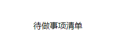

# 创造第一个组件

## 新建组件

在frontend\src\components中新建文件Heading.jsx

在其中写入

```jsx
import React from "react";

const Heading = () => {
  return <div className="text-center text-4xl font-bold"> Your's ToDoList</div>;
};

export default Heading;
```

其中

```jsx
import React from "react";
```

是在 React 应用中引入 React 模块的语法。它是使用 ES6 的模块导入语法，用于将 React 模块导入到当前文件中，以便在该文件中使用 React 相关的功能和组件。

```jsx
export default Heading; 
```

是将名为 `Heading` 的组件导出为默认导出。

在 React 应用中，通过将组件导出为默认导出，可以在其他文件中使用该组件。默认导出允许使用者在导入时为组件指定任意名称，而不需要使用原始导出的名称。

例如，如果一个文件中定义了一个名为 `Heading` 的组件，并使用 `export default Heading;` 将其作为默认导出，那么其他文件可以使用以下语法导入该组件并赋予任意名称：

```jsx
import CustomHeading from "./Heading";
```

这样，导入的组件就可以在其他文件中使用，并使用 `CustomHeading` 这个名称进行引用。

```jsx
const Heading = () => {
  return <div className="text-center text-4xl font-bold"> Your's ToDoList</div>;
};
```

在上述代码中，使用了以下的 Tailwind CSS 类名：

- `text-center`：文本居中对齐。
- `text-4xl`：文本字体大小为 4xl（相当于 2rem）。
- `font-bold`：文本字体加粗。

函数组件 `Heading` 返回一个包含文本的 `<div>` 元素，文本内容为 "Your's ToDoList"。该文本应用了上述提到的 Tailwind CSS 类名，以达到居中对齐、指定字体大小和加粗的效果。

## 挂载组件

打开frontend\src\App.jsx,将代码替换为

```jsx
import Heading from "./Heading";

function App() {
  return (
    <div className="App font-Poppins container py-16 px-6 min-h-screen mx-auto">
      <Heading />
    </div>
  );
}

export default App;
```

打开网页，此时出现



:::tip


在上述代码中，应用了以下的 Tailwind CSS 类名：

- `App`：指定了一个名为 "App" 的样式类。
- `font-Poppins`：应用了名为 "Poppins" 的字体。
- `container`：包裹内容的容器，具有最大宽度和居中对齐的样式。
- `py-16`：垂直方向上添加了 16 个单位的内边距。
- `px-6`：水平方向上添加了 6 个单位的内边距。
- `min-h-screen`：设置元素的最小高度为屏幕高度。
- `mx-auto`：水平居中对齐。

这些类名的组合可以用于创建一个具有特定字体、居中对齐、固定内边距和最小屏幕高度的容器元素。

:::

## 总结

通过新建.jsx文件，创建组件，导出该组件，并在其它文件内通过import 语句使用该组件