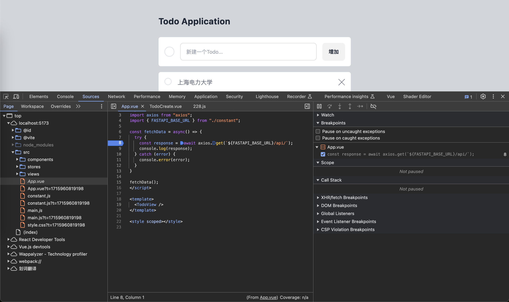
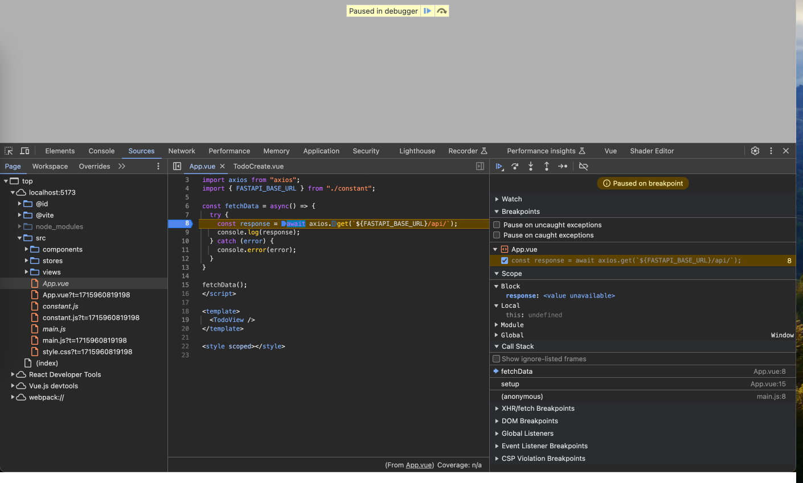
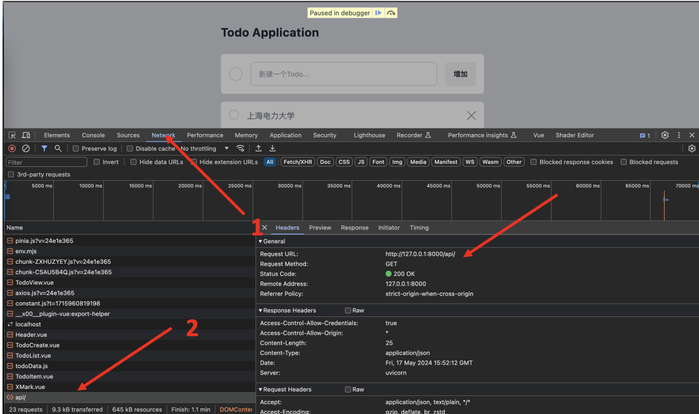
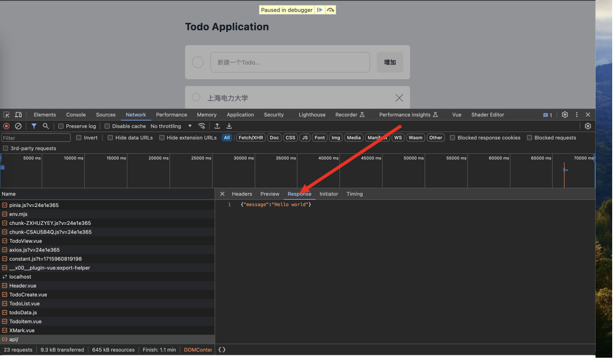
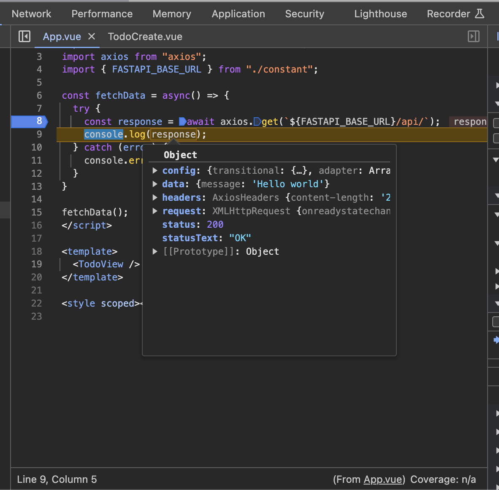

# axios库发送HTTP请求

目前我们操作的数据都是在浏览器中，只要浏览器关闭，数据就没了。
而我们前面利用FastAPI实现了Todo的增删改查的HTTP API。
因此我们可以通过发送HTTP请求的方式到后端，
将我们Web页面操作的数据持久化到数据库中。
这样数据不会因为浏览器的关闭而丢失，
同时也可以读取之前设置的Todo数据，
呈现到Web页面中。

## 设置 FastAPI后端服务地址

由于不同开发者环境不一样，FastAPI的后端在本机运行的端口不一样。
亦或许你已经将FastAPI的后端程序部署到了一台服务器上。
而每一个API都要用到 FastAPI的后端服务的地址，
因此我们需要设置一个常量，用户可以根据自己的实际情况进行更改。

新建一个 `src/constant.js` 文件，输入如下代码：

```js
export const FASTAPI_BASE_URL="http://127.0.0.1:8001/api/";
```


## axios 库安装

命令行如书如下明亮：

```bash
npm i axios
```

## axios 发送一个HTTP GET 请求

我们在FastAPI的后端代码中实现了一个最简单的API
`http://localhost:8000/api/`
这个API会返回如下数据：

```json
{"message":"Hello world"}
```
因此我们可以通过这个最简单的API来测试我们axios是否有用。

我们可以将 `src/App.vue` 的代码更改成如下:

```html showLineNumbers title="src/App.vue"
<script setup>
import TodoView from "./views/TodoView.vue";
import axios from "axios";
import { FASTAPI_BASE_URL } from "./constant";

const fetchData = async() => {
  try {
    const response = await axios.get(`${FASTAPI_BASE_URL}/api/`);
    console.log(response);
  } catch (error) {
    console.error(error);
  }
}
fetchData();
</script>

<template>
  <TodoView />
</template>

<style scoped></style>
```
Chrome浏览器中在 `src/App.vue`的第八行打个断点，如下图所示。



刷新页面，就可以看到我们的代码卡在了如下页面：



执行下一步，然后在Network中查看所发送的HTTP请求：



点击response便可看到这个API返回的值：



回到代码页面，将鼠标悬停到 `response` 变量，
可以看到 `response`的 `data`属性里面有我们FastAPI后端API返回的值`{"message":"Hello world"}`，
如下图所示。



## axios与pinia结合

在`src\stores\todoData.js`中，将原本`state`，替换成

```js
  state: () => ({
    todoList: [],
    isLoggedIn: false,
    userName: "",
    url: "http://127.0.0.1:8001/api/",
    token: "",
  }),
```
这里的`url`指的是后端对应的`url`。


## 删除


## 修改

## 注册

在`src\stores\todoData.js`中，将原本`createUser`函数，替换成

```js
 createUser({ username, password }) {
      const email = username;

      return new Promise((resolve, reject) => {
        fetch(this.url + "users/", {
          method: "POST",
          headers: {
            Accept: "application/json",
            "Content-Type": "application/json",
          },
          body: JSON.stringify({
            name: username,
            email: email,
            password: password,
          }),
        })
          .then((response) => {
            if (!response.ok) {
              throw new Error("Network response was not ok");
            }
            return response.json(); // 返回服务器的响应数据
          })
          .then((data) => {
            resolve(true); // 注册成功，返回 true
          })
          .catch((error) => {
            console.error("Error:", error);
            reject(false); // 注册失败，返回 false
          });
      });
    },
```

这段代码是一个用于创建用户的函数，它使用了 `fetch` 来向服务器发送一个 POST 请求，以创建新用户。

1. `return new Promise((resolve, reject) => { ... })`: 这里创建了一个 Promise 对象，用于异步处理创建用户的请求。`resolve` 和 `reject` 是两个回调函数，用于表示 Promise 的执行结果。

2. `fetch(this.url + "users/", { ... })`: 这是一个使用 Fetch API 发送 HTTP 请求的语句。它向服务器端的 `/users/` 路径发送了一个 POST 请求，以创建新用户。请求中包含了必要的请求头和请求体信息。

3. `.then((response) => { ... })`: 这是对请求的响应进行处理的部分。当收到服务器的响应时，首先检查响应是否成功。如果响应不成功（即状态码不在 200~299 范围内），则抛出一个错误。

4. `.then((data) => { ... })`: 如果响应成功，这一步将对响应数据进行处理。通常情况下，服务器会返回一些数据作为响应，这些数据在这里被解析并传递给 `resolve` 函数，以表示注册成功。

5. `.catch((error) => { ... })`: 如果在请求过程中出现了错误，比如网络错误或服务器返回的错误信息，这一步将捕获到这些错误，并通过 `reject` 函数来表示注册失败，并输出相应的错误信息到控制台。

总的来说，这段代码的功能是发送一个创建用户的请求，并根据服务器返回的结果来判断注册是否成功。如果注册成功，则通过 `resolve` 函数返回 `true`，否则通过 `reject` 函数返回 `false`。


## 登录

首先我们需要登录，从后端获取`token`,在`src\stores\todoData.js`中，将原本`login`函数，替换成

```js
    login({ username, password }) {
      return new Promise((resolve, reject) => {
        const formData = new URLSearchParams();
        formData.append("username", username);
        formData.append("password", password);

        fetch(this.url + "login/access_token", {
          method: "POST",
          headers: {
            Accept: "application/json",
            "Content-Type": "application/x-www-form-urlencoded",
          },
          body: formData,
        })
          .then((response) => {
            if (!response.ok) {
              reject(false);
              throw new Error("Network response was not ok");
            }
            return response.json(); // 解析 JSON 数据
          })
          .then((data) => {
            // 获取 access_token 并存储
            this.token = `Bearer ${data.access_token}`;

            // 登录成功，更新 Vuex state 中的用户信息
            this.isLoggedIn = true;
            this.userName = username;
            this.fetchTodos();

            // 返回登录结果
            resolve(true);
          })
          .catch((error) => {
            console.error("Error:", error);
            reject(false);
          });
      });
    },
```

1. `const formData = new URLSearchParams();`: 创建了一个 URLSearchParams 对象，用于构建 POST 请求的表单数据。

2. `formData.append("username", username);` 和 `formData.append("password", password);`: 将用户名和密码添加到表单数据中。

3. `fetch(this.url + "login/access_token", { ... })`: 使用 Fetch API 发送一个 POST 请求到服务器的 `/login/access_token` 路径，以获取访问令牌。

4. `.then((response) => { ... })`: 对服务器响应的处理部分。如果响应不成功（即状态码不在 200~299 范围内），则使用 `reject` 函数抛出一个错误。

5. `.then((data) => { ... })`: 如果响应成功，解析响应中的 JSON 数据，并将访问令牌存储在客户端（通常是在浏览器的 localStorage 或 sessionStorage 中），同时更新用户的登录状态和用户名，并调用 `fetchTodos` 方法获取用户的待办事项列表。

6. `.catch((error) => { ... })`: 如果在请求过程中出现错误，例如网络错误或服务器返回的错误信息，通过 `reject` 函数返回一个错误，并在控制台打印错误信息。

总的来说，这段代码的功能是向服务器发送一个登录请求，如果登录成功，则返回一个包含登录结果的 Promise 对象，如果登录失败，则返回一个拒绝的 Promise 对象。

## 获取数据

新增`action`，`fetchTodos()`

```js
    fetchTodos() {
      fetch(this.url + "todos/", {
        method: "GET",
        headers: {
          Accept: "application/json",
          Authorization: this.token,
        },
      })
        .then((response) => {
          if (!response.ok) {
            throw new Error("Network response was not ok");
          }
          return response.json(); // 解析 JSON 数据
        })
        .then((data) => {
          // 处理返回的待办事项列表数据
          this.todoList = [];
          data.forEach((item) => {
            const { is_done, content, id } = item;
            this.todoList.push({ id: id, content: content, isDone: is_done });
          });
        })
        .catch((error) => {
          console.error("Error:", error);
        });
    },
```


1. `fetch(this.url + "todos/", { ... })`: 使用 Fetch API 发送一个 GET 请求到服务器的 `/todos/` 路径，以获取用户的待办事项列表。

2. `.then((data) => { ... })`: 如果响应成功，解析响应中的 JSON 数据，并对每个待办事项进行处理。在这里，清空当前的 `todoList` 数组，然后遍历返回的数据数组，提取每个待办事项的 `is_done`、`content` 和 `id` 属性，并将其添加到 `todoList` 数组中。这里的 `isDone` 是 JavaScript 对象的属性名，用于表示待办事项是否已完成。

在`src\components\Todos.vue`中写入

```vue
<script setup>
import Todo from "./Todo.vue";
import { useTodoDataStore } from "../stores/todoData";
import { ref, toRefs } from "vue";
import { storeToRefs } from "pinia";
const input = ref("");
const todoData = useTodoDataStore();
const { todoList, isLoggedIn } = storeToRefs(todoData); 
const addTodo = todoData.addTodo;
const deleteTodo = todoData.deleteTodo;
const changeIsDone = todoData.changeIsDone;

const AddTodo = () => {
  addTodo(input.value);
  input.value = "";
};

const DeleteTodo = (id) => {
  deleteTodo(id);
};

const ChangeIsDone = (id) => {
  changeIsDone(id);
};
</script>

<template>
  <div class="bg-white text-black p-4">
    <div v-if="isLoggedIn">
      <el-row>
        <el-col :span="6">
          <el-input v-model="input" placeholder="请输入代办事项" />
        </el-col>
        <el-button @click="AddTodo">提交</el-button>
      </el-row>

      <el-row v-for="todo in todoList" :key="todo.id" class="items-center space-x-3">
        <div @click="() => ChangeIsDone(todo.id)">
          <a :class="todo.isDone ? 'text-red-600 line-through' : 'text-blue-600'">
            Hello, {{ todo.content }}
          </a>
          <!-- <Todo :todo="todo" /> -->
        </div>
        <el-icon size="16" class="center">
          <Delete @click="() => DeleteTodo(todo.id)" />
        </el-icon>
      </el-row>
    </div>
    <div v-else>请先登录</div>
  </div>
</template>
```
`const { todoList, isLoggedIn } = storeToRefs(todoData);`
这行代码使用了 `storeToRefs` 函数从 `todoData` store 中提取 `todoList` 和 `isLoggedIn` 这两个属性，并将它们转换为响应式的引用。这样做的目的是确保在 `todoList` 和 `isLoggedIn` 的值发生变化时，相关的视图会及时更新。通常在 Vue.js 中，当状态改变时，相关视图会自动重新渲染，但是在 Composition API 中，我们需要手动将数据转换为响应式的引用以确保这种响应性。

## 剩余功能

在`src\stores\todoData.js`中写入

```js
import { defineStore } from "pinia";
import { ref } from "vue";
export const useTodoDataStore = defineStore("todoData", {
  state: () => ({
    todoList: [],
    isLoggedIn: false,
    userName: "",
    url: "http://127.0.0.1:8001/api/",
    token: "",
  }),
  getters: { allTodos: (state) => state.todoList.value },
  actions: {
    addTodo(content) {
      const newTodo = {
        content: content,
        is_done: false,
      };
      fetch(this.url + "todos/", {
        method: "POST",
        headers: {
          Accept: "application/json",
          "Content-Type": "application/json",
          Authorization: this.token,
        },
        body: JSON.stringify(newTodo),
      })
        .then((response) => {
          if (!response.ok) {
            throw new Error("add response was not ok");
          }
          this.fetchTodos();
          return response.json();
        })
        .catch((error) => {
          console.error("Error:", error);
        });
    },
    deleteTodo(id) {
      return new Promise((resolve, reject) => {
        fetch(`http://localhost:8001/api/todos/${id}`, {
          method: "DELETE",
          headers: {
            Accept: "application/json",
            Authorization: this.token,
          },
        })
          .then((response) => {
            if (!response.ok) {
              throw new Error("Network response was not ok");
            }
            this.fetchTodos();
            resolve(true); // 成功删除返回 true
          })
          .catch((error) => {
            console.error("Error:", error);
            reject(false); // 删除失败返回 false
          });
      });
    },
    changeIsDone(id) {
      const todo = this.todoList.find((item) => item.id === id);
      const body = {
        is_done: !todo.isDone,
        content: todo.content,
      };
      return new Promise((resolve, reject) => {
        fetch(`http://localhost:8001/api/todos/${id}`, {
          method: "PUT",
          headers: {
            Accept: "application/json",
            "Content-Type": "application/json",
            Authorization: this.token,
          },
          body: JSON.stringify(body),
        })
          .then((response) => {
            if (!response.ok) {
              throw new Error("Network response was not ok");
            }
            this.fetchTodos();
            resolve(true); // 成功更新返回 true
          })
          .catch((error) => {
            console.error("Error:", error);
            reject(false); // 更新失败返回 false
          });
      });
    },
    createUser({ username, password }) {
      const email = username;

      return new Promise((resolve, reject) => {
        fetch(this.url + "users/", {
          method: "POST",
          headers: {
            Accept: "application/json",
            "Content-Type": "application/json",
          },
          body: JSON.stringify({
            name: username,
            email: email,
            password: password,
          }),
        })
          .then((response) => {
            if (!response.ok) {
              throw new Error("Network response was not ok");
            }
            return response.json(); // 返回服务器的响应数据
          })
          .then((data) => {
            resolve(true); // 注册成功，返回 true
          })
          .catch((error) => {
            console.error("Error:", error);
            reject(false); // 注册失败，返回 false
          });
      });
    },

    login({ username, password }) {
      return new Promise((resolve, reject) => {
        const formData = new URLSearchParams();
        formData.append("username", username);
        formData.append("password", password);

        fetch(this.url + "login/access_token", {
          method: "POST",
          headers: {
            Accept: "application/json",
            "Content-Type": "application/x-www-form-urlencoded",
          },
          body: formData,
        })
          .then((response) => {
            if (!response.ok) {
              reject(false);
              throw new Error("Network response was not ok");
            }
            return response.json(); // 解析 JSON 数据
          })
          .then((data) => {
            // 获取 access_token 并存储
            this.token = `Bearer ${data.access_token}`;

            // 登录成功，更新 Vuex state 中的用户信息
            this.isLoggedIn = true;
            this.userName = username;
            this.fetchTodos();

            // 返回登录结果
            resolve(true);
          })
          .catch((error) => {
            console.error("Error:", error);
            reject(false);
          });
      });
    },
    fetchTodos() {
      fetch(this.url + "todos/", {
        method: "GET",
        headers: {
          Accept: "application/json",
          Authorization: this.token,
        },
      })
        .then((response) => {
          if (!response.ok) {
            throw new Error("Network response was not ok");
          }
          return response.json(); // 解析 JSON 数据
        })
        .then((data) => {
          // 处理返回的待办事项列表数据
          this.todoList = [];
          data.forEach((item) => {
            const { is_done, content, id } = item;
            this.todoList.push({ id: id, content: content, isDone: is_done });
          });
        })
        .catch((error) => {
          console.error("Error:", error);
        });
    },
    logOut() {
      if (this.isLoggedIn == false) alert("请先登录");
      else {
        this.isLoggedIn = false;
        this.token = "";
        alert("注销成功");
      }
    },
  },
});

```
