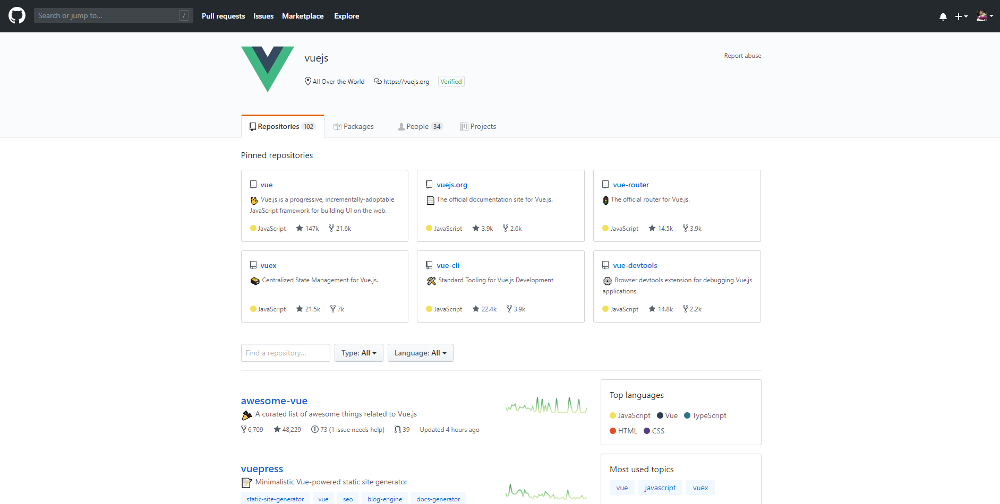
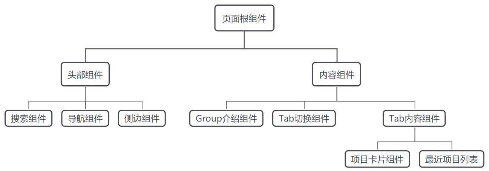

# 程序代码解析

:::tip

本课程网站内容请仔细阅读后再进行实操。因未仔细阅读内容，出现任何错误后果自负（逃～～～逃～～～逃

**所有的代码请不要复制粘贴，请手敲每一行代码。复制粘贴不会让你动脑子，而手敲每一个行代码会让你自然而然地去动脑子会想每一行代码的含义和原理**
:::

一个 Vue 应用由根组件以及组件树（可复用的 Vue 组件）组成，简单来说，
组件可以扩展 HTML 元素，封装可重用的代码。
几乎任意类型的应用界面都可以抽象为一个组件树，
例如 Github 上 Vue 主页，我们能看到页面能划分成一块块的内容块，其中有些也可以看作组件：



一般来说，这样的一个管理页面，我们可以抽象成这样的组件树：



为什么要对一个Vue应用的Web页面进行组件的划分，而不是像HTML代码那样写在一整个代码文件中呢？
这是因为采用分而治之的思想能够更好地应对大型、复杂的应用开发挑战。
在单个代码文件中编写整个应用的HTML、CSS和JavaScript代码会导致文件庞大、结构混乱，
不利于维护和拓展。

通过将应用拆分为小型、独立且可复用的组件，我们能够：

- 降低开发难度： 组件化开发使得每个组件只关注于特定的功能或界面部分，简化了开发过程，降低了复杂度，使开发者能够更专注于每个组件的实现细节。

- 提高可维护性： 拥有小而清晰的组件可以使代码更易于理解和维护。每个组件都有自己的作用域和职责，当需要修改或优化功能时，只需针对特定的组件进行操作，而不会影响到其他部分。

- 增加代码的可复用性： 组件可以被多次使用在不同的地方，甚至在不同的项目中。这种重复利用可以节省开发时间，并确保应用中的功能保持一致性。

- 提升团队协作效率： 组件化开发使得团队成员可以并行开发不同的组件，减少了彼此之间的依赖，提高了团队的协作效率。

## 单个组件文件

前面讲到，一个组件是一些逻辑和功能完整的代码片段组成的，
同时也包括了 HTML、CSS 和 Javascript 的代码。

在大多数启用了构建工具的 Vue 项目中，
我们可以使用一种类似 HTML 格式的文件来书写 Vue 组件，
它被称为单文件组件 (也被称为 `*.vue` 文件，英文 Single-File Components，缩写为 SFC)。
顾名思义，Vue 的单文件组件会将一个组件的逻辑 (JavaScript)，模板 (HTML) 和样式 (CSS) 封装在同一个文件里，
如下所示的案例：

```html showLineNumbers 
<script setup>
  // 组件逻辑，放置JS代码部分
</script>

<template>
  <!-- 组件模板， 放置HTML模板代码部分 -->
</template>

<style scoped>
  /* 组件样式， 放置CSS样式代码部分 */
</style>

```

让我们回看一下自己写的`components/HelloWorld.vue`这个组件的代码：

```html showLineNumbers title="components/HelloWorld.vue"
<script setup>
import { ref } from 'vue';

const count = ref(0);

const result = ref("?");

function add(x, y) {
  let value = x + y;
  return value;
}

function calculate() {
  let a = 3;
  let b = 4;
  result.value = add(a, b);
  console.log(`${a} + ${b} = ${result.value}`);
}

</script>

<template>
  <h1>你的第一个Vue应用</h1>
  
  <div class="card">
    <button type="button" @click="count++">count is {{ count }}</button>
    <button type="button" @click="calculate">Calculate</button>
  </div>
  <h2>3 + 4 = {{ result }}</h2>
</template>

<style scoped>
.read-the-docs {
  color: #888;
}
</style>

```

## 响应状态

在JavaScript部分，我们看到了 `ref`这个函数。
在Vue 3中，`ref` 是一个用于在响应式系统中包装基本类型值（如数字、字符串、布尔值等）的函数。
它能够确保在数据发生变化时，视图能够及时地更新。
`ref` 返回一个响应式且可变的对象，其中包含了一个 `.value` 属性，该属性用于访问被包装的值。

```js showLineNumbers 
import { ref } from 'vue';

const count = ref(0);

const result = ref("?");
```
代码的第一行是从`vue`中导入 `ref` 函数，
第三行和第五行是分别声明了一个数字类型和字符串类型的引用。
然后我们可以用`count.value`和 `result.value`来访问它所包装的值。

```html showLineNumbers 
  <button type="button" @click="count++">count is {{ count }}</button>
```
在 `vue` 中 ` {{ count }}` 的写法属于数据绑定形式的文本插值，
意思是在javascript代码中有 count 这个变量的值，
双大括号标签会被替换为相应组件实例HTML模版中 count 属性的值。
同时每次 count 属性更改时它也会同步更新。

请将`components/HelloWorld.vue`代码更新成如下代码，并且观察浏览器的效果：

```html showLineNumbers title="components/HelloWorld.vue"
<script setup>
import { ref } from 'vue';

const count = ref(0);

const result = ref("?");

const msg = "Hello Vue!";

function add(x, y) {
  let value = x + y;
  return value;
}

function calculate() {
  let a = 3;
  let b = 4;
  result.value = add(a, b);
  console.log(`${a} + ${b} = ${result.value}`);
}

</script>

<template>
  <h1>{{ msg }}</h1>
  
  <div class="card">
    <button type="button" @click="count++">count is {{ count }}</button>
    <button type="button" @click="calculate">Calculate</button>
  </div>
  <h2>3 + 4 = {{ result }}</h2>
</template>

<style scoped>
.read-the-docs {
  color: #888;
}
</style>

```

前面提到对于我们可以通过 `count.value`访问ref的值，
实际上在`vue`模板中访问的 `count` 响应状态`ref` 时不需要使用 `.value`：
它会被自动解包，让使用更简单。

## 监听事件

`@click="count++"` 和 `@click="calculate"`代码是Vue中用来监听DOM事件的，
并在事件触发时执行对应的JavaScript代码。

事件处理的用法：`v-on:click="handler"` 或 `@click="handler"。`

事件处理器 (handler) 的值可以是：

- 内联事件处理器：事件被触发时执行的内联 JavaScript 语句。

- 方法事件处理器：一个指向组件上定义的方法的属性名或是路径。

### 内联事件处理器

内联事件处理器通常用于简单场景，例如：

```html showLineNumbers
<script setup>
import { ref } from 'vue';
const count = ref(0);
</script>

<template>  
  <div class="card">
    <button @click="count++">Add 1</button>
    <p>Count is: {{ count }}</p>
  </div>
</template>

<style scoped>
</style>
```

### 方法事件处理器

随着事件处理器的逻辑变得愈发复杂，
内联代码方式变得不够灵活。
因此 `v-on` 也可以接受一个方法名或对某个方法的调用。

```html showLineNumbers
<script setup>
import { ref } from 'vue'

const count = ref(0)

function increment() {
  count.value++
}
</script>

<template>  
  <div class="card">
    <button @click="increment">Add 1</button>
    <p>Count is: {{ count }}</p>
  </div>
</template>

<style scoped>
</style>
```

## 如何在其他组件中使用已经定义好的组件

组件使用其实很简单，
只需要在HTML模版中使用`<MyTemplate />`或者`<MyTemplate></MyTemplate>`即可。
案例如下

```html showLineNumbers title="App.vue"
<script setup>
import HelloWorld from './components/HelloWorld.vue'
</script>

<template>
  <HelloWorld />
</template>

<style scoped>
</style>
```
第二行代码是导入 `HelloWorld.vue` 这个组件，第六行代码便是使用这个组件。

因此对于如下的组件树：


我们在根组件中的代码通常呈现是：

```html showLineNumbers
<script setup>
import app-header from './components/app-header.vue'
...
</script>

<template>
<div id="root">
  <app-header>
    <header-search></header-search>
    <header-nav></header-nav>
    <header-aside></header-aside>
  </app-header>
  <app-view>
    <group-info></group-info>
    <app-tab></app-tab>
    <app-tab-container>
      <project-card></project-card>
      <card-list></card-list>
    </app-tab-container>
  </app-view>
</div>
</template>

<style scoped>
</style>
```

## 项目中其他部分的介绍

我们在 VS Code 中可以看到我们整个Vue的应用的文件树主要包含如下内容：

```bash
./
├── README.md
├── index.html
├── node_modules
│   ├── @vitejs
│   ├── vite -> .pnpm/vite@5.2.6/node_modules/vite
│   └── vue -> .pnpm/vue@3.4.21/node_modules/vue
├── package.json
├── public
│   └── vite.svg
├── src
│   ├── App.vue
│   ├── assets
│   │   └── vue.svg
│   ├── components
│   │   └── HelloWorld.vue
│   ├── main.js
│   └── style.css
└── vite.config.js
```

- README.md: 这是项目的说明文件，通常包含了项目的介绍、使用说明、安装步骤等信息。它通常是开发者阅读项目的入口。

- index.html: 这是项目的主 HTML 文件，是 Vue 应用的入口文件。通常包含了根元素，用于挂载 Vue 应用。

- node_modules/: 这个文件夹包含了项目中使用的所有依赖库。当你使用 npm 安装依赖时，它们会被下载到这个文件夹中。

- package.json: 这是项目的配置文件，其中包含了项目的元数据信息（如名称、版本、作者等），以及项目的依赖和脚本等信息。此文件是 npm 包管理工具的配置文件。

- public/: 这个文件夹包含了一些公共的静态资源，如图片、字体等。其中的内容会被复制到最终打包的输出目录中。

- src/: 这个文件夹包含了项目的源代码，是开发者主要操作的目录。

  - App.vue: 这是 Vue 应用的根组件，包含了应用的整体结构和布局。

  - assets/: 这个文件夹用于存放项目中使用的静态资源文件，如图片、图标等。

  - components/: 这个文件夹包含了项目中的 Vue 组件，通常每个组件都是一个单独的文件。

  - main.js: 这是项目的主 JavaScript 文件，是 Vue 应用的入口文件，通常包含了创建 Vue 实例、配置路由、挂载根组件等操作。

  - style.css: 这是项目的全局样式文件，包含了项目的全局样式定义。

- vite.config.js: 这是 Vite 构建工具的配置文件，用于配置项目的构建行为，比如指定输出路径、自定义插件等。

对于整个Vue项目中，最重要的文件是`package.json`、`index.html`、`src`整个文件夹下的文件。

请用 VS Code 打开 `package.json`：

```js showLineNumbers title="package.json"
{
  "name": "frontend",
  "private": true,
  "version": "0.0.0",
  "type": "module",
  "scripts": {
    "dev": "vite",
    "build": "vite build",
    "preview": "vite preview"
  },
  "dependencies": {
    "vue": "^3.4.21"
  },
  "devDependencies": {
    "@vitejs/plugin-vue": "^5.0.4",
    "vite": "^5.2.0"
  }
}
```

任何一个 Node.js 项目中都包含 `package.json` 文件，它包含了项目的名称、依赖、脚本等信息。
让我们逐个解释其中的字段和属性：

1. `"name": "frontend"`：项目的名称，这个字段指定了项目在 npm 仓库中的唯一标识符。

2. `"private": true`：这个字段指示该项目是私有的，即不能发布到 npm 仓库。这是一个安全措施，防止意外发布敏感信息或未完整的代码。

3. `"version": "0.0.0"`：项目的版本号。在这个例子中，版本号被设置为初始值 "0.0.0"。

4. `"type": "module"`：指定了项目使用 ECMAScript 模块化。这是因为在 Node.js 中，原生支持 CommonJS 模块化，但是通过设置 "type": "module"，项目可以使用 ECMAScript 模块化来导入和导出模块。

5. `"scripts"`：这个字段包含了一系列可以通过 npm 运行的脚本命令。

      - `"dev": "vite"`：启动开发服务器，用于开发环境。
      - `"build": "vite build"`：用于构建生产环境的项目代码。
      - `"preview": "vite preview"`：启动一个本地服务器来预览生产环境的项目。

6. `"dependencies"`：这个字段包含了项目运行时依赖的模块。在这个例子中，项目依赖于 Vue.js 的版本为 "^3.4.21"。

7. `"devDependencies"`：这个字段包含了开发时依赖的模块。在这个例子中，项目依赖于 Vite 相关的插件和工具，包括 @vitejs/plugin-vue 和 vite 本身。

请用 VS Code 打开 `index.html`，便可看到如下代码：

```html showLineNumbers title="index.html"
<!doctype html>
<html lang="en">
  <head>
    <meta charset="UTF-8" />
    <link rel="icon" type="image/svg+xml" href="/vite.svg" />
    <meta name="viewport" content="width=device-width, initial-scale=1.0" />
    <title>Vite + Vue</title>
  </head>
  <body>
    <div id="app"></div>
    <script type="module" src="/src/main.js"></script>
  </body>
</html>
```
`index.html`是我们整个应用程序的HTML入口文件，其中定义ID了为`app`的`div`的DOM元素，
可以看到第11行代码，我们引入了 `src/main.js` 的javascript代码文件，
接下来请打开 `src/main.js` 文件：

```js showLineNumbers title="src/main.js"
import { createApp } from "vue";
import App from "./App.vue";
import "./index.css";
createApp(App).mount("#app");
```

- `import { createApp } from "vue"`：这行代码从 Vue 库中导入 createApp 方法。createApp 方法用于创建一个 Vue 应用程序实例。

- `import App from "./App.vue"`：这行代码从当前目录下的 App.vue 文件中导入 App 组件。在 Vue 3 中，.vue 文件通常包含了 Vue 组件的结构、样式和行为。

- `import "./index.css"`：这行代码导入了 index.css 文件，这是一个样式文件，可能包含了全局的 CSS 样式。

- `createApp(App)`：这行代码调用 createApp 方法，并传入 App 组件作为参数，创建了一个 Vue 应用程序实例。

- `.mount("#app")`：最后一行代码将 Vue 应用程序实例挂载到 HTML 页面中的一个 DOM 元素上，该元素的 id 为 "app"。这意味着该 Vue 应用程序将会在 id 为 "app" 的 DOM 元素内部进行渲染。
