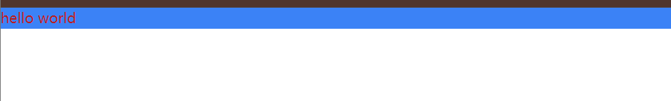

# Hello world 组件


## 你编写的第一个Vue组件

VS Code 打开 `src/App.vue` 文件，将其中代码替换成如下内容:

```jsx
<template>
  <div class="text-red-700  bg-blue-500">
    hello world
  </div>
</template>
```

在项目root路径下运行如下命令（*如果之前已经运行那么杀掉该进程并运行该命令*）：

```bash
npm run dev
```
浏览器中的效果应该是这样的：




:::tip

请一直打开`npm run dev`，不要关闭。这样修改代码后，浏览器中的内容将会自动刷新！

:::

`<template> `是 Vue.js 中的模板标签，用于定义组件的模板结构。

**更多请仔细学习JavaScript的基础语法**

VS Code 打开 `src/main.js` 文件，便可看到如下代码：

```jsx
import { createApp } from "vue";
import App from "./App.vue";
import "./index.css";
createApp(App).mount("#app");

```


VS Code 打开 `index.html`，便可看到如下代码：

```jsx
<!doctype html>
<html lang="en">
  <head>
    <meta charset="UTF-8" />
    <link rel="icon" type="image/svg+xml" href="/vite.svg" />
    <meta name="viewport" content="width=device-width, initial-scale=1.0" />
    <title>Vite + Vue</title>
  </head>
  <body>
    <div id="app"></div>
    <script type="module" src="/src/main.js"></script>
  </body>
</html>
```

上述是我们整个应用程序的HTML入口文件，其中定义了ID为root的DOM元素，以及引入了`src/main.js`文件，
因此我们整个应用程序需要进行coding的部分是从`src/main.js`开始的。

我们可以像在 HTML 中一样，给元素标签加上属性，只不过我们需要遵守[驼峰式命名](https://baike.baidu.com/item/%E9%A9%BC%E5%B3%B0%E5%91%BD%E5%90%8D%E6%B3%95/7560610?fromtitle=%E9%AA%86%E9%A9%BC%E5%91%BD%E5%90%8D%E6%B3%95&fromid=7794053)法则，

