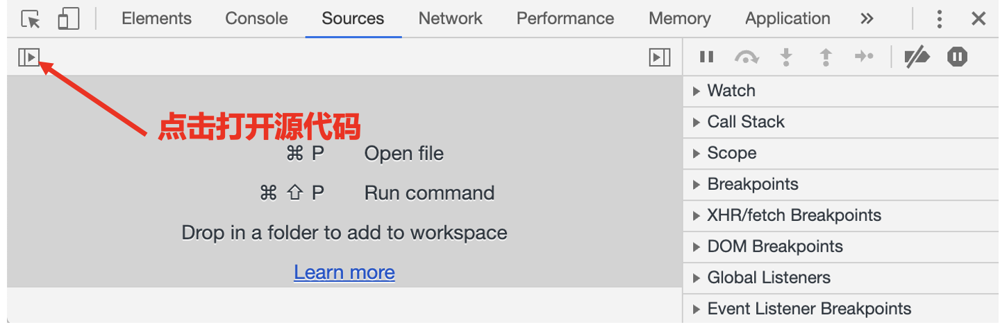
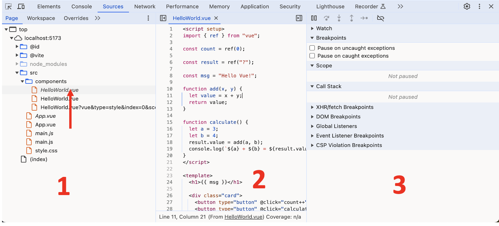
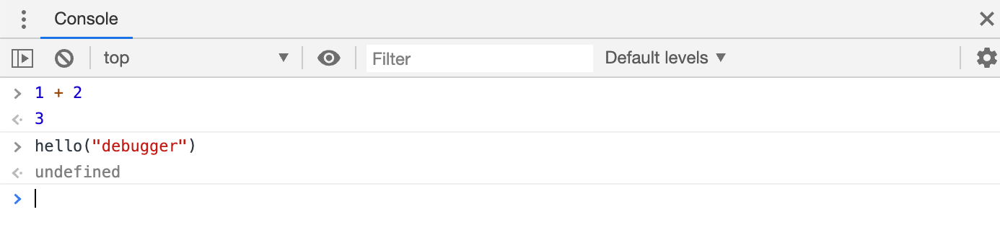
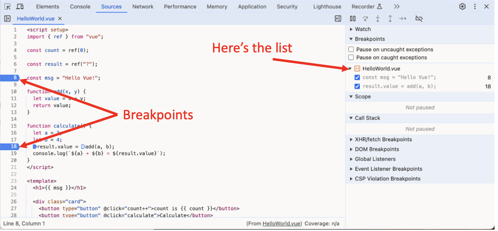
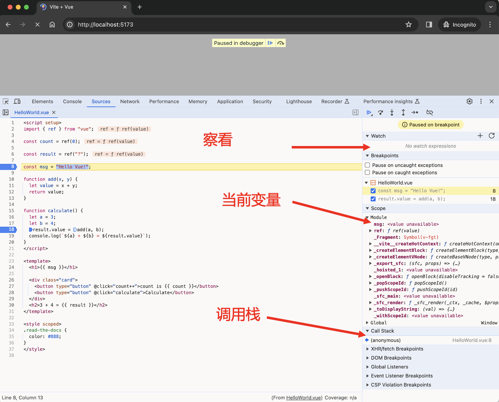
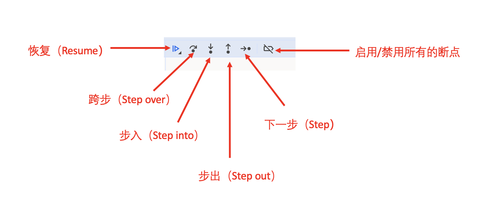
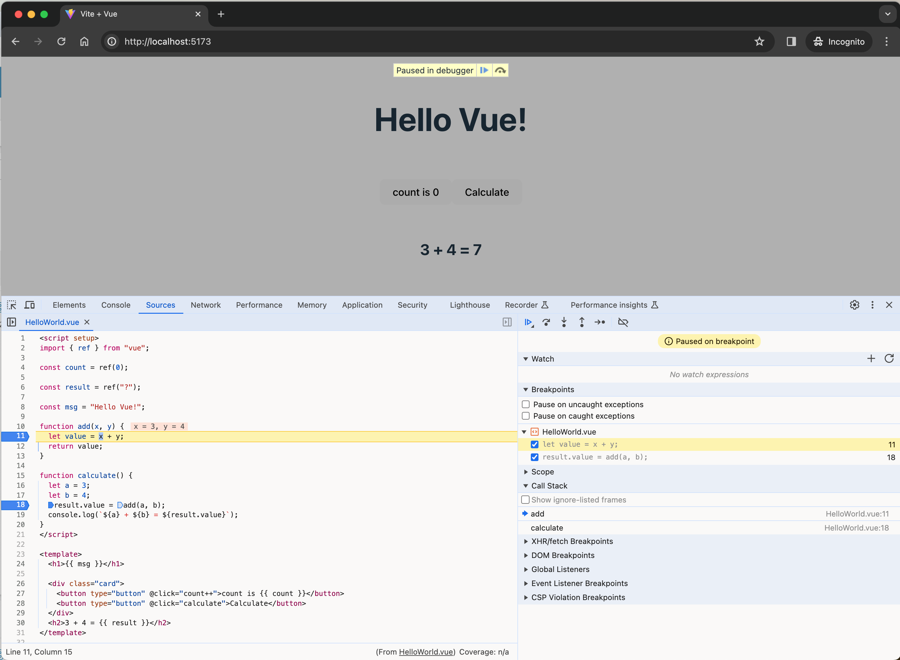

# 在Chrome浏览器调试代码

在编写更复杂的代码前，让我们先来聊聊调试吧。

调试 是指在一个脚本中找出并修复错误的过程。所有的现代浏览器和大多数其他环境都支持调试工具 —— 开发者工具中的一个令调试更加容易的特殊用户界面。它也可以让我们一步步地跟踪代码以查看当前实际运行情况。

在这里我们将会使用 [Chrome（谷歌浏览器）](https://www.google.cn/intl/zh-CN/chrome/)，因为它拥有足够多的功能，其他大部分浏览器的功能也与之类似。

## “资源（Sources）”面板

你的 Chrome 版本可能看起来有一点不同，但是它应该还是处于很明显的位置。

- 使用快捷键 `F12（Mac：Cmd+Opt+I）`打开开发者工具。
- 选择 Sources（资源）面板。

如果你是第一次这么做，那你应该会看到下面这个样子：

让我们在预览树中点击和选择 `HelloWorld.vue`。这里应该会如下图所示：

:::tip 为什么会有两个同名的vue组件？
在实际的开发中，浏览器并不能直接解析 `.vue` 文件，因为浏览器只能解析 HTML、CSS 和 JavaScript 文件。因此，在构建 Vue 项目时，通常会使用构建工具（如 Vue CLI、Vite 等）将 `.vue` 文件转换为浏览器可以理解的格式。
因此，在 Chrome 的开发者工具中，你会看到每个组件都有两个文件，一个是转换后的 JavaScript 文件，
另一个是转换后的 CSS 文件。这样做是为了使开发者能够更方便地调试和查看组件的代码。

在上述案例中字体是倾斜 *HelloWorld.vue* 的文件是Vue原始代码，而字体为倾斜的 HelloWorld.vue 为转换后的文件。
:::

资源（Sources）面板包含三个部分：

- 文件导航（File Navigator） 区域列出了 HTML、JavaScript、CSS 和包括图片在内的其他依附于此页面的文件。Chrome 扩展程序 也会显示在这。
- 代码编辑（Code Editor） 区域展示源码。
- JavaScript 调试（JavaScript Debugging） 区域是用于调试的，我们很快就会来探索它。

## 控制台（Console）

如果我们按下 `Esc`，下面会出现一个控制台，我们可以输入一些命令然后按下 `Enter` 来执行。

语句执行完毕之后，其执行结果会显示在下面。

例如，`1+2` 将会返回 `3`，而 `hello("debugger")` 函数调用什么也没返回，所以结果是 `undefined`：

## 断点（Breakpoints）

在 `HelloWorld.vue` 中，点击第 8 行。是的，就点击数字 "8" 上，不是点击代码。

恭喜你！你已经设置了一个断点。现在，请在第 18 行的数字上也点击一下。

看起来应该是这样的（蓝色是你应该点击的地方）：

**断点** 是调试器会自动暂停 JavaScript 执行的地方。

当代码被暂停时，我们可以检查当前的变量，在控制台执行命令等等。换句话说，我们可以调试它。

我们总是可以在右侧的面板中找到断点的列表。当我们在数个文件中有许多断点时，这是非常有用的。它允许我们：

- 快速跳转至代码中的断点（通过点击右侧面板中的对应的断点）。
- 通过取消选中断点来临时禁用对应的断点。
- 通过右键单击并选择移除来删除一个断点。
- ……等等。

:::note 条件断点

在行号上 **右键单击** 允许你创建一个 **条件** 断点。只有当给定的表达式（你创建条件断点时提供的表达式）为真时才会被触发。

当我们需要在特定的变量值或参数的情况下暂停程序执行时，这种调试方法就很有用了。

:::

## 暂停并查看

在我们的例子中，`HelloWorld.vue`组件在页面加载期间被调用，因此激活调试器的最简单的方法（在我们已经设置了断点后）就是 —— 重新加载页面。因此让我们按下 `F5（Windows，Linux）`或 `Cmd+R（Mac）`吧。

设置断点之后，程序会在第 8 行暂停执行：

请打开右侧的信息下拉列表（箭头指示出的地方）。这里允许你查看当前的代码状态：

1. 察看（Watch） —— 显示任意表达式的当前值。

你可以点击加号 `+` 然后输入一个表达式。调试器将显示它的值，并在执行过程中自动重新计算该表达式。

2. 调用栈（Call Stack） —— 显示嵌套的调用链。

此时，调试器正在 `HelloWorld.vue` 的调用链中。

如果你点击了一个堆栈项，调试器将跳到对应的代码处，并且还可以查看其所有变量。

3. 作用域（Scope） —— 显示当前的变量。

`Module` 显示当组件中的变量，你还可以在源代码中看到它们的值高亮显示了出来。

`Global` 显示全局变量（不在任何函数中）。

## 跟踪执行

现在是 **跟踪** 脚本的时候了。

在右侧面板的顶部是一些关于跟踪脚本的按钮。让我们来使用它们吧。

1. “恢复（Resume）”：继续执行，快捷键 `F8`。

继续执行。如果没有其他的断点，那么程序就会继续执行，并且调试器不会再控制程序。

请在第11行和18行打一个断点，然后在网页上点击`Calculate`按钮，程序会卡在第十八行处，之后按快捷键`F8`，我们会看到这样的情况：

程序恢复执行了，执行到第11行 `add()` 函数中的`let value = x + y`另外一个断点后暂停在了那里。看一下右边的 “Call stack”。它已经增加了一个调用信息。我们现在在 `add()` 里面。

2. “下一步（Step）”：运行下一条（即当前行）指令，快捷键 `F9`。

运行下一条语句。如果我们现在点击它，alert 会被显示出来。

一次接一次地点击此按钮，整个脚本的所有语句会被逐个执行。

3. “跨步（Step over）”：运行下一条（即当前行）指令，但 不会进入到一个函数中，快捷键 `F10`。

跟上一条命令“下一步（Step）”类似，但如果下一条语句是函数调用则表现不同。这里的函数指的是：不是内建的如 alert 函数等，而是我们自己写的函数。

如果我们对比一下，“下一步（Step）”命令会进入嵌套函数调用并在其第一行暂停执行，而“跨步（Step over）”对我们不可见地执行嵌套函数调用，跳过了函数内部。

执行会在该函数调用后立即暂停。

如果我们对该函数的内部执行不感兴趣，这命令会很有用。

4. “步入（Step into）”，快捷键 `F11`。

和“下一步（Step）”类似，但在异步函数调用情况下表现不同。如果你刚刚才开始学 JavaScript，那么你可以先忽略此差异，因为我们还没有用到异步调用。

至于之后，只需要记住“下一步（Step）”命令会忽略异步行为，例如 setTimeout（计划的函数调用），它会过一段时间再执行。而“步入（Step into）”会进入到代码中并等待（如果需要）。详见 DevTools 手册。

5. “步出（Step out）”：继续执行到当前函数的末尾，快捷键 `Shift+F11`。

继续执行当前函数内的剩余代码，并暂停在调用当前函数的下一行代码处。当我们使用  偶然地进入到一个嵌套调用，但是我们又对这个函数不感兴趣时，我们想要尽可能的继续执行到最后的时候是非常方便的。

6. 启用/禁用所有的断点。

这个按钮不会影响程序的执行。只是一个批量操作断点的开/关。

:::note Continue to here
在代码中的某一行上右键，在显示的关联菜单（context menu）中点击一个非常有用的名为 “Continue to here” 的选项。

当你想要向前移动很多步到某一行为止，但是又懒得设置一个断点时非常的方便。
:::