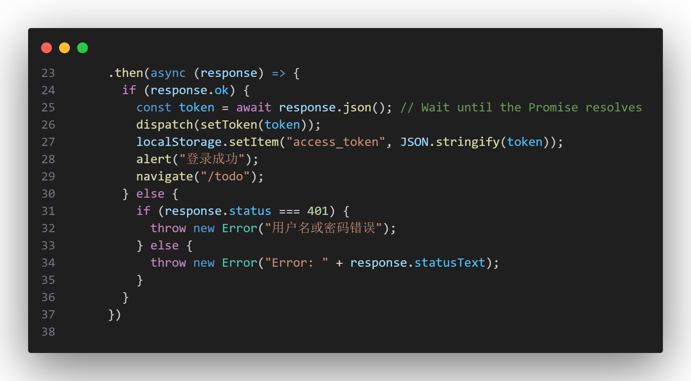
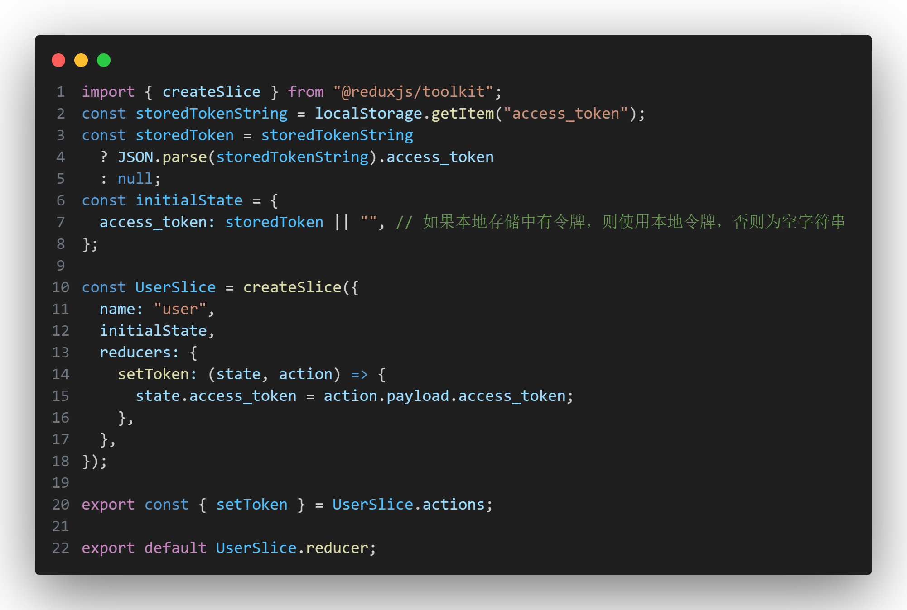
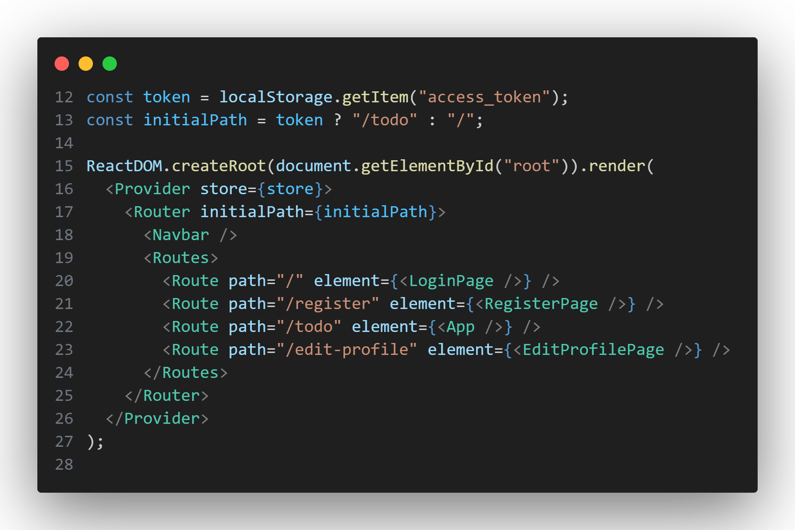

# 令牌储存

每次刷新的时候都需要重新登录，比较麻烦，所以我们将令牌储存在本地

## frontend\src\components\LoginPage.jsx

在登陆页面中添加代码
```jsx
localStorage.setItem("access_token", JSON.stringify(token));
```



`localStorage.setItem("access_token", JSON.stringify(token))` 语句用于将令牌存储到本地浏览器的本地存储中。

它将使用 `JSON.stringify` 将令牌对象转换为字符串，并将其存储在名为 "access_token" 的键下。

## frontend\src\UserSlice.jsx

新增代码
```jsx
const storedTokenString = localStorage.getItem("access_token");
const storedToken = storedTokenString
  ? JSON.parse(storedTokenString).access_token
  : null;
const initialState = {
  access_token: storedToken || "", // 如果本地存储中有令牌，则使用本地令牌，否则为空字符串
};
```




这段代码首先使用 `localStorage.getItem("access_token")` 从本地存储中获取存储的令牌字符串。然后，通过使用条件运算符 `? :`，它检查令牌字符串是否存在。如果令牌字符串存在，它将使用 `JSON.parse` 解析为对象，并从中提取 `access_token` 值。如果令牌字符串不存在，它将将 `storedToken` 设置为 `null`。最后，初始状态对象的 `access_token` 属性被设置为存储的令牌或空字符串。

通过这段代码，你可以将存储在本地浏览器中的令牌作为初始状态的一部分，并在应用中使用它。如果令牌不存在，`access_token` 属性将被设置为空字符串。

## frontend\src\main.jsx
```jsx
const token = localStorage.getItem("access_token");
const initialPath = token ? "/todo" : "/";
ReactDOM.createRoot(document.getElementById("root")).render(
  <Provider store={store}>
    <Router initialPath={initialPath}>
      <Navbar />
      <Routes>
        <Route path="/" element={<LoginPage />} />
        <Route path="/register" element={<RegisterPage />} />
        <Route path="/todo" element={<App />} />
        <Route path="/edit-profile" element={<EditProfilePage />} />
      </Routes>
    </Router>
  </Provider>
);
```


在创建 `Router` 组件时使用了条件渲染，根据存储在本地浏览器中的令牌的存在与否来确定初始路径。

这段代码首先使用 `localStorage.getItem("access_token")` 从本地存储中获取存储的令牌。然后，通过条件运算符 `? :`，它检查令牌是否存在。如果令牌存在，它将将 `initialPath` 设置为 `"/todo"`，表示初始路径应该是 "/todo"。如果令牌不存在，它将将 `initialPath` 设置为 `"/"`，表示初始路径应该是根路径。

然后，在创建 `Router` 组件时，将 `initialPath` 作为 `initialPath` 属性传递给 `Router` 组件。这将确保在初始加载时，如果令牌存在，应用程序会重定向到 "/todo" 页面，否则会重定向到根路径。

## frontend\src\components\Navbar.jsx
当登出时，删除令牌
在`handleLogout`函数中修改
```jsx
  const handleLogout = () => {
    localStorage.removeItem("access_token");
    dispatch(setToken(""));
    navigate("/");
  };
```

`handleLogout` 函数用于处理用户注销操作。它执行以下操作：

1. 使用 `localStorage.removeItem("access_token")` 从本地存储中移除存储的令牌。
2. 调用 `dispatch(setToken(""))` 将令牌状态设置为空字符串，以更新 Redux 中的令牌状态。
3. 使用 `navigate("/")` 将用户重定向到根路径，即登录页面。

这样，当用户点击注销按钮时，会触发 `handleLogout` 函数，从本地存储中移除令牌、更新令牌状态，并将用户重定向到登录页面。
