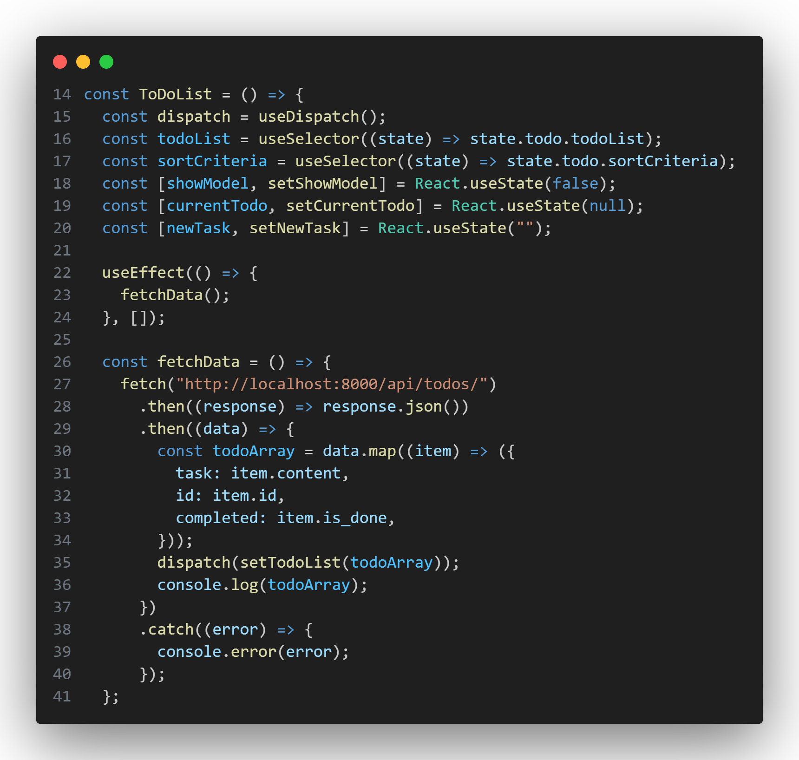
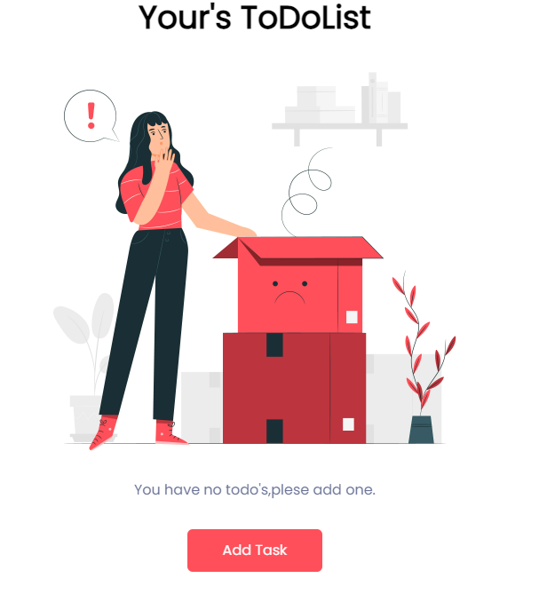
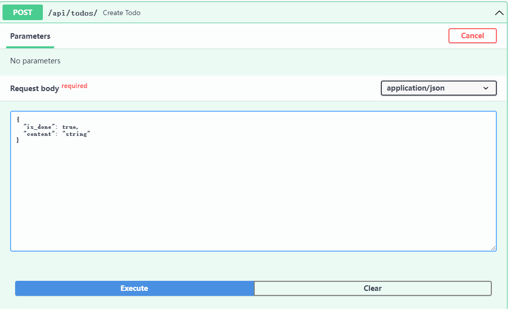
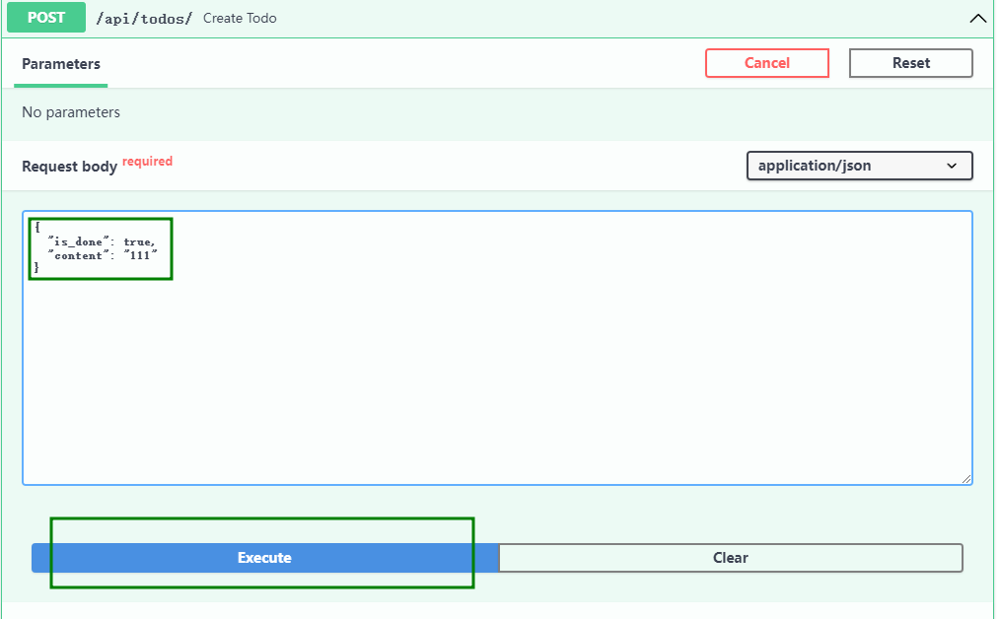
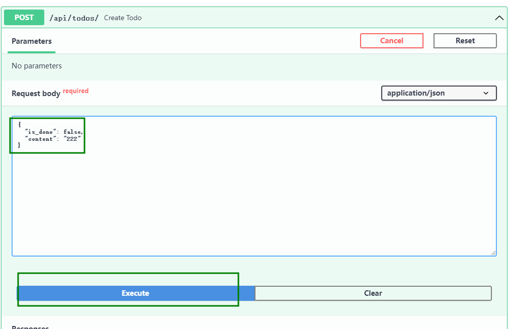
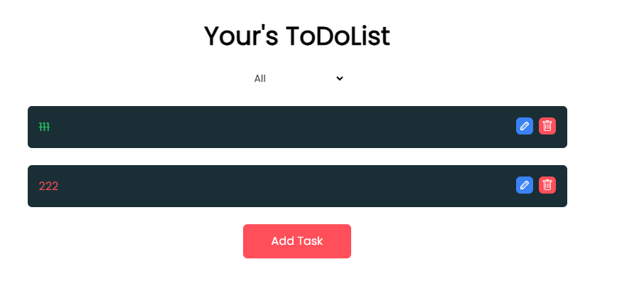

# 修改数据存储

## 新增函数`fetchData`

```jsx
  const fetchData = () => {
    fetch("http://localhost:8000/api/todos/")
      .then((response) => response.json())
      .then((data) => {
        const todoArray = data.map((item) => ({
          task: item.content,
          id: item.id,
          completed: item.is_done,
        }));
        dispatch(setTodoList(todoArray));
        console.log(todoArray);
      })
      .catch((error) => {
        console.error(error);
      });
  };

```

这段代码使用了 Fetch API 来从 `http://localhost:8000/api/todos/` 发起一个 GET 请求，并处理返回的 JSON 数据。

代码的执行步骤如下：

1. 使用 `fetch` 函数发起一个 GET 请求到 `http://localhost:8000/api/todos/`。
2. 在第一个 `then` 方法中，使用 `response.json()` 方法将响应数据解析为 JSON 格式。
3. 在第二个 `then` 方法中，使用 `data.map()` 方法遍历解析后的数据数组，并为每个数组元素创建一个新的对象。在这里，我们为每个待办事项项创建一个包含 `task`、`id` 和 `completed` 属性的对象。
4. 调用 `dispatch(setTodoList(todoArray))`，将提取的 `todoArray` 数组传递给 `setTodoList` 动作创建函数（假设这是 Redux 中的一个动作）。
5. 使用 `console.log` 打印提取的 `todoArray`。
6. 如果发生错误，使用 `catch` 方法捕获错误并输出到控制台。


删除代码

```jsx
  useEffect(() => {
    if (todoList.length > 0)
      localStorage.setItem("todoList", JSON.stringify(todoList));
  }, [todoList]);

  useEffect(() => {
    const localTodoList = JSON.parse(localStorage.getItem("todoList"));
    if (localTodoList) {
      dispatch(setTodoList(localTodoList));
    }
  }, []);
```

添加代码

```jsx
  useEffect(() => {
    fetchData();
  }, []);

  const fetchData = () => {
    fetch("http://localhost:8000/api/todos/")
      .then((response) => response.json())
      .then((data) => {
        const todoArray = data.map((item) => ({
          task: item.content,
          id: item.id,
          completed: item.is_done,
        }));
        dispatch(setTodoList(todoArray));
        console.log(todoArray);
      })
      .catch((error) => {
        console.error(error);
      });
  };
```



此时打开页面



这是因为我们后端没有任何数据

使用[http://localhost:8000/docs#/](http://localhost:8000/docs#/)中的`POST`,为其添加数据





点击`Execute`



点击`Execute`

返回页面并刷新，可以见到



