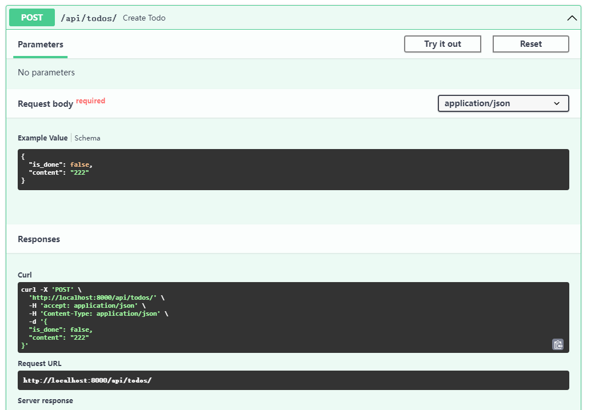
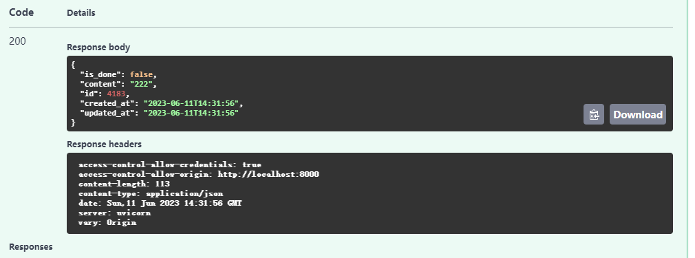
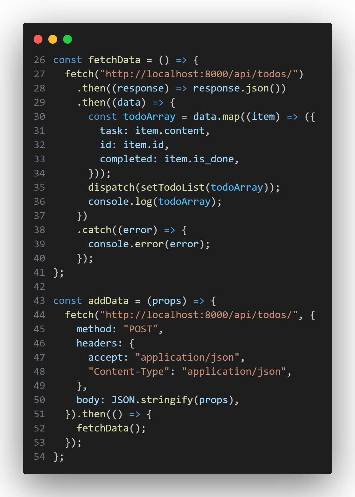
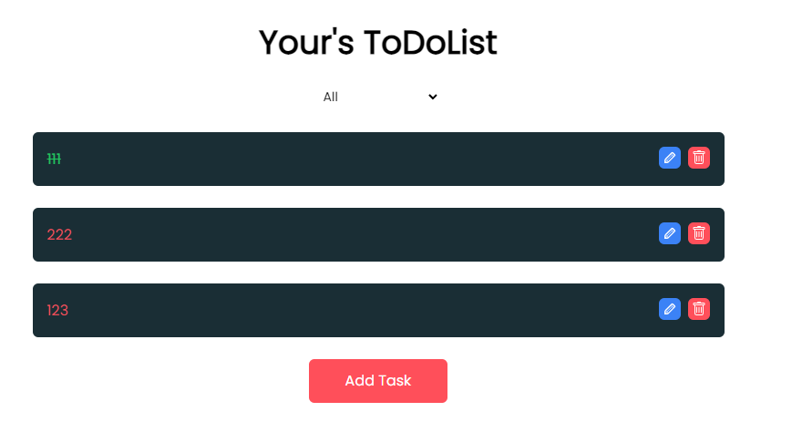

# 增加数据

## api docs



在docs中，`POST`请求

```bash
curl -X 'POST' \
  'http://localhost:8000/api/todos/' \
  -H 'accept: application/json' \
  -H 'Content-Type: application/json' \
  -d '{
  "is_done": false,
  "content": "222"
}'
```

将其转变为fetch

```jsx
const addData = (props) => {
fetch("http://localhost:8000/api/todos/", {
      method: "POST",
      headers: {
        accept: "application/json",
        "Content-Type": "application/json",
      },
      body: JSON.stringify(props),
    })
}
```

其中
1. method与"POST"对应
2. headers与
   ```bash
     -H 'accept: application/json' \
     -H 'Content-Type: application/json' \
   ```
   中-H的对应，格式为
   ```jsx
    headers: {
    accept: "application/json",
    "Content-Type": "application/json",
    },
   ```

3. body是`JSON.stringify(props)`，props是传进来的参数并其转换为JSON格式



这个`post`的`responses`我们不需要处理

## 添加函数`addData`

```jsx
const addData = (props) => {
    fetch("http://localhost:8000/api/todos/", {
      method: "POST",
      headers: {
        accept: "application/json",
        "Content-Type": "application/json",
      },
      body: JSON.stringify(props),
    })
      .then(() => {
        fetchData();
      });
  };
```
   

   

这段代码定义了一个名为 `addData` 的函数，用于向服务器发送一个 POST 请求，将数据作为 JSON 字符串发送到 `http://localhost:8000/api/todos/`。

函数的执行步骤如下：

1. 使用 `fetch` 函数发起一个 POST 请求到 `http://localhost:8000/api/todos/`。
2. 在请求中设置了请求头，包括 `accept` 和 `Content-Type`。
   - `accept: "application/json"` 表示客户端接受 JSON 格式的响应。
   - `"Content-Type": "application/json"` 表示请求的主体是 JSON 格式。
3. 在请求的主体中，使用 `JSON.stringify(props)` 将传入的 `props` 对象转换为 JSON 字符串，并作为请求的主体发送到服务器。
4. 在请求的 `then` 方法中，调用 `fetchData()` 函数，该函数用于获取更新后的待办事项列表数据。


## 更改函数

当`Add Task`按钮被点击时，我们希望触发`addData`这个函数，所以我们将`handleAddTodo`这个函数

```jsx
  const handleAddTodo = (task) => {
    if (task.trim().length === 0) {
      alert("please enter a task");
    } else {
      dispatch(
        addTodo({
          task: task,
          id: Date.now(),
        })
      );
      setNewTask("");
      setShowModel(false);
    }
  };
```

修改为

```jsx
  const handleAddTodo = (task) => {
    if (task.trim().length === 0) {
      alert("please enter a task");
    } else {
      addData({
        content: task,
        is_done: false,
      });
      setNewTask("");
      setShowModel(false);
    }
  };
```

`addData` 函数将以以下数据结构发送 POST 请求：

```javascript
{
  content: task,
  is_done: false
}
```

其中 `task` 是一个变量，表示待办事项的内容。

调用 `addData` 函数时，将会发送包含 `content` 和 `is_done` 属性的 JSON 对象作为请求的主体。

返回网页添加todo，可以看到成功添加


