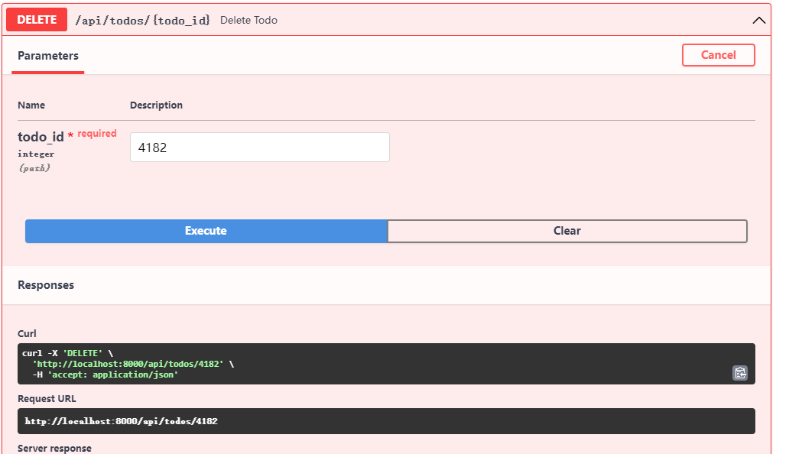
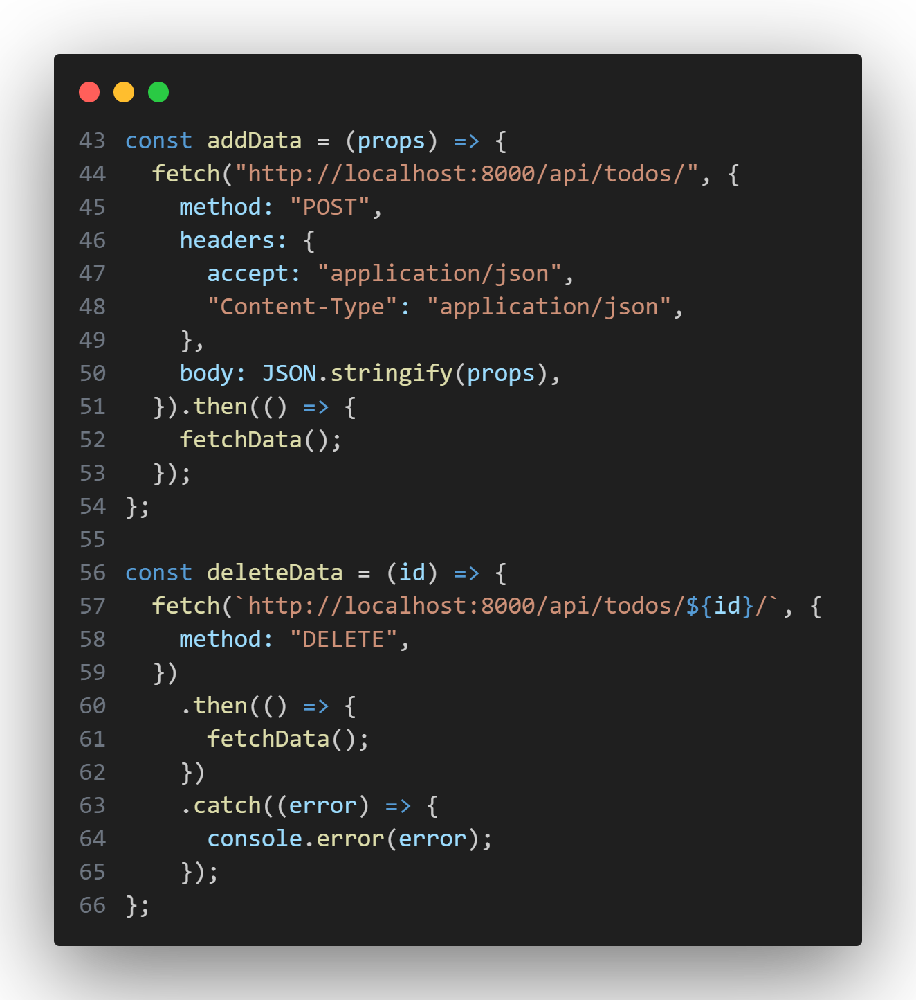
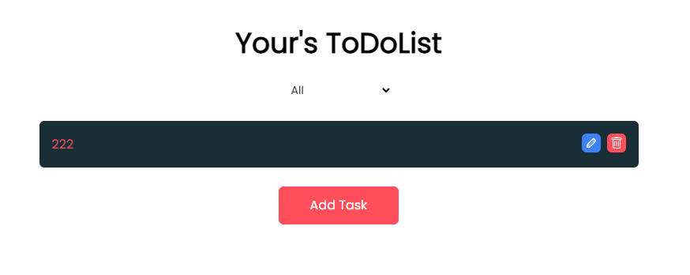

# 添加删除功能

## docs



可以看到使用`DELETE`所必须一个ID

```bash
curl -X 'DELETE' \
  'http://localhost:8000/api/todos/4182' \
  -H 'accept: application/json'
```

对应fetch

```jsx
  const deleteData = (id) => {
    fetch(`http://localhost:8000/api/todos/${id}/`, {
      method: "DELETE",
    })
```
:::tip
`${id}` 是 JavaScript 中的模板字符串语法，用于将变量 `id` 的值插入到字符串中。

在代码中，`${id}` 可以用于创建一个包含动态 ID 的字符串。
:::

## 添加函数`deleteData`

```jsx
  const deleteData = (id) => {
    fetch(`http://localhost:8000/api/todos/${id}/`, {
      method: "DELETE",
    })
      .then(() => {
        fetchData();
      })
      .catch((error) => {
        console.error(error);
      });
  };
```


这段代码定义了一个名为 `deleteData` 的函数，用于向服务器发送一个 DELETE 请求，删除具有指定 ID 的待办事项。

函数的执行步骤如下：

1. 使用 `fetch` 函数发起一个 DELETE 请求到 `http://localhost:8000/api/todos/${id}/`。`${id}` 会被替换为传入的 ID 值。
2. 在请求中设置了请求方法为 `DELETE`，表示删除资源。
3. 在请求的 `then` 方法中，调用 `fetchData()` 函数，该函数用于获取更新后的待办事项列表数据。
4. 如果发生错误，使用 `catch` 方法捕获错误并输出到控制台。

## 更改函数

当删除按钮被点击时，我们希望触发`deleteData`这个函数，所以我们将`handleDeleteToDo`这个函数

```jsx
  const handleDeleteToDo = (id) => {
    const updatedToDoList = todoList.filter((todo) => todo.id != id);
    dispatch(setTodoList(updatedToDoList));
    localStorage.setItem("todoList", JSON.stringify(updatedToDoList));
  };
```

修改为

```jsx
  const handleDeleteToDo = (id) => {
    deleteData(id);
  };
```

返回网页删除todo，可以看到成功删除

