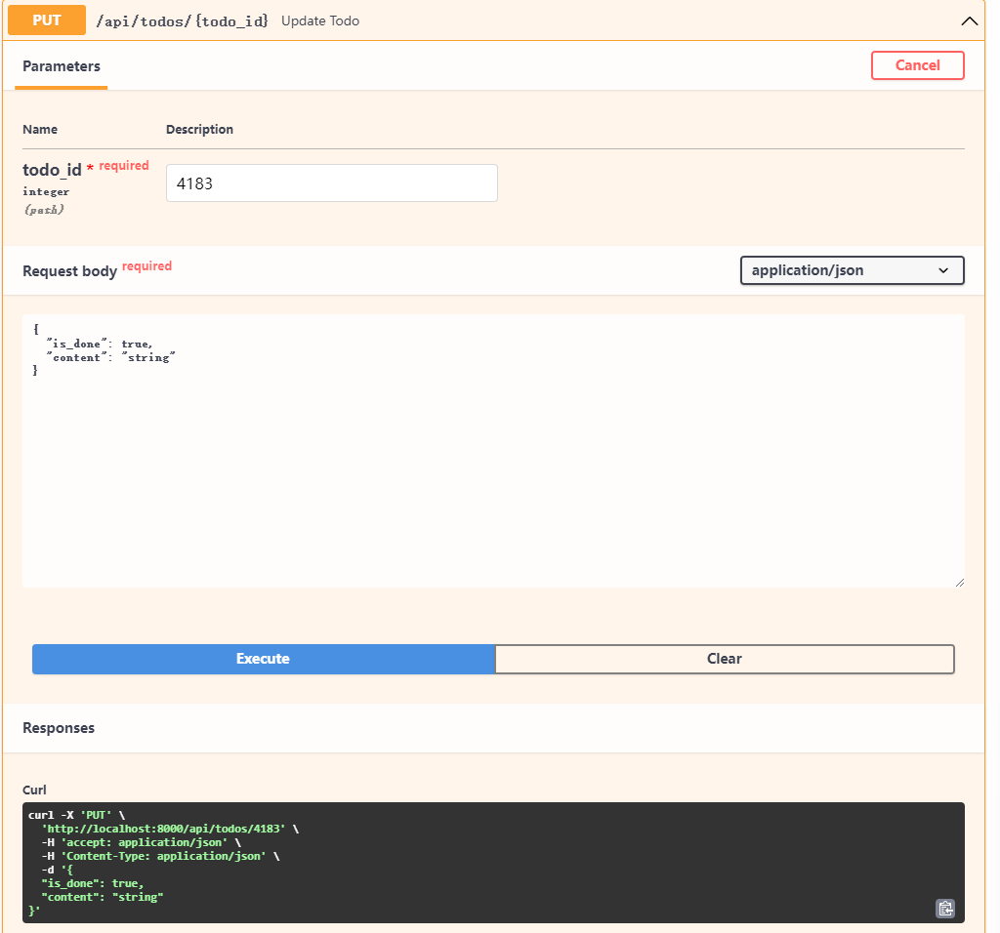
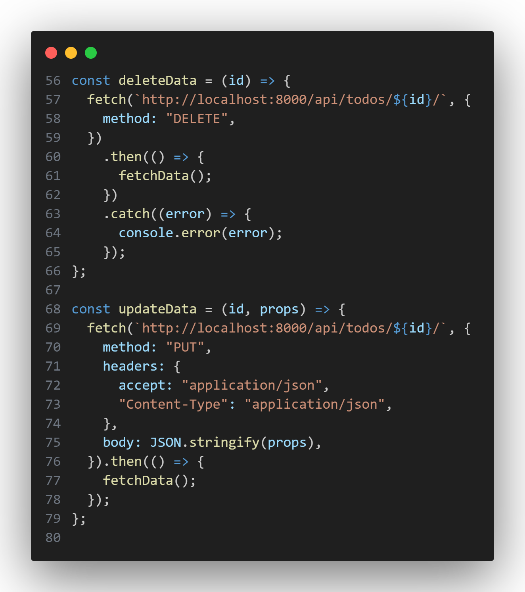
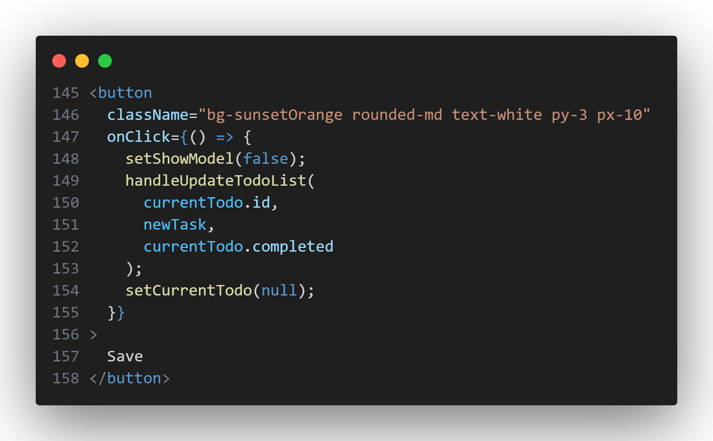
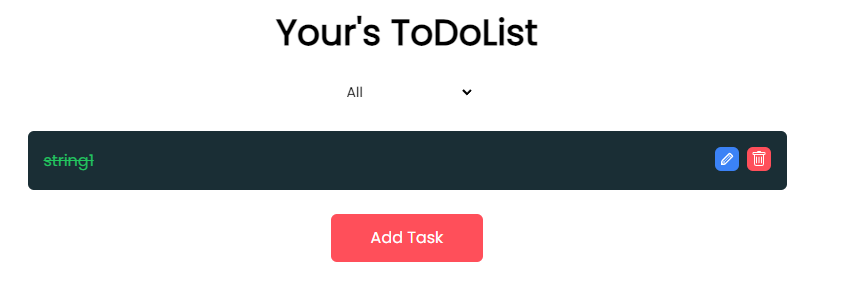
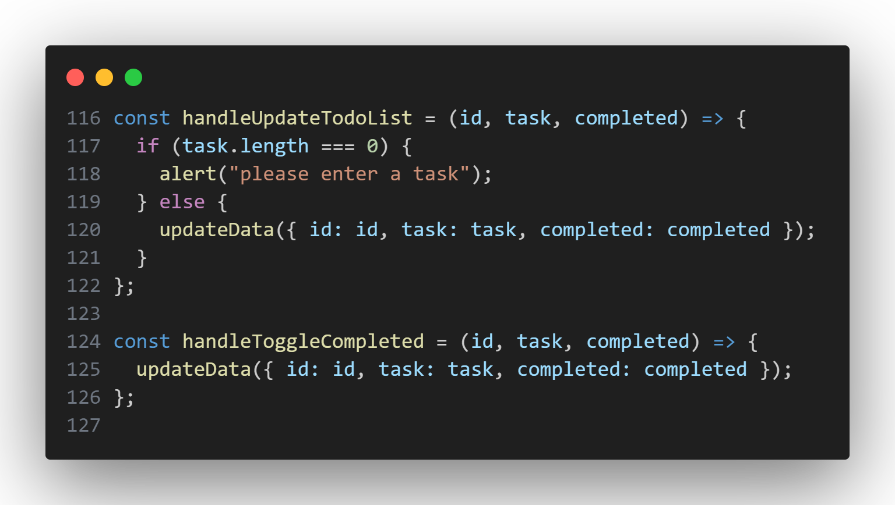
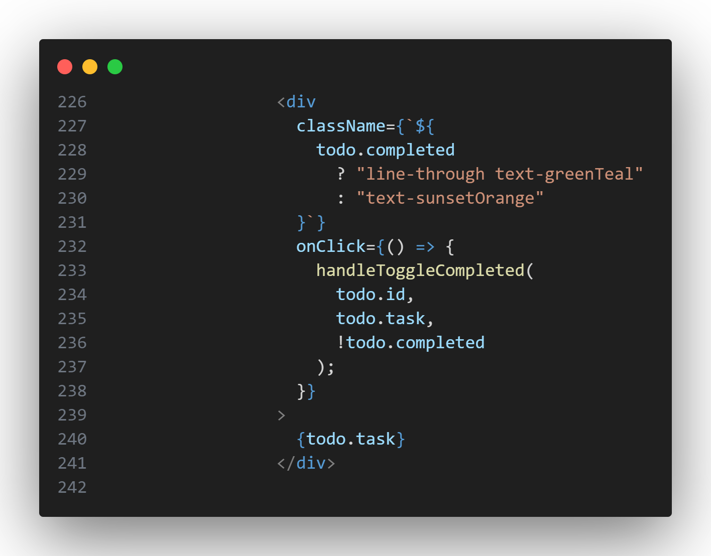
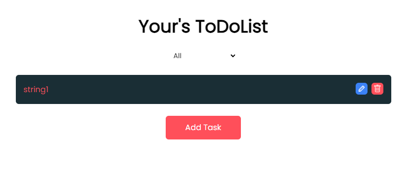

# 添加修改功能

## docs



可以看到使用`PUT`所必须一个ID,以及内容

```bash
curl -X 'PUT' \
  'http://localhost:8000/api/todos/4183' \
  -H 'accept: application/json' \
  -H 'Content-Type: application/json' \
  -d '{
  "is_done": true,
  "content": "string"
}'
```

对应fetch

```jsx
  const updateData = ({ id, task, completed }) => {
    fetch(`http://localhost:8000/api/todos/${id}/`, {
      method: "PUT",
      headers: {
        accept: "application/json",
        "Content-Type": "application/json",
      },
      body: JSON.stringify({
        is_done: completed,
        content: task,
      }),
```

## 添加函数`updateData`

```jsx
  const updateData = ({ id, task, completed }) => {
    fetch(`http://localhost:8000/api/todos/${id}/`, {
      method: "PUT",
      headers: {
        accept: "application/json",
        "Content-Type": "application/json",
      },
      body: JSON.stringify({
        is_done: completed,
        content: task,
      }),
    })
      .then(() => {
        fetchData();
      })
      .catch((error) => {
        console.error(error);
      });
  };

```


这段代码定义了一个名为 `updateData` 的函数，用于向服务器发送一个 PUT 请求，更新具有指定 ID 的待办事项。

函数的执行步骤如下：

1. 使用 `fetch` 函数发起一个 PUT 请求到 `http://localhost:8000/api/todos/${id}/`。`${id}` 会被替换为传入的 ID 值。
2. 在请求中设置了请求方法为 `PUT`，表示更新资源。
3. 在请求的头部设置了请求头，包括 `accept` 和 `Content-Type`。
   - `accept: "application/json"` 表示客户端接受 JSON 格式的响应。
   - `"Content-Type": "application/json"` 表示请求的主体是 JSON 格式。
4. 在请求的主体中，使用 `JSON.stringify` 将传入的对象转换为 JSON 字符串，并作为请求的主体发送到服务器。对象中的 `completed` 和 `task` 属性将分别映射到服务器端的 `is_done` 和 `content` 字段。
5. 在请求的 `then` 方法中，调用 `fetchData` 函数，该函数用于获取更新后的待办事项列表数据。
6. 在 `catch` 方法中，捕获任何可能的错误并输出到控制台。


## 更改函数

当删除按钮被点击时，我们希望触发`updateData`这个函数，所以我们将`handleUpdateTodoList`这个函数

```jsx
  const handleUpdateTodoList = (id, task) => {
    if (task.trim().length === 0) {
      alert("please enter a task");
    } else {
      dispatch(updateTodo({ task: task, id: id }));
    }
  };
```

修改为

```jsx
  const handleUpdateTodoList = (id, task, completed) => {
    if (task.length === 0) {
      alert("please enter a task");
    } else {
      updateData({ id: id, task: task, completed: completed });
    }
  };
```

save按钮的onClick更改为

```jsx
handleUpdateTodoList(
currentTodo.id,
newTask,
currentTodo.completed
);
```



返回网页更改todo，可以看到成功更改



## 更改完成状态

当todolist本身被点击时，我们希望触发`updateData`这个函数，所以我们将`handleToggleCompleted`这个函数修改为

```jsx
  const handleToggleCompleted = (id, task, completed) => {
    updateData({ id: id, task: task, completed: completed });
  };
```



将todolist本身的onClick修改为
```jsx
onClick={() => {
  handleToggleCompleted(
    todo.id,
    todo.task,
    !todo.completed
  );
}}
```



返回网页更改todo的完成状态，可以看到成功更改

