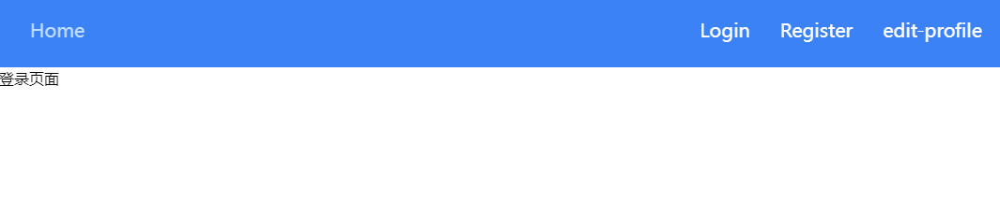
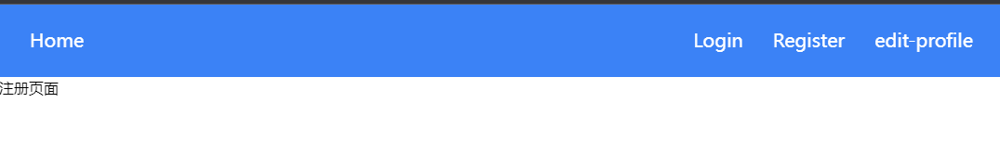
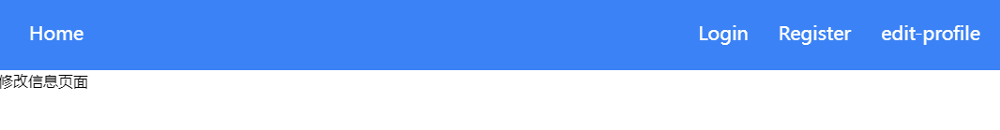

# 创建组件

根据上一章的需求分析，发现我们需要其它几个组件

1. 导航栏
2. 注册页面
3. 登陆页面
4. 修改用户信息页面

## 新建组件

在frontend\src\components目录下新建

frontend\src\components\EditProfilePage.jsx
```jsx
import React from "react";

const EditProfilePage = () => {
  return <div>修改信息页面</div>;
};

export default EditProfilePage;

```

frontend\src\components\LoginPage.jsx
```jsx
import React from "react";

const LoginPage = () => {
  return <div>登录页面</div>;
};

export default LoginPage;

```

frontend\src\components\RegisterPage.jsx
```jsx
import React from "react";

const RegisterPage = () => {
  return <div>注册页面</div>;
};

export default RegisterPage;
```

frontend\src\components\Navbar.jsx
```jsx
import { Link } from "react-router-dom";

function Navbar() {}

export default Navbar;
```
## 修改frontend\src\main.jsx

将其替代为

```jsx
import React from "react";
import ReactDOM from "react-dom/client";
import App from "./App.jsx";
import "./index.css";
import { Provider } from "react-redux";
import store from "./Store/store.jsx";
import { BrowserRouter as Router, Routes, Route } from "react-router-dom";
import Navbar from "./components/Navbar.jsx";
import LoginPage from "./components/LoginPage.jsx";
import RegisterPage from "./components/RegisterPage.jsx";
import EditProfilePage from "./components/EditProfilePage.jsx";

ReactDOM.createRoot(document.getElementById("root")).render(
  <Provider store={store}>
    <Router>
      <Navbar />
      <Routes>
        <Route path="/" element={<LoginPage />} />
        <Route path="/register" element={<RegisterPage />} />
        <Route path="/todo" element={<App />} />
        <Route path="/edit-profile" element={<EditProfilePage />} />
      </Routes>
    </Router>
  </Provider>
);
```

这段代码是一个使用 React Router 和 Redux 的基本应用程序入口文件。它使用了 React 的新的 `ReactDOM.createRoot` 方法来渲染应用程序。

以下是对代码的逐行解释：

```javascript
import React from "react";
import ReactDOM from "react-dom/client";
import App from "./App.jsx";
import "./index.css";
import { Provider } from "react-redux";
import store from "./Store/store.jsx";
import { BrowserRouter as Router, Routes, Route } from "react-router-dom";
import Navbar from "./components/Navbar.jsx";
import LoginPage from "./components/LoginPage.jsx";
import RegisterPage from "./components/RegisterPage.jsx";
import EditProfilePage from "./components/EditProfilePage.jsx";
```

这些是代码中导入的依赖项和组件。

```javascript
ReactDOM.createRoot(document.getElementById("root")).render(
  <Provider store={store}>
    <Router>
      <Navbar />
      <Routes>
        <Route path="/" element={<LoginPage />} />
        <Route path="/register" element={<RegisterPage />} />
        <Route path="/todo" element={<App />} />
        <Route path="/edit-profile" element={<EditProfilePage />} />
      </Routes>
    </Router>
  </Provider>
);
```

在这里，通过 `ReactDOM.createRoot` 方法创建了根节点，并使用 `.render` 方法渲染了整个应用程序。

- `<Provider store={store}>` 用于将 Redux 的 `store` 提供给应用程序的组件。
- `<Router>` 是根路由器，用于管理整个应用程序的路由。
- `<Navbar />` 是一个导航栏组件，用于显示应用程序的导航菜单。
- `<Routes>` 是路由器的子组件，用于定义应用程序的路由配置。
- `<Route>` 定义了一个特定的路由规则，指定了 URL 路径和相应的组件。
- `element` 属性指定了与路由匹配时要渲染的组件。

这段代码将不同路径下的 URL 映射到不同的组件，例如 `/` 对应 `<LoginPage />` 组件，`/register` 对应 `<RegisterPage />` 组件等。

请注意，这只是一个示例代码，实际的应用程序可能会有更多的组件和路由配置。你可以根据你的需求进行修改和扩展。

## 更改导航栏

```jsx
import { Link } from "react-router-dom";

function Navbar() {
  return (
    <nav className="flex items-center justify-between p-6 bg-blue-500 border border-blue-500">
      <div>
        <ul className="flex space-x-4">
          <li>
            <Link
              to="/todo"
              className="px-2 py-1 text-xl text-white  hover:border-transparent hover:text-blue-200"
            >
              Home
            </Link>
          </li>
        </ul>
      </div>
      <div>
        <ul className="flex space-x-4">
          <li>
            <Link
              to="/"
              className="px-2 py-1 text-xl text-white  hover:border-transparent hover:text-blue-200"
            >
              Login
            </Link>
          </li>
          <li>
            <Link
              to="/register"
              className="px-2 py-1 text-xl text-white  hover:border-transparent hover:text-blue-200"
            >
              Register
            </Link>
          </li>
          <li>
            <Link
              to="/edit-profile"
              className="px-2 py-1 text-xl text-white  hover:border-transparent hover:text-blue-200"
            >
              edit-profile
            </Link>
          </li>
        </ul>
      </div>
    </nav>
  );
}

export default Navbar;
```

此时打开页面可以看到







