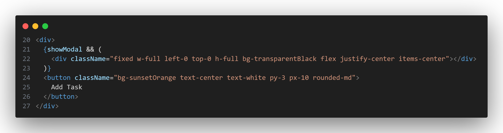
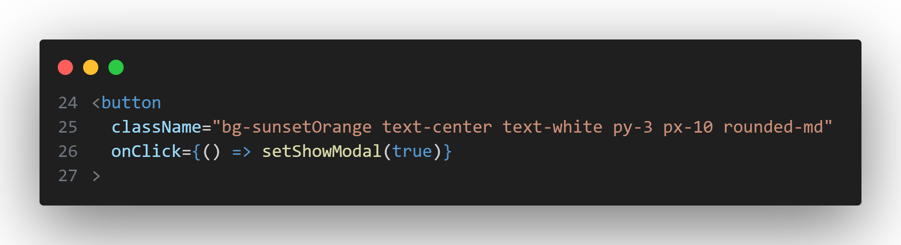
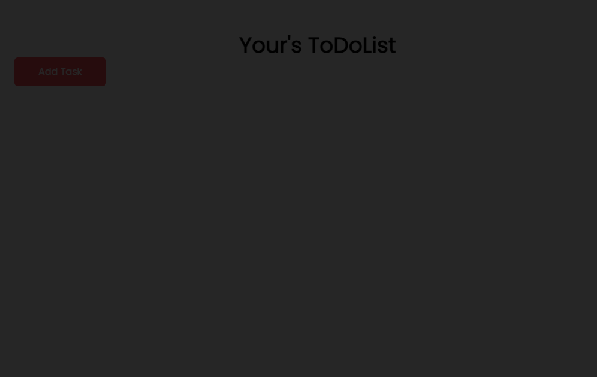
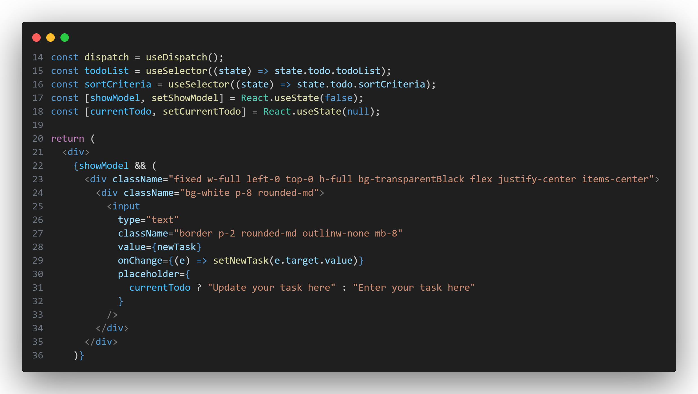
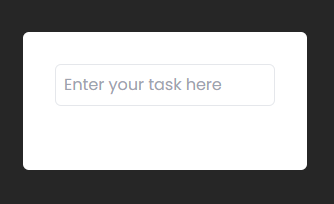
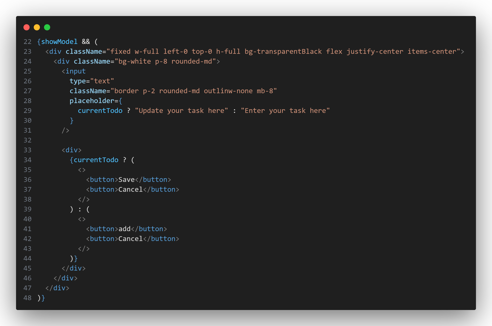
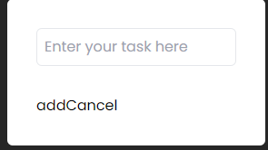
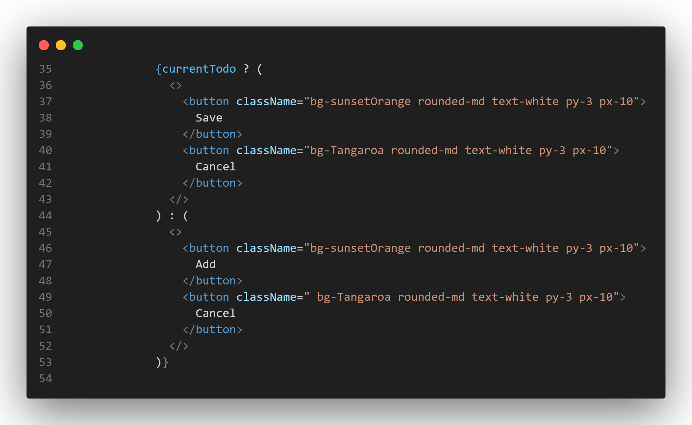
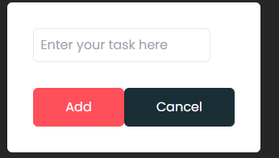
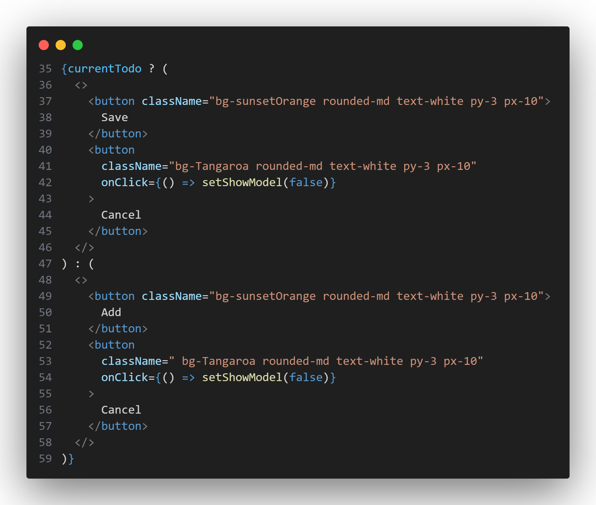

# 完成Add Task按钮

接下来我们需要为Add Task按钮添加点击动作，当点击Add Task按钮后，会跳出一个输入框，可以添加todolist。

## 设置跳出输入框时的背景

1. 首先在return语句的最外层添加`<div>`,在`<div>`中添加一个条件渲染，具体内容为
   ```jsx
      {showModel && (
        <div className="fixed w-full left-0 top-0 h-full bg-transparentBlack flex justify-center items-center"></div>
      )}
   ```

   

2. 在Add Task的button中绑定点击事件处理函数

   ```jsx
   onClick={() => setShowModel(true)}
   ```

   

   回到网页，当点击Add Task按钮后，整体变暗

   

## 设置跳出输入框时以及保存以及取消按钮

1. 在这个条件渲染所处的div下增加一个输入框
   添加
   ```jsx
  const [currentTodo, setCurrentTodo] = React.useState(null);
   ```
    这段代码定义了一个名为 `currentTodo` 的状态变量，并通过 `setCurrentTodo` 方法来更新该变量的值。

    `currentTodo`的用途下面会讲

    添加
    ```jsx
    <div className="bg-white p-8 rounded-md">
        <input
            type="text"
            className="border p-2 rounded-md outlinw-none mb-8"
            placeholder={
            currentTodo ? "Update your task here" : "Enter your task here"
            }
        />
    </div>
    ```
    

    在网页上查看，点击Add Task按钮后出现

    

2. 在此之后，再次用条件渲染添加两组按钮

    ```jsx
    <div>
        {currentTodo ? (
            <>
            <button>Save</button>
            <button>Cancel</button>
            </>
        ) : (
            <>
            <button>add</button>
            <button>Cancel</button>
            </>
        )}
    </div>
    ```

    

    其中Save,Cancel这组按钮下面会讲

    打开网页，点击Add Task按钮后出现

    

3. 因为这两个按钮过于丑陋，因此增加css样式

    ```jsx
    <div className="flex justify-between">
    {currentTodo ? (
    <>
        <button className="bg-sunsetOrange rounded-md text-white py-3 px-10">
        Save
        </button>
        <button className="bg-Tangaroa rounded-md text-white py-3 px-10">
        Cancel
        </button>
    </>
    ) : (
    <>
        <button className="bg-sunsetOrange rounded-md text-white py-3 px-10">
        Add
        </button>
        <button className=" bg-Tangaroa rounded-md text-white py-3 px-10">
        Cancel
        </button>
    </>
    )}
    </div>
    ```
    

    打开网页，点击Add Task按钮后出现
    

4. 接下来为这四个按钮添加逻辑，当被cancel按钮被点击时，隐藏输入框

    ```jsx
    onClick={() => setShowModel(false)}
    ```

    

    可以回到网页验证是否隐藏

## 总结

通过逻辑渲染以及`onClick`可以控制是否显示输入框


