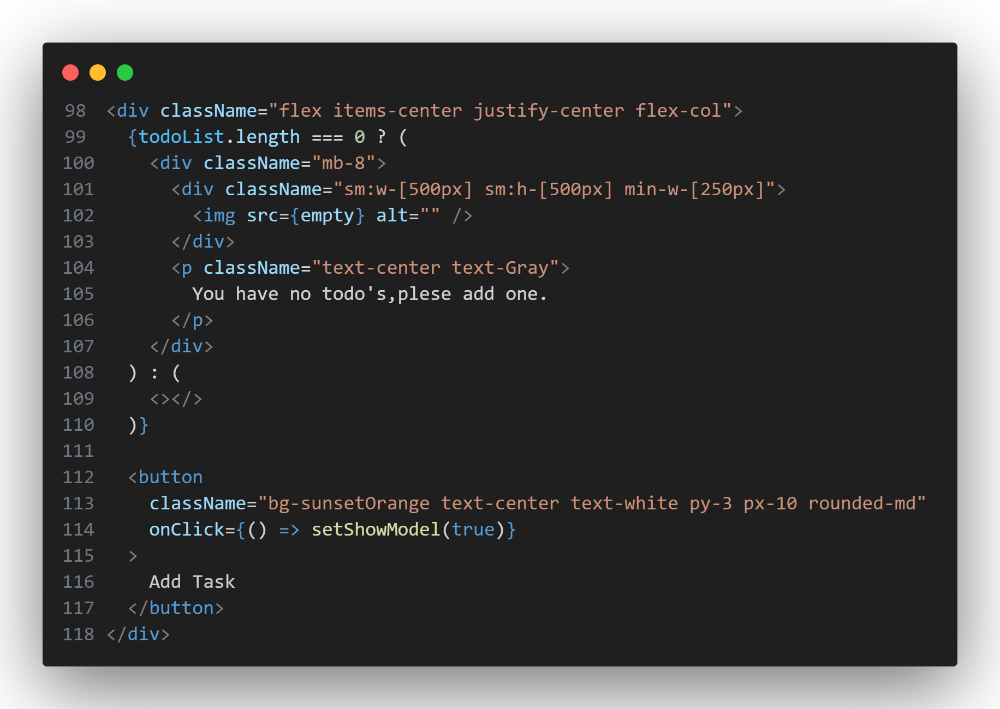
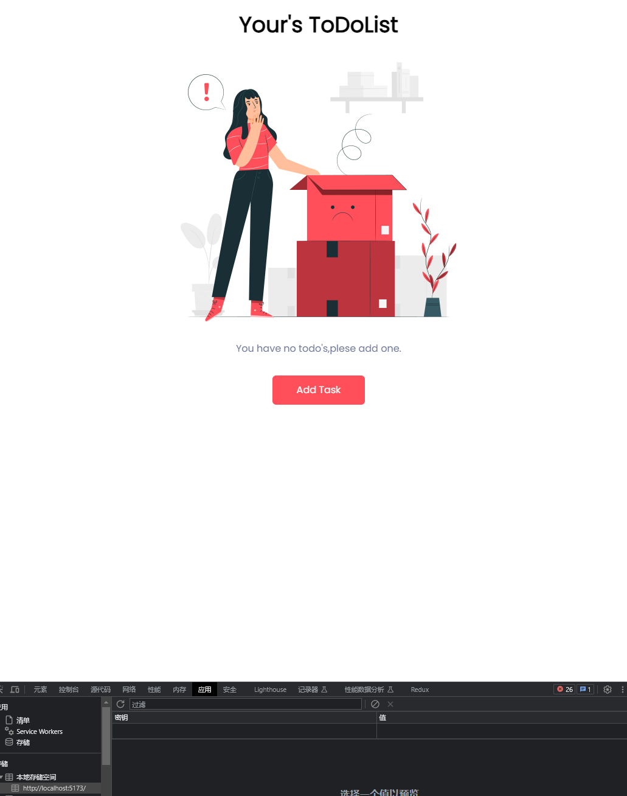

# 增加`todoList`为空的页面

## 增加图片作为背景

在"Add Task"的按钮上方添加并替换
```jsx
<div className="flex items-center justify-center flex-col">
{todoList.length === 0 ? (
    <div className="mb-8">
    <div className="sm:w-[500px] sm:h-[500px] min-w-[250px]">
        
    </div>
    <p className="text-center text-Gray">
        You have no todo's,plese add one.
    </p>
    </div>
) : (
    <></>//之后会填写
)}

<button
    className="bg-sunsetOrange text-center text-white py-3 px-10 rounded-md"
    onClick={() => setShowModel(true)}
>
    Add Task
</button>
</div>
```


这段代码是一个条件渲染的示例。它根据 `todoList` 的长度来决定渲染不同的内容。

如果 `todoList` 的长度为 0，即没有待办事项，那么将渲染一个包含图片和提示信息的区块，告诉用户没有待办事项并提示添加。如果 `todoList` 的长度大于 0，即有待办事项，其中的具体内容接下来讲。

这段代码使用了 Flex 布局，并根据条件渲染不同的内容，以提供不同的用户反馈。如果 `todoList` 的长度为 0，将显示一个空白区块和提示信息；


可以看到，当`todoList`为空时，显示了一张图片,以及提示信息