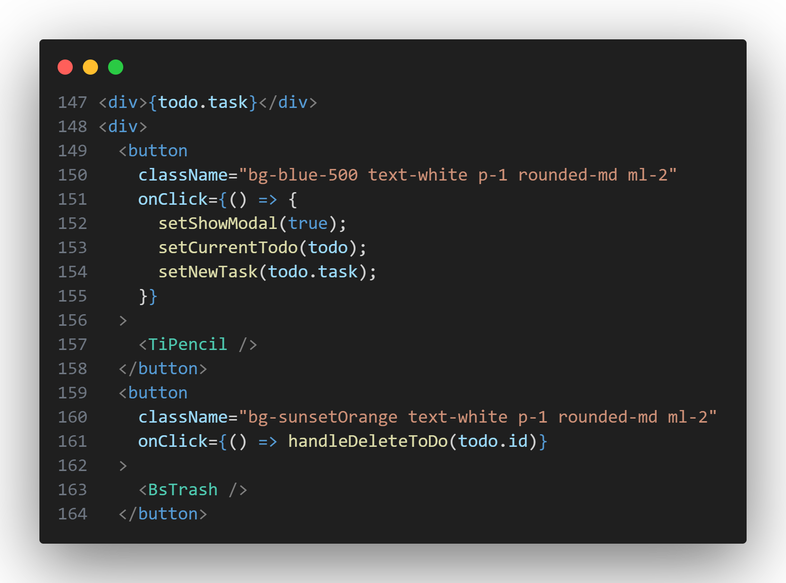
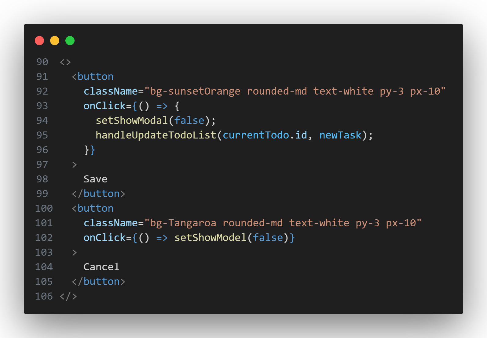
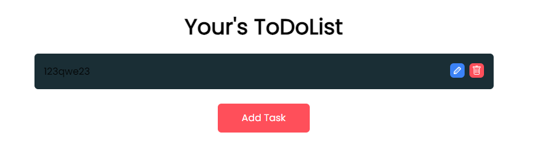
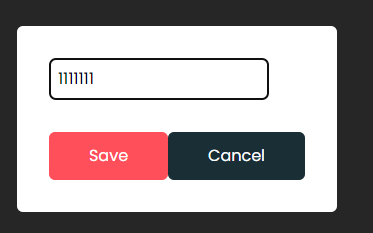
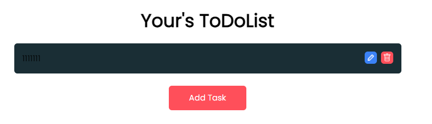

# 增加修改功能

## 创建被点击后执行的函数

```jsx
  const handleUpdateTodoList = (id, task) => {
    if (task.trim().length === 0) {
      alert("please enter a task");
    } else {
      dispatch(updateTodo({ task: task, id: id }));
    }
  };
```

这段代码定义了 `handleUpdateTodoList` 函数，用于更新待办事项的任务内容。

函数接受两个参数：`id` 表示待办事项的唯一标识符，`task` 表示待办事项的新任务内容。

在函数体内，首先检查新的任务内容是否为空，如果为空则弹出警告提示。

如果新的任务内容不为空，就通过 `dispatch` 函数触发 `updateTodo` action，并传递一个包含任务内容和待办事项的 `id` 的对象作为 payload。

最后，设置 `setShowModal` 状态为 `false`，关闭模态框。

通过调用 `handleUpdateTodoList` 函数并传递待办事项的 `id` 和新的任务内容，即可更新对应的待办事项。

## 添加onClick

在"修改"按钮添加
```jsx
onClick={() => {
    setShowModel(true);
    setCurrentTodo(todo);
    setNewTask(todo.task);
}}
```




当这个按钮被点击时，首先弹出输入框，然后将这一栏的`todolist`保存到`CurrentTodo`,再将输入框内显示的`newTask`更新为这一栏的`todolist`中的内容

在Save按钮添加
```jsx
onClick={() => {
    setShowModel(false);
    handleUpdateTodoList(currentTodo.id, newTask);
    setCurrentTodo(null);
}}
```



当`CurrentTodo`不为空时，输入框中的按钮为`Save`和`Cancel`,当点击`Save`时，关闭输入框，调用函数`handleUpdateTodoList`,并将`CurrentTodo`设置为null，若不设置，则当点击`Add Task`按钮时，跳出的输入框的按钮仍为`Save`和`Cancel`而非`Add`和`Cancel`

在与`Save`同一栏的`Cancel`按钮的onClick中添加

```jsx
onClick={() => {
    setShowModal(false);
    setNewTask("");
    setCurrentTodo(null);
}}
```

当点击`Cancel`按钮时，若不设置`NewTask`为""，则下一次打开输入框，其内容仍然保存。添加代码`setCurrentTodo(null)`的原因与上面相同

## 网页中的修改演示







## 总结

通过创建`handleUpdateTodoList`函数，修改对应id的todolist，并调用 `dispatch` 函数触发 `updateTodo` action。当点击修改按钮时，触发`setCurrentTodo(todo);`函数，让`CurrentTodo`设置成这一行的todo的值，因为`CurrentTodo`不为空，所以输入框显示`Save`和`Cancel`按钮，点击`Save`按钮，触发`handleUpdateTodoList(currentTodo.id, newTask);`函数，更改对应ID的todolist值。