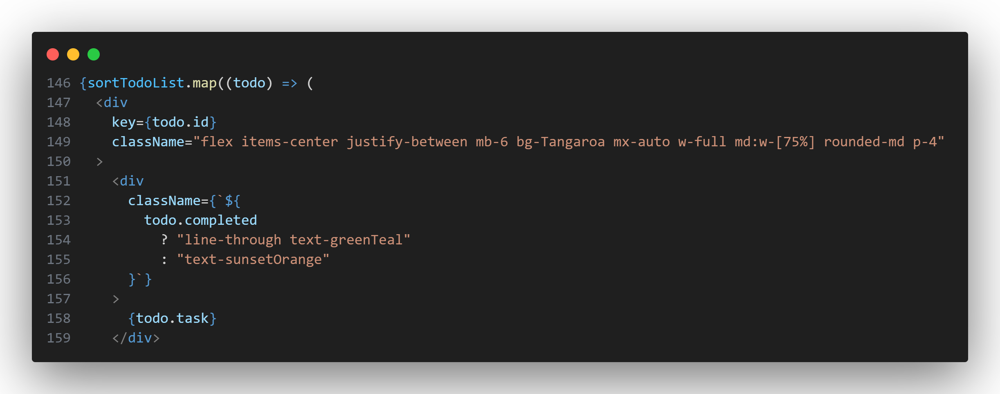
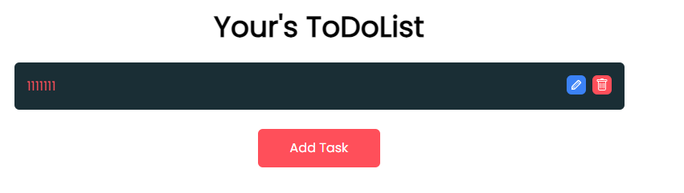
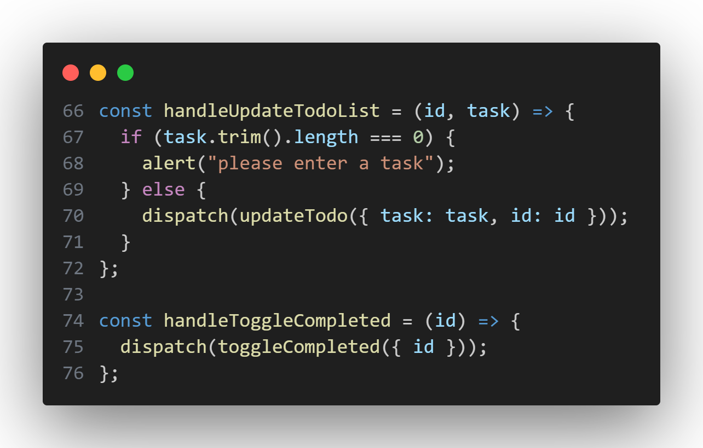
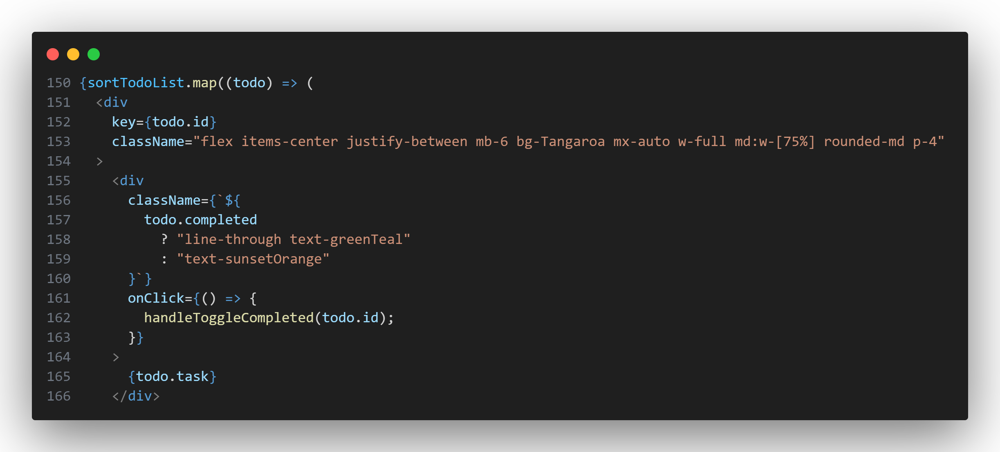
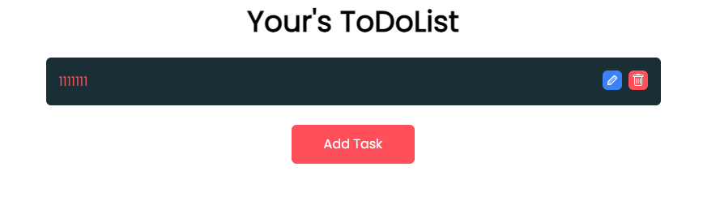
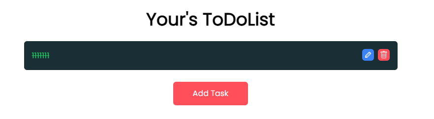
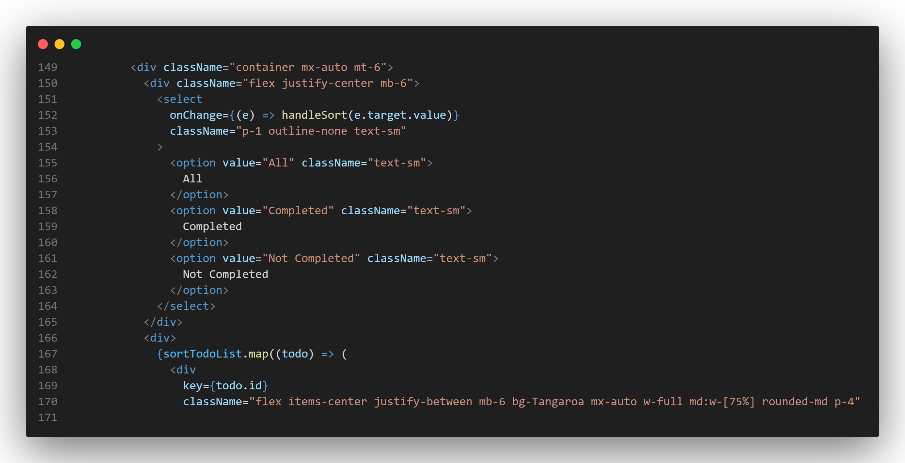
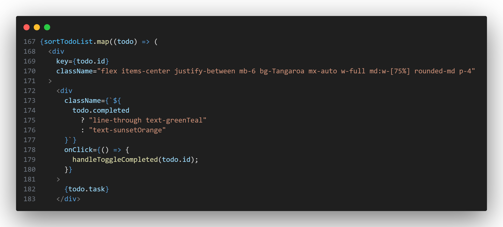

# 增加筛选功能

## 修改字体

在网页中可以看到字体不是很明显，

所以增加点css样式

```jsx
className={`${
todo.completed
    ? "line-through text-greenTeal"
    : "text-sunsetOrange"
}`}
```




这段代码根据待办事项的 `completed` 属性动态设置类名，从而实现不同样式的显示效果。

如果待办事项的 `completed` 属性为 `true`，即已完成状态，那么应用的类名为 `"line-through text-greenTeal"`，其中 `"line-through"` 为 CSS 属性，用于添加删除线样式，`"text-greenTeal"` 为文本颜色样式，用于设置文本颜色为绿蓝色。

如果待办事项的 `completed` 属性为 `false`，即未完成状态，那么应用的类名为 `"text-sunsetOrange"`，其中 `"text-sunsetOrange"` 为文本颜色样式，用于设置文本颜色为日落橙色。

通过根据待办事项的状态动态设置类名，可以实现根据不同状态展示不同样式的效果，例如已完成的待办事项显示为删除线文本，未完成的待办事项显示为正常文本。



## 增加改变completed状态的函数

```jsx
  const handleToggleCompleted = (id) => {
    dispatch(toggleCompleted({ id }));
  };
```



这段代码是用来切换待办事项的完成状态。当用户点击待办事项时，`handleToggleCompleted` 函数会被调用，它会触发 `toggleCompleted` action，并传递待办事项的 ID。
```jsx
toggleCompleted: (state, action) => {
    const { id } = action.payload;
    const index = state.todoList.findIndex((todo) => todo.id === id);
    state.todoList[index].completed = !state.todoList[index].completed;
}
```
在 reducer 中，`toggleCompleted` reducer 接收到该 action 后，会根据传递的待办事项的 ID，找到对应的待办事项在状态树中的位置，然后切换该待办事项的 `completed` 属性的值，从而实现完成状态的切换。

这样，通过调用 `handleToggleCompleted` 函数，可以在界面上切换待办事项的完成状态。

## 添加onClick

我们想要点击todolist时，让该todolist变成已完成的状态，所以要增加一个`onClick`函数

```jsx
onClick={() => {
    handleToggleCompleted(todo.id);
}}
```



点击前



点击后



## 通过添加下拉框来筛选完成与未完成的todolist

首先用一个`<div>`包含"todolist内容，删除与修改按钮"，即
```jsx
<div className="container mx-auto mt-6">
<div>
    {sortTodoList.map((todo) => (
    <div
        key={todo.id}
        className="flex items-center justify-between mb-6 bg-Tangaroa mx-auto w-full md:w-[75%] rounded-md p-4"
    >
        <div
        className={`${
            todo.completed
            ? "line-through text-greenTeal"
            : "text-sunsetOrange"
        }`}
        onClick={() => {
            handleToggleCompleted(todo.id);
        }}
        >
        {todo.task}
        </div>
        <div>
        <button
            className="bg-blue-500 text-white p-1 rounded-md ml-2"
            onClick={() => {
            setShowModel(true);
            setCurrentTodo(todo);
            setNewTask(todo.task);
            }}
        >
            <TiPencil />
        </button>
        <button
            className="bg-sunsetOrange text-white p-1 rounded-md ml-2"
            onClick={() => handleDeleteToDo(todo.id)}
        >
            <BsTrash />
        </button>
        </div>
    </div>
    ))}
</div>
</div>
```

然后在`<div className="container mx-auto mt-6">`与新增的`<div>`之间新增一个下拉框代码
```jsx
<div className="flex justify-center mb-6">
    <select
    onChange={(e) => handleSort(e.target.value)}
    className="p-1 outline-none text-sm"
    >
    <option value="All" className="text-sm">
        All
    </option>
    <option value="Completed" className="text-sm">
        Completed
    </option>
    <option value="Not Completed" className="text-sm">
        Not Completed
    </option>
    </select>
</div>
```


这段代码创建了一个下拉选择框，用于对待办事项列表进行排序。当用户选择不同的选项时，会触发 `handleSort` 函数，并将选中的值作为参数传递给该函数。

选择框中有三个选项：All、Completed 和 Not Completed。每个选项都设置了对应的值（"All"、"Completed"、"Not Completed"）和类名（"text-sm"），用于指定选项的样式。当用户选择一个选项时，会触发 `onChange` 事件，并将选中的值传递给 `handleSort` 函数进行处理。

通过这个下拉选择框，用户可以根据不同的选项对待办事项列表进行排序，从而方便地查看全部、已完成或未完成的任务。

## 总结
当点击todolist的内容时，会改变其css样式，即红色与绿色并带有删除线，还会改变其`Completed`状态，当选择下拉框的选项的时候，会更改`sortCriteria`状态
```jsx
  const sortTodoList = todoList.filter((todo) => {
    if (sortCriteria === "All") return true;
    if (sortCriteria === "Completed" && todo.completed) return true;
    if (sortCriteria === "Not Completed" && !todo.completed) return true;
    return false;
  });
```
此时，通过`sortCriteria`与`todo.completed`的判断，筛选出一个我们想要的数组

再通过`map`函数，显示出想要的选项。