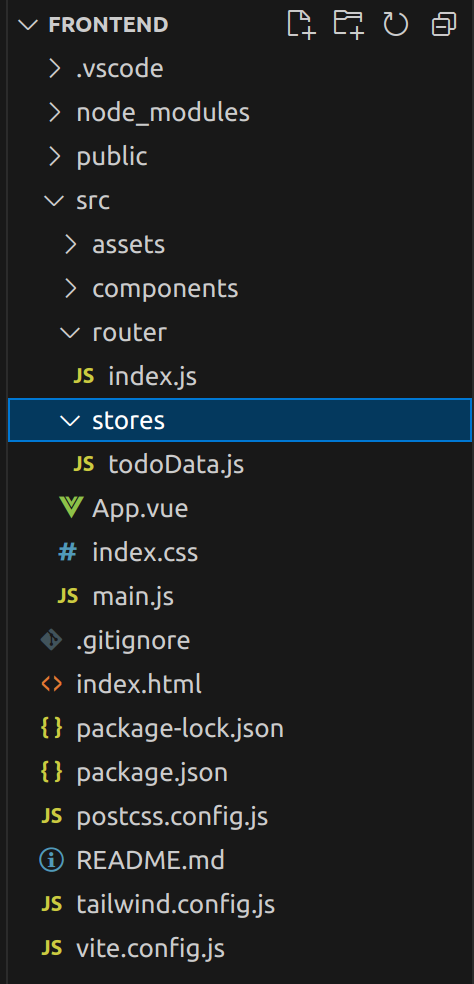
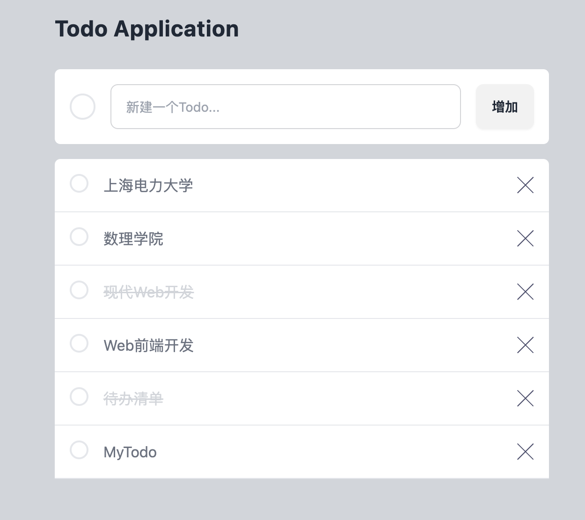

# 状态管理和事件处理


## 什么是状态？

理论上来说，每一个 Vue 组件实例都已经在“管理”它自己的响应式状态了。
我们以一个简单的计数器组件为例：


```html
<script setup>
import { ref } from 'vue'

// 状态
const count = ref(0)

// 动作
function increment() {
  count.value++
}
</script>

<!-- 视图 -->
<template>{{ count }}</template>
```

它是一个独立的单元，由以下几个部分组成：

- 状态：驱动整个应用的数据源；
- 视图：对状态的一种声明式映射；
- 交互：状态根据用户在视图中的输入而作出相应变更的可能方式。

下面是“单向数据流”这一概念的简单图示：


然而，当我们有多个组件共享一个共同的状态时，就没有这么简单了：

1. 多个视图可能都依赖于同一份状态。
2. 来自不同视图的交互也可能需要更改同一份状态。

对于情景 1，一个可行的办法是将共享状态“提升”到共同的祖先组件上去，再通过 props 传递下来。
然而在深层次的组件树结构中这么做的话，很快就会使得代码变得繁琐冗长。
这会导致另一个问题：Prop 逐级透传问题。

对于情景 2，我们经常发现自己会直接通过模板引用获取父/子实例，
或者通过触发的事件尝试改变和同步多个状态的副本。
但这些模式的健壮性都不甚理想，很容易就会导致代码难以维护。

一个更简单直接的解决方案是抽取出组件间的共享状态，放在一个全局单例中来管理。这样我们的组件树就变成了一个大的“视图”，而任何位置上的组件都可以访问其中的状态或触发动作。

## pinia

Pinia 就是一个实现了上述需求的状态管理库，由 Vue 核心团队维护，对 Vue 2 和 Vue 3 都可用。

现有用户可能对 Vuex 更熟悉，它是 Vue 之前的官方状态管理库。由于 Pinia 在生态系统中能够承担相同的职责且能做得更好，因此 Vuex 现在处于维护模式。它仍然可以工作，但不再接受新的功能。对于新的应用，建议使用 Pinia。

[pinia官网地址](https://pinia.vuejs.org/zh/introduction.html)

Pinia安装如下，在命令行中输入

```bash
npm install pinia
```

## 如何使用 `pinia`

为了使用`pinia`这个插件，我们需要先挂载它

在```src\main.js```中输入以下代码

```js
import { createApp } from 'vue'
import './style.css'
import App from './App.vue'
import { createPinia } from "pinia"

const app = createApp(App);
app.use(createPinia());
app.mount('#app');
```
<!-- TODO:解释何为插件，怎么使用 -->

:::tip

`app.use(createPinia())` 初始化了 Pinia 状态管理系统，使其可在Vue应用中使用。

`app.mount("#app")` 将整个Vue应用挂载到HTML文档中ID为 "app" 的元素上。

这确保了Pinia状态管理系统能够管理Vue应用的状态，并且Vue应用能够正确地在指定的HTML元素上启动。

这是在Vue.js应用中使用插件的方式。在Vue.js中，插件是一种扩展应用功能的方式，可以在应用中全局注册插件以提供额外的特性或功能。，`createPinia` 函数用于创建一个 Pinia 的状态管理实例，并通过 `app.use(createPinia())` 将其注册为Vue.js应用的插件。

使用插件的方式，可以使应用具有额外的功能或能力，而不必在每个组件中重复配置相同的逻辑。

:::

我们需要定义一个全局的状态管理器，用来在整个 Vue.js 应用中使用 

在```/src```文件夹下新建```stores```文件夹,在store文件夹下新建```todoData.js```文件

:::tip
将相关的代码组织到单独的文件夹中，这样可以更容易地查找和管理相关的代码。

todoData.js 文件被放置在 stores 文件夹中，表明它包含与状态管理有关的代码。

Todo.vue 文件被放置在 components 文件夹内，表明它是组件。
:::



在```src\stores\todoData.js```写入代码

```js
import { defineStore } from "pinia";

export const useTodoDataStore = defineStore("todoData", {
  state: () => ({
    todoList: [
      {
        id: 1,
        content: "上海电力大学",
        isDone: false,
      },
      {
        id: 2,
        content: "数理学院",
        isDone: false,
      },
      {
        id: 3,
        content: "现代Web开发",
        isDone: true,
      },
      {
        id: 4,
        content: "Web前端开发",
        isDone: false,
      },
      {
        id: 5,
        content: "待办清单",
        isDone: true,
      },
    ],
  }),
  getters: { allTodos: (state) => state.todoList },
  actions: {},
});

```

这段代码使用 `Pinia`，它是一个 Vue.js 的状态管理库,在这个代码中，通过 `defineStore` 函数创建了一个名为 `useTodoDataStore` 的状态管理仓库。

1. **state:**
   在 Pinia 中，`state` 是用于存储数据的地方。`state` 函数返回一个对象，其中包含一个名为 `todoList` 的数组。这个数组存储了待办事项的信息，每个事项是一个包含 `id`、`content` 和 `isDone` 属性的对象。

   ```javascript
   state: () => ({
     todoList: [
       // ... todo items ...
     ],
   }),
   ```

2. **getters:**
   `getters` 允许你在仓库中计算派生状态或对 `state` 进行一些逻辑操作。在这个例子中，定义了一个名为 `allTodos` 的 getter 函数，它返回当前存储在 `state` 中的所有待办事项。

   ```javascript
   getters: { 
     allTodos: (state) => state.todoList 
   },
   ```

3. **actions:**
   `actions` 是用于处理异步逻辑或对 `state` 进行更改的地方。在这个例子中，`actions` 没有被定义，因此在这个仓库中没有异步操作或对 `state` 的更改逻辑。

   ```javascript
   actions: {},
   ```

这个 `Pinia` 仓库用于管理应用程序中的待办事项数据。`state` 存储数据，
`getters` 提供对数据的访问，而 `actions` 可以在需要时执行一些逻辑操作。
在应用中，你可以使用 `useTodoDataStore` 来访问或更改待办事项的状态。

有了状态管理后，我们需要改进先前的代码，使用pinia来管理状态。

我们可以将 `src/components/TodoList.vue` 的代码更改成如下:

```html showLineNumbers title="src/components/TodoList.vue"
<script setup>
import TodoItem from "./TodoItem.vue";
import { useTodoDataStore } from "../stores/todoData";
const todoData = useTodoDataStore();
const todos = todoData.allTodos;
</script>
<template>
  <div 
    class="mt-4 rounded-t-md bg-white transition-all duration-75"
  >
    <div v-for="todo in todos" :key="todo.id">
      <TodoItem :todo="todo"/>
    </div>
  </div>
</template>
<style></style>
```

此时网页效果没有改变，这说明已经成功使用pinia。


## Web页面新增一个Todo

接下来我们要完成"添加Todo的功能"，首先现在pinia增加`actions`,这是接下来需要调用的函数。

在``src\stores\todoData.js``中写入代码
```js
import { defineStore } from "pinia";

export const useTodoDataStore = defineStore("todoData", {
  state: () => ({
    todoList: [
      {
        id: 1,
        content: "上海电力大学",
        isDone: false,
      },
      {
        id: 2,
        content: "数理学院",
        isDone: false,
      },
      {
        id: 3,
        content: "现代Web开发",
        isDone: true,
      },
      {
        id: 4,
        content: "Web前端开发",
        isDone: false,
      },
      {
        id: 5,
        content: "待办清单",
        isDone: true,
      },
    ],
  }),
  getters: { allTodos: (state) => state.todoList },
  actions: {
    addTodo(content) {
      const newTodo = {
        id: this.todoList.length + 1,
        content: content,
        isDone: false,
      };
      this.todoList.push(newTodo);
    },
  },
});
```

我们的目标是完成一个输入框，一个确认按钮，当点击时，调用`addTodo`函数，
将输入框输入的内容添加到`todoList`这个状态里，然后设置输入框的内容为空，
因为`todoList`这个状态更新了，
所以网页的内容更新了。

我们可以将 `src/components/TodoCreate.vue` 的代码更改成如下:

```html showLineNumbers title="src/components/TodoCreate.vue"
<script setup>
import { useTodoDataStore } from '../stores/todoData';
import { ref } from 'vue';

const inputValue = ref("");

const todoData = useTodoDataStore();

const addTodo = () => {
  todoData.addTodo(inputValue.value);
  inputValue.value = ""
}

</script>
<template>
  <form
    v-on:submit.prevent="addTodo"
    class="mt-7 flex items-center gap-4 overflow-hidden rounded-md bg-white p-4 transition-all duration-700"
  >
    <span
      class="inline-block h-7 w-7 rounded-full border-2 transition-all duration-700"
    ></span>

    <input
      v-model="inputValue"
      type="text"
      placeholder="新建一个Todo..."
      class="input input-bordered input-md w-96"
    />
    <button class="btn">增加</button>
  </form>
</template>
<style></style>
```
在输入框输入`mytodo`可以看到



- `v-on:submit.prevent="addTodo"` 指令在调用 addTodo 函数的同时，阻止表单的默认提交行为（默认行为会刷新页面）
- `v-model="inputValue` 这个输入框使用 `v-model` 绑定到 `inputValue`，所以它的值会始终与 `inputValue` 同步