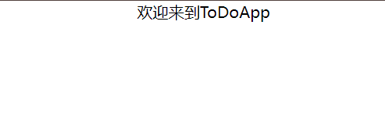
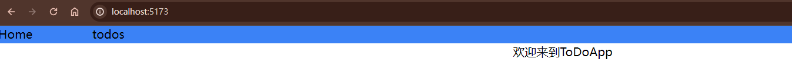
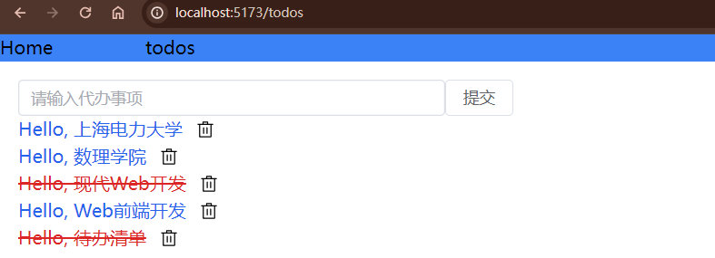

# 路由

接下来，我们想要增加一个登陆注册的功能，这将是一个单独的页面，那么如何访问这个页面呢？我们将引入一个叫做[路由](https://router.vuejs.org/zh/introduction.html)的概念。

## 什么是路由

路由（Routing）是指在应用程序中，根据用户访问的 URL 地址，将不同的页面或视图组件进行匹配和展示的机制。在前端应用中，路由的主要目的是根据用户的导航行为，动态地加载和渲染相应的视图，而不需要整页刷新。

在单页面应用（Single Page Application，SPA）中，页面的切换是通过路由来实现的，而不是通过传统的方式进行整个页面的刷新。这样可以提升用户体验，减少页面刷新的延迟，并允许在不同的页面之间保持一些状态。

## 路由的安装

```bash
npm install vue-router@4
```

## 路由的使用

一般的项目中,`App.vue`这个文件是作为应用的主要组件，该组件包含应用的布局和结构。因为我们要增加路由，所以应该对原本已经完成的"TODO"功能进行组件化，再用路由对其进行加载。


### 组件化

接下来我们将对`App.vue`中的功能转移到一个组件中。

新建文件`src\components\Todos.vue`，在其中写入

```vue
<script setup>
import Todo from "./Todo.vue";
import { useTodoDataStore } from "../stores/todoData";
import { ref } from "vue";
const input = ref("");
const todoData = useTodoDataStore();

const todoList = todoData.allTodos;
const addTodo = todoData.addTodo;
const deleteTodo = todoData.deleteTodo;
const changeIsDone = todoData.changeIsDone;

const AddTodo = () => {
  addTodo(input.value);
  input.value = "";
};

const DeleteTodo = (id) => {
  deleteTodo(id);
};

const ChangeIsDone = (id) => {
  changeIsDone(id);
};
</script>

<template>
  <div class="bg-white text-black p-4">
    <el-row>
      <el-col :span="6">
        <el-input v-model="input" placeholder="请输入代办事项" />
      </el-col>
      <el-button @click="AddTodo">提交</el-button>
    </el-row>

    <el-row v-for="todo in todoList" :key="todo.id" class="items-center space-x-3">
      <div @click="() => ChangeIsDone(todo.id)">
        <Todo :todo="todo" />
      </div>
      <el-icon size="16" class="center">
        <Delete @click="() => DeleteTodo(todo.id)" />
      </el-icon>
    </el-row>
  </div>
</template>
```
可以发现，只有`setup`中的import的路径发生了改变。

接下来打开`APP.vue`，写入
```vue
<script setup>
import Todos from "./components/Todos.vue";
</script>

<template>
  <Todos />
</template>
```
这样我们就完成了调用，打开浏览器可以发现，没有任何变化。

### 添加另一个组件

因为当我们有多个页面的时候才体现出路由的用处，所以我们新建一个组件。

新建文件`src\components\Welcome.vue`,写入

```vue
<template>
  <div class="items-center text-center">欢迎来到ToDoApp</div>
</template>
```

在`src\App.vue`中测试下

```vue
<script setup>
import Welcome from "./components/Welcome.vue";
</script>

<template>
  <Welcome />
</template>
```



可以看见，浏览器的上方有我们的组件。

### 添加路由

此时我们有两个页面，可以用路由进行切换。

首先新建文件夹`src\router`,这是我们存放路由代码的地方，接下来新建文件`src\router\index.js`,在其中写入

```vue
import { createRouter, createWebHistory } from "vue-router";
import Todos from "../components/Todos.vue";
import Welcome from "../components/Welcome.vue";
const router = createRouter({
  history: createWebHistory(import.meta.env.BASE_URL),
  routes: [
    {
      path: "/",
      name: "home",
      component: Welcome,
    },
    {
      path: "/todos",
      name: "todos",
      component: Todos,
    },
  ],
});

export default router;
```

这段代码使用了 Vue Router 来管理应用程序的导航，可以在不同页面间切换而不刷新整个页面。

1. `createRouter` 和 `createWebHistory` 是 Vue Router 提供的工具，用于创建路由实例和配置路由历史。

2. `history: createWebHistory(import.meta.env.BASE_URL)` 部分指定了使用基于浏览器 history 模式的路由。`import.meta.env.BASE_URL` 是当前项目的基本 URL，有助于在不同环境中正确生成路径。

3. **根路径 ("/") 对应 home 路由：**
   - `path: "/"` 表示该路由规则匹配根路径。
   - `name: "home"` 是这个路由的名字，可以在代码中用来进行导航。
   - `component: Welcome` 表示该路由对应的 Vue 组件是 `Welcome`。当用户访问根路径时，会展示 `Welcome` 组件。

4. **"/todos" 路径对应 todos 路由：**
   - `path: "/todos"` 表示该路由规则匹配 "/todos" 路径。
   - `name: "todos"` 是这个路由的名字，可以在代码中用来进行导航。
   - `component: Todos` 表示该路由对应的 Vue 组件是 `Todos`。当用户访问 "/todos" 路径时，会展示 `Todos` 组件。
  
### 配置路由

在`src\main.js`中写入

```js
import { createApp } from "vue";
import App from "./App.vue";
import "./index.css";
import { createPinia } from "pinia";
import * as ElementPlusIconsVue from "@element-plus/icons-vue";
import router from "./router";
const app = createApp(App);
app.use(createPinia());
for (const [key, component] of Object.entries(ElementPlusIconsVue)) {
  app.component(key, component);
}
app.use(router);
app.mount("#app");
```

现在已经配置好了路由节点，接下来在`App.vue`中使用。

在`App.vue`写入

```vue
<script setup>
import { RouterLink, RouterView } from "vue-router";
</script>

<template>
  <el-row class="bg-blue-500">
    <el-col :span="2"><RouterLink to="/">Home</RouterLink></el-col>
    <el-col :span="2"><RouterLink to="/todos">todos</RouterLink></el-col>
  </el-row>
  <RouterView />
</template>
```

`RouterLink` 和 `RouterView` 是 Vue Router 提供的两个组件，用于处理页面导航和渲染视图的。

1. **`RouterLink`：**
   - `<RouterLink>` 是用于创建页面导航链接的组件。
   - `to` 属性指定了链接的目标路由，比如 `/` 或 `/todos`。
   - 当用户点击这些链接时，Vue Router 会根据 `to` 属性的值导航到相应的路由，而不会触发整个页面的刷新。这是一种单页应用 (SPA) 的常见导航方式。

2. **`RouterView`：**
   - `<RouterView>` 是用于渲染当前路由匹配组件的组件。在你的代码中，它被放置在一个 `<el-row>` 组件下，表示这个区域将用于渲染视图。
   - 当用户点击导航链接并切换路由时，`RouterView` 会动态地渲染匹配到当前路由的组件。

这种结构允许你在页面中定义多个链接，每个链接指向不同的路由，而 `RouterView` 则根据当前路由动态地显示相应的组件，实现了 SPA 中的页面切换效果。

### 效果



此时可以看到，浏览器的地址为`http://localhost:5173/`，显示的是Welcome组件。



此时可以看到，浏览器的地址为`http://localhost:5173/todos`，显示的是todos组件。

:::tip
此时可以自己实验下将`<RouterView />`更换到别的地方，又或者增加一些别的代码看看效果。
:::