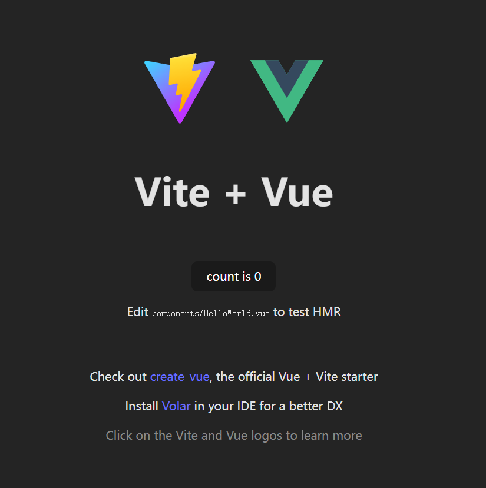

# 初始化Web前端项目

[Vue.js中文文档网站](https://cn.vuejs.org/guide/introduction.html)

# Nodejs镜像中国加速：

由于众所周知的原因，中国地区访问 npm 的镜像仓库速度较慢。为了加速下载，建议使用以下命令切换至国内 npm 镜像：

```bash
npm config set registry https://registry.npmmirror.com
```

## Vite 新建Vue项目

首先用 VSCode 中打开TodoListApplication，并打开终端。

我们使用[Vite](https://cn.vitejs.dev/guide/#scaffolding-your-first-vite-project)来新建并初始化前端项目。

在命令行中输入

```bash
npm create vite@latest frontend -- --template vue
```


用 VSCode 打开 frontend 文件夹，并且打开 VS Code 的命令行，输入

```bash
npm install
npm run dev
```
:::tip

`npm install`用来安装所需要的包依赖，只需在初始化项目后或者增减包依赖时执行。

`npm run dev`是启动开发模式，这样便可在浏览器上看到代码实际执行后的效果。
**开发代码时若浏览器打开网址没反应，则注意一下命令行中是否运行该命令**
:::


此时本地服务器已经启动，浏览器输入http://localhost:5173/，即可看到我们的项目



🎉🎉🎉 恭喜你！成功创建了第一个 React 应用！

## 安装Tailwin CSS

为了开始减少大家写CSS的工作量，我们推荐使用Web前端开发工程师都说好用的Tailwind CSS。
首先在终端中按 ctrl + c 关闭刚刚运行的开发环境，然后在终端中依次输入如下的命令。

```bash
npm install -D tailwindcss postcss autoprefixer
npx tailwindcss init -p
```

如果安装速度较慢，可以使用国内npm镜像加速
```bash
npm config set registry https://registry.npmmirror.com
```

:::tip
[Tailwind](https://www.tailwindcss.cn/)是什么？
只需书写 HTML 代码，无需书写 CSS，即可快速构建美观的网站。

这里推荐可以学习Tailwind CSS 写的样式模板合集————[HyperUI](https://www.hyperui.dev/)，
可以通过一行一行将模版中的代码敲出来，然后体会每一个CSS的样式意义。
CSS其实不难，就是刚开始写的网页布局太少，不会融会贯通，唯一的办法就是唯手熟尔，多写多练，自然而然就会掌握CSS如何写。

同时在自己的项目中推荐大家使用最流行的Tailwind CSS组件库[daisyUI](https://daisyui.com/)。

**组件库虽好，但作为初学者还是要自己实现一遍功能，掌握底层原理后就算再复杂的组件库，对你来说其原理都不是黑盒子，而是透明的**

:::


### 查看是否正确安装


打开**package.json**文件，可以看到已经安装好了所需要的包。(*你的Tailwind 以及React等包的版本号可能和教程不一致，
请不要慌，我们的教程里面的代码支持最新的版本，版本号不一致不影响后续的学习*)

:::tip
package.json 是一个用于描述和管理项目的配置文件，通常位于项目的根目录下。它是 Node.js 项目的一部分，用于定义项目的元数据、依赖关系和脚本命令等信息。

在 package.json 文件中，可以包含以下信息：

1. 项目名称 (`name`)：指定项目的名称。
2. 项目版本 (`version`)：指定项目的版本号。
3. 项目描述 (`description`)：对项目进行简要描述。
4. 作者 (`author`)：指定项目的作者。
5. 许可证 (`license`)：指定项目的许可证。
6. 依赖关系 (`dependencies`)：指定项目所依赖的外部包或库。
7. 开发依赖关系 (`devDependencies`)：指定项目在开发过程中所需要的依赖项。
8. 脚本命令 (`scripts`)：定义一些自定义的脚本命令，可以通过 `npm run` 或 `yarn run` 来执行这些命令。
9. 其他自定义配置项：可以根据项目的需要添加其他自定义的配置项。

通过编辑和维护 package.json 文件，开发人员可以管理项目的依赖、运行自定义的脚本命令，以及描述项目的基本信息。这对于项目的开发、构建和部署非常有用。
:::

### 配置Tailwind CSS


删除`style.css`文件，因为我们有了Tailwind css就不需要自己写css了


删除文件`src\assets\vue.svg`

新建文件`src\index.css`，写入代码

```css
@tailwind base;
@tailwind components;
@tailwind utilities;
```


将`tailwind.config.js`替代为
```jsx
/** @type {import('tailwindcss').Config} */
module.exports = {
  content: ["./src/**/*.{vue,js,ts,jsx,tsx}"],
  theme: {
    extend: {},
  },
  plugins: [],
};


```

在main.js 中加入 ```import "./index.css";```，删除 ```import "./style.css";```


:::tip
`tailwind.config.js` 是 Tailwind CSS 的配置文件。它用于自定义和配置 Tailwind CSS 的各种选项和样式。

在 `tailwind.config.js` 文件中，可以进行以下配置：

1. 主题（Theme）：通过配置颜色、字体、边框、间距等参数来定义项目的主题样式。
2. 变体（Variants）：配置哪些 CSS 类名的变体应该生成，例如响应式类名、伪类、状态类等。
3. 插件（Plugins）：引入和配置各种插件来扩展 Tailwind CSS 的功能，例如自定义样式、添加第三方库、优化工具等。
4. 样式（Styles）：配置自定义的 CSS 类名和样式，可以使用原生 CSS 或预处理器语法。
5. PurgeCSS：配置用于清除未使用的 CSS 的选项，以减小生成的 CSS 文件大小。

通过编辑和配置 `tailwind.config.js` 文件，可以根据项目的需要自定义和调整 Tailwind CSS 的样式和功能。这样可以使得 Tailwind CSS 更加适应项目的需求，并提供一致的设计风格和样式规范。

:::


