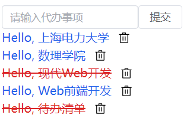

# 完成Todo List剩下功能

## 图标库

为了方便使用UI，我们使用[element-plus](https://element-plus.org/zh-CN/component/icon.html)的图标库，在命令行里输入下面的命令进行安装。

```bash
npm install @element-plus/icons-vue
```

首先对其进行配置。

在```src\main.js```中写入
```js
import { createApp } from "vue";
import App from "./App.vue";
import "./index.css";
import { createPinia } from "pinia";
import * as ElementPlusIconsVue from "@element-plus/icons-vue";

const app = createApp(App);
app.use(createPinia());
for (const [key, component] of Object.entries(ElementPlusIconsVue)) {
  app.component(key, component);
}
app.mount("#app");
```
## 删除功能

接下来我们需要一个删除按钮，用于删除`todoList`这个状态里的数据。

与之前一样，先添加一个对应的`action`。

在``src\stores\todoData.js``中写入
```js
import { defineStore } from "pinia";

export const useTodoDataStore = defineStore("todoData", {
  state: () => ({
    todoList: [
      {
        id: 1,
        content: "上海电力大学",
        isDone: false,
      },
      {
        id: 2,
        content: "数理学院",
        isDone: false,
      },
      {
        id: 3,
        content: "现代Web开发",
        isDone: true,
      },
      {
        id: 4,
        content: "Web前端开发",
        isDone: false,
      },
      {
        id: 5,
        content: "待办清单",
        isDone: true,
      },
    ],
  }),
  getters: { allTodos: (state) => state.todoList },
  actions: {
    addTodo(content) {
      const newTodo = {
        id: this.todoList.length + 1,
        content: content,
        isDone: false,
      };
      this.todoList.push(newTodo);
    },
    deleteTodo(id) {
      // 查找待办事项在 todoList 数组中的索引
      const index = this.todoList.findIndex((todo) => todo.id === id);

      // 检查是否找到了待办事项
      if (index !== -1) {
        // 如果找到了，使用 splice 方法从 todoList 数组中移除该待办事项
        this.todoList.splice(index, 1);
      }
    }
  },
});
```
然后需要调用这个`action`

在``src\App.vue``中写入
```vue
<script setup>
import Todo from "./components/Todo.vue";
import { useTodoDataStore } from "./stores/todoData";
import { ref } from "vue";
const input = ref("");
const todoData = useTodoDataStore();
const todoList = todoData.allTodos;
const addTodo = todoData.addTodo;
const deleteTodo = todoData.deleteTodo;

const AddTodo = () => {
  addTodo(input.value);
  input.value = "";
};

const DeleteTodo = (id) => {
  deleteTodo(id);
};
</script>

<template>
  <div class="bg-white text-black p-4">
    <el-row>
      <el-col :span="6">
        <el-input v-model="input" placeholder="请输入代办事项" />
      </el-col>
      <el-button @click="AddTodo">提交</el-button>
    </el-row>

    <el-row v-for="todo in todoList" class="items-center space-x-3">
      <Todo :todo="todo" :keys="todo.id" />
      <el-icon size="16" class="center">
        <Delete @click="() => DeleteTodo(todo.id)" />
      </el-icon>
    </el-row>
  </div>
</template>
```

其中 `<Delete>` 是图标，通过监听 `@click` 事件触发一个方法，该方法通过匿名函数调用 `DeleteTodo` 方法，传递了一个参数 `todo.id`。


点击mytodo的删除图标



## 修改"是否完成"

接下来我们需要一个点击该TODO，改变其是否完成的功能。

同样的，需要增加对应的`action`

在``src\stores\todoData.js``中修改代码

```js
import { defineStore } from "pinia";
export const useTodoDataStore = defineStore("todoData", {
  state: () => ({
    todoList: [
      {
        id: 1,
        content: "上海电力大学",
        isDone: false,
      },
      {
        id: 2,
        content: "数理学院",
        isDone: false,
      },
      {
        id: 3,
        
        content: "现代Web开发",
        isDone: true,
      },
      {
        id: 4,
        content: "Web前端开发",
        isDone: false,
      },
      {
        id: 5,
        content: "待办清单",
        isDone: true,
      },
    ],
  }),
  getters: { allTodos: (state) => state.todoList },
  actions: {
    addTodo(content) {
      const newTodo = {
        id: this.todoList.length + 1,
        content: content,
        isDone: false,
      };
      this.todoList.push(newTodo);
    },
    deleteTodo(id) {
      const index = this.todoList.findIndex((todo) => todo.id == id);
      if (index !== -1) {
        this.todoList.splice(index, 1);
      }
    },
    changeIsDone(id) {
      // 查找待办事项在 todoList 数组中的对象
      const todo = this.todoList.find((item) => item.id === id);

      // 检查是否找到了待办事项
      if (todo) {
        // 如果找到了，切换待办事项的完成状态
        todo.isDone = !todo.isDone;
      }
    }
  },
});
```

在``src\App.vue``中修改代码

```vue
<script setup>
import Todo from "./components/Todo.vue";
import { useTodoDataStore } from "./stores/todoData";
import { ref } from "vue";
const input = ref("");
const todoData = useTodoDataStore();

const todoList = todoData.allTodos;
const addTodo = todoData.addTodo;
const deleteTodo = todoData.deleteTodo;
const changeIsDone = todoData.changeIsDone;

const AddTodo = () => {
  addTodo(input.value);
  input.value = "";
};

const DeleteTodo = (id) => {
  deleteTodo(id);
};

const ChangeIsDone = (id) => {
  changeIsDone(id);
};
</script>

<template>
  <div class="bg-white text-black p-4">
    <el-row>
      <el-col :span="6">
        <el-input v-model="input" placeholder="请输入代办事项" />
      </el-col>
      <el-button @click="AddTodo">提交</el-button>
    </el-row>

    <el-row v-for="todo in todoList" :key="todo.id" class="items-center space-x-3">
      <div @click="() => ChangeIsDone(todo.id)">
        <Todo :todo="todo" />
      </div>
      <el-icon size="16" class="center">
        <Delete @click="() => DeleteTodo(todo.id)" />
      </el-icon>
    </el-row>
  </div>
</template>
```

`<Delete>`也是一个图标。