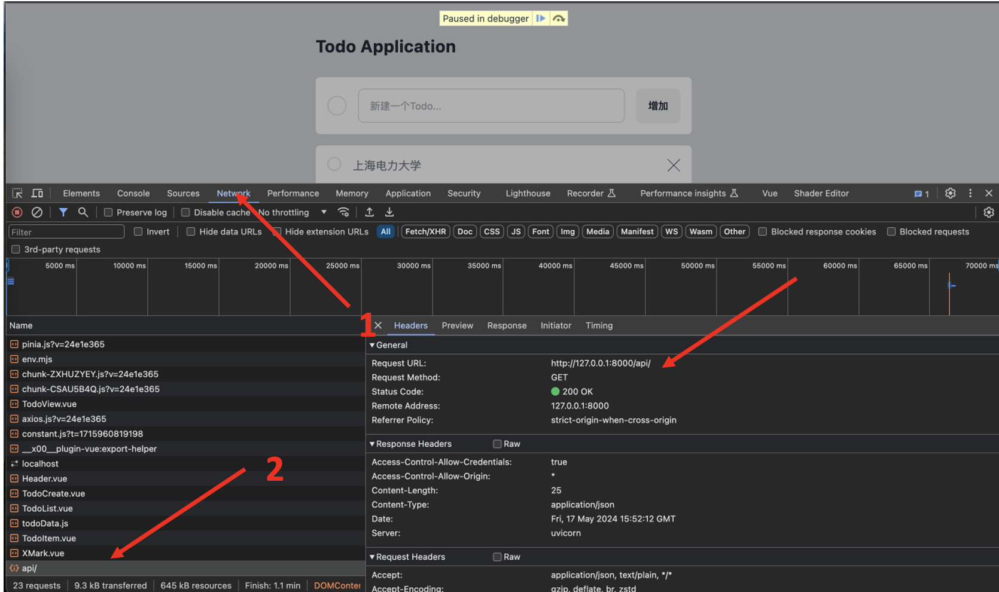

# Web前端：axios库发送HTTP请求

:::tip

本课程网站内容请仔细阅读后再进行实操。因未仔细阅读内容，出现任何错误后果自负（逃～～～逃～～～逃

**所有的代码请不要复制粘贴，请手敲每一行代码。复制粘贴不会让你动脑子，而手敲每一个行代码会让你自然而然地去动脑子会想每一行代码的含义和原理**
:::

目前我们操作的数据都是在浏览器中，只要浏览器关闭，数据就没了。
而我们前面利用FastAPI实现了Todo的增删改查的HTTP API。
因此我们可以通过发送HTTP请求的方式到后端，
将我们Web页面操作的数据持久化到数据库中。
这样数据不会因为浏览器的关闭而丢失，
同时也可以读取之前设置的Todo数据，
呈现到Web页面中。

## 设置 FastAPI后端服务地址

由于不同开发者环境不一样，FastAPI的后端在本机运行的端口不一样。
亦或许你已经将FastAPI的后端程序部署到了一台服务器上。
而每一个API都要用到 FastAPI的后端服务的地址，
因此我们需要设置一个常量，用户可以根据自己的实际情况进行更改。

新建一个 `src/constant.js` 文件，输入如下代码：

```js
export const FASTAPI_BASE_URL="http://127.0.0.1:8001/api/";
```


## axios 库安装

命令行如书如下明亮：

```bash
npm i axios
```

## axios 发送一个HTTP GET 请求

我们在FastAPI的后端代码中实现了一个最简单的API
`http://localhost:8000/api/`
这个API会返回如下数据：

```json
{"message":"Hello world"}
```
因此我们可以通过这个最简单的API来测试我们axios是否有用。

我们可以将 `src/App.vue` 的代码更改成如下:

```html showLineNumbers title="src/App.vue"
<script setup>
import TodoView from "./views/TodoView.vue";
import axios from "axios";
import { FASTAPI_BASE_URL } from "./constant";

const fetchData = async() => {
  try {
    const response = await axios.get(`${FASTAPI_BASE_URL}/api/`);
    console.log(response);
  } catch (error) {
    console.error(error);
  }
}
fetchData();
</script>

<template>
  <TodoView />
</template>

<style scoped></style>
```

- `const response = await axios.get(...)`: `axios.get`这是axios库提供的一个函数，用于发送GET请求，更多内容请看官方文档：https://axios-http.com/docs/intro。
`await`关键字用于等待`axios.get`函数返回的`Promise`对象。在这里，它使得JavaScript引擎暂停执行，直到该请求完成并且`Promise`状态变为`resolved`（已完成）。


Chrome浏览器中在 `src/App.vue`的第八行打个断点，如下图所示。


刷新页面，就可以看到我们的代码卡在了如下页面：


执行下一步，然后在Network中查看所发送的HTTP请求：



点击response便可看到这个API返回的值：


回到代码页面，将鼠标悬停到 `response` 变量，
可以看到 `response`的 `data`属性里面有我们FastAPI后端API返回的值`{"message":"Hello world"}`，
如下图所示。


## axios与pinia结合

在`src\stores\todo.js`中，修改代码如下：

```js showLineNumbers title="src\stores\todo.js"
import { defineStore } from "pinia";
import axios from 'axios';

import { FASTAPI_BASE_URL } from "../constant";

export const todoStore = defineStore("todo", {
  state: () => ({
    todos: [],
  }),
  actions: {
    async loadTodos() {
      try {
        const response = await axios.get(`${FASTAPI_BASE_URL}/api/todos`);
        this.todos = response.data;
        console.log(this.todos);
      } catch (error) {
        console.error(error);
      }
    },
    async addTodo(content) {
      const newTodo = { content: content, is_done: false };
      try {
        const response = await axios.post(`${FASTAPI_BASE_URL}/api/todos`, newTodo);
        this.todos.push(response.data);
      } catch (error) {
        console.error(error);
      } finally {
        console.log(this.todos);
      }
    },
  }
});
```

- `const response = await axios.post(..., newTodo)`: `axios.post`：这是axios库提供的一个函数，用于发送POST请求。

- `${FASTAPI_BASE_URL}/api/todos`：这是一个模板字符串，用于构建请求的URL。`${FASTAPI_BASE_URL}`是一个常量，表示后端API的基础URL，
`/api/todos`则是特定的API端点路径。

FastAPI程序中的**Create Todo**API。


该API是POST请求，URL为：`${FASTAPI_BASE_URL}/api/todos`，使用该API时我们需要在HTTP body体里面加入这样的JSON数据： 
```json
{
  "content": "string",
  "is_done": true
}
```
因此新建一个 `newTodo`对象的代码为： `const newTodo = { content: content, is_done: false }` 。
此时 `newTodo`的数据结构和**Create Todo** API所需的一样，axios会自动将 JavaScript 中的字典对象转换成JSON数据格式。


我们可以将 `src/components/TodoList.vue` 的代码更改成如下:

```html showLineNumbers title="src/components/TodoList.vue"
<script setup>
import TodoItem from "./TodoItem.vue";
import { todoStore } from "../stores/todo";

import { onMounted, computed } from "vue";

const useTodoStore = todoStore();
const todos = computed(()=> useTodoStore.todos);

onMounted(() => {
  useTodoStore.loadTodos();
})
</script>
<template>
  <div 
    class="mt-4 rounded-t-md bg-white transition-all duration-75"
  >
    <div v-for="todo in todos" :key="todo.id">
      <TodoItem :todo="todo"/>
    </div>
  </div>
</template>
<style></style>
```

- `onMounted(() => { ... })`: 使用`onMounted`钩子函数，表示在组件挂载后执行的操作。在这里，调用`useTodoStore.loadTodos()`方法，用于加载初始的待办事项数据。


这样我们就实现了往FastAPI后端发送获取所有的Todo和新增Todo的请求。