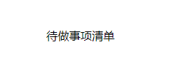

# 第一个组件

## 新建组件

在src\components文件夹中新建`MyToDoListHead.jsx`文件

```
frontend
├─ .eslintrc.cjs
├─ .gitignore
├─ index.html
├─ package-lock.json
├─ package.json
├─ postcss.config.js
├─ public
│  └─ vite.svg
├─ README.md
├─ src
│  ├─ App.jsx
│  ├─ assets
│  ├─ components
│  │  └─ MyToDoListHead.jsx
│  ├─ index.css
│  └─ main.jsx
├─ tailwind.config.js
└─ vite.config.js

```

## 组件内容

在`MyToDoListHead.jsx`文件中输入

```jsx
import React from "react";

const MyToDoListHead = () => {
  return <div>待做事项清单</div>;
};

export default MyToDoListHead;
```

## 具体含义

1. `import React from "react";`
   这一行代码导入了名为 "React" 的变量，它表示 React 库。这样，你就可以使用 React 库中的组件、函数和其他功能了。

2. `const MyToDoListHead = () => {`
   这一行代码声明了一个名为 "MyToDoListHead" 的常量，它是一个箭头函数。箭头函数是一种创建匿名函数的简洁语法。这个箭头函数不接受任何参数，因此它是一个无参函数。

3. `return <div>hello world</div>;`
   这一行代码是箭头函数的主体。它使用 JSX 语法来返回一个 React 元素。在这里，代码返回一个包含文本内容 "待做事项清单" 的 `<div>` 元素。JSX 是一种类似于 HTML 的语法，它允许你在 JavaScript 中描述 UI 组件的结构。

4. `};`
   这一行代码结束了箭头函数的定义。

5. `export default MyToDoListHead;`
   这一行代码将 "MyToDoListHead" 常量导出为默认导出。这意味着在其他文件中，你可以使用 `import` 语句来导入并使用名为 "MyToDoListHead" 的组件。

## 组件调用

在`src\App.jsx`文件第一行中增加

```jsx
import React from "react";
import MyToDoListHead from "./components/MyToDoListHead";
```

将app替换为`<MyToDoListHead />`

全部代码:

```jsx
import React from "react";
import MyToDoListHead from "./components/MyToDoListHead";

function App() {
  return (
    <div className="container py-16 px-6 min-h-screen mx-auto">
      <MyToDoListHead />
    </div>
  );
}

export default App;
```

:::tips
`<MyToDoListHead />` 是一个 JSX 表达式，它代表了一个名为 "MyToDoList" 的 React 组件的使用。
:::

## 调用后的效果

