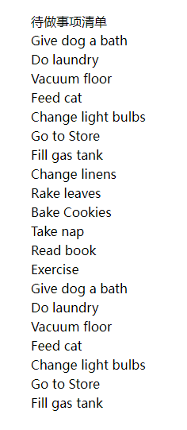
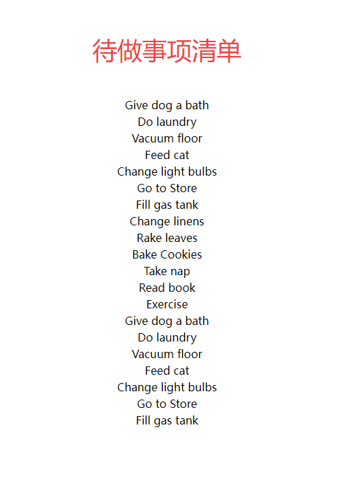

# 展示待办事项清单

要展示todolist，首先得要有数据

## 储存数据

我们在本地存储数据，新建文件`MyToDoListBody.jsx`

输入

```jsx

import React from "react";

const data = [
  {
    id: 1,
    task: "Give dog a bath",
    complete: true,
  },
  {
    id: 2,
    task: "Do laundry",
    complete: true,
  },
  {
    id: 3,
    task: "Vacuum floor",
    complete: false,
  },
  {
    id: 4,
    task: "Feed cat",
    complete: true,
  },
  {
    id: 5,
    task: "Change light bulbs",
    complete: false,
  },
  {
    id: 6,
    task: "Go to Store",
    complete: true,
  },
  {
    id: 7,
    task: "Fill gas tank",
    complete: true,
  },
  {
    id: 8,
    task: "Change linens",
    complete: false,
  },
  {
    id: 9,
    task: "Rake leaves",
    complete: true,
  },
  {
    id: 10,
    task: "Bake Cookies",
    complete: false,
  },
  {
    id: 11,
    task: "Take nap",
    complete: true,
  },
  {
    id: 12,
    task: "Read book",
    complete: true,
  },
  {
    id: 13,
    task: "Exercise",
    complete: false,
  },
  {
    id: 14,
    task: "Give dog a bath",
    complete: false,
  },
  {
    id: 15,
    task: "Do laundry",
    complete: false,
  },
  {
    id: 16,
    task: "Vacuum floor",
    complete: false,
  },
  {
    id: 17,
    task: "Feed cat",
    complete: true,
  },
  {
    id: 18,
    task: "Change light bulbs",
    complete: false,
  },
  {
    id: 19,
    task: "Go to Store",
    complete: false,
  },
  {
    id: 20,
    task: "Fill gas tank",
    complete: false,
  },
];

```

这就将数据保存在了本地

## 展示数据

在数据后输入

```jsx
const MyToDoListBody = () => {
  return (
    <div>
      {data.map((item) => (
        <div>{item.task}</div>
      ))}
    </div>
  );
};

export default MyToDoListBody;
```
### 代码解释

这段代码定义了一个名为 `MyToDoListBody` 的无参函数组件，它根据给定的 `data` 数组，渲染了一个包含任务内容的列表。

让我们逐行解释代码的含义：

1. ```jsx
   const MyToDoListBody = () => {
   ```
   这一行代码声明了一个名为 `MyToDoListBody` 的箭头函数组件。

2. ```jsx
   return (
     <div>
       {data.map((item) => (
         <div>{item.task}</div>
       ))}
     </div>
   );
   ```
   这是函数组件的返回部分，使用了 JSX 语法来渲染组件的 UI。在这里，它做了以下事情：
   
   - 外围的 `<div>` 元素是这个组件的根元素，它将包含任务列表。
   
   - `{data.map((item) => (...)}` 是 JavaScript 表达式，用于映射 `data` 数组中的每个项到一个 `<div>` 元素。这里使用了 `map` 函数来遍历数组中的每个 `item`。

   - 在 `map` 函数的映射过程中，对于每个 `item`，创建一个包含任务内容的 `<div>` 元素，其中 `{item.task}` 会渲染 `item` 对象中的 `task` 属性值，显示任务的文本内容。

3. ```jsx
   };
   ```
   这一行代码结束了函数组件的定义。

总之，这个组件根据提供的 `data` 数组，渲染一个包含任务内容的列表。你可以在应用的其他部分使用 `<MyToDoListBody />`，并将 `data` 作为属性传递给它，从而在界面上展示任务列表的内容。例如：

```jsx
import React from "react";

const data = [
  { task: "Buy groceries" },
  { task: "Walk the dog" },
  { task: "Finish homework" },
];

const App = () => {
  return (
    <div>
      <h1>My To-Do List</h1>
      <MyToDoListBody data={data} />
    </div>
  );
};

export default App;
```

这将在你的应用中渲染一个标题为 "My To-Do List" 的页面，并展示由 `data` 数组中的任务内容组成的列表。

## 调用`MyToDoListBody`组件

在`src\App.jsx`文件中

```jsx
import React from "react";
import MyToDoListHead from "./components/MyToDoListHead";
import MyToDoListBody from "./components/MyToDoListBody";

function App() {
  return (
    <div className="container py-16 px-6 min-h-screen mx-auto">
      <MyToDoListHead />
      <MyToDoListBody />
    </div>
  );
}

export default App;
```

## 效果



## 添加一点css

`src\components\MyToDoListBody.jsx`

```jsx
import React from "react";

const data = [
  {
    id: 1,
    task: "Give dog a bath",
    complete: true,
  },
  {
    id: 2,
    task: "Do laundry",
    complete: true,
  },
  {
    id: 3,
    task: "Vacuum floor",
    complete: false,
  },
  {
    id: 4,
    task: "Feed cat",
    complete: true,
  },
  {
    id: 5,
    task: "Change light bulbs",
    complete: false,
  },
  {
    id: 6,
    task: "Go to Store",
    complete: true,
  },
  {
    id: 7,
    task: "Fill gas tank",
    complete: true,
  },
  {
    id: 8,
    task: "Change linens",
    complete: false,
  },
  {
    id: 9,
    task: "Rake leaves",
    complete: true,
  },
  {
    id: 10,
    task: "Bake Cookies",
    complete: false,
  },
  {
    id: 11,
    task: "Take nap",
    complete: true,
  },
  {
    id: 12,
    task: "Read book",
    complete: true,
  },
  {
    id: 13,
    task: "Exercise",
    complete: false,
  },
  {
    id: 14,
    task: "Give dog a bath",
    complete: false,
  },
  {
    id: 15,
    task: "Do laundry",
    complete: false,
  },
  {
    id: 16,
    task: "Vacuum floor",
    complete: false,
  },
  {
    id: 17,
    task: "Feed cat",
    complete: true,
  },
  {
    id: 18,
    task: "Change light bulbs",
    complete: false,
  },
  {
    id: 19,
    task: "Go to Store",
    complete: false,
  },
  {
    id: 20,
    task: "Fill gas tank",
    complete: false,
  },
];

const MyToDoListBody = () => {
  return (
    <div className="text-center">
      {data.map((item) => (
        <div>{item.task}</div>
      ))}
    </div>
  );
};

export default MyToDoListBody;
```

`src\components\MyToDoListHead.jsx`
```jsx
import React from "react";

const MyToDoListHead = () => {
  return (
    <div className="text-center text-red-500 text-4xl py-12">待做事项清单</div>
  );
};

export default MyToDoListHead;
```



文件结构:
```
frontend
├─ .eslintrc.cjs
├─ .gitignore
├─ index.html
├─ package-lock.json
├─ package.json
├─ postcss.config.js
├─ public
│  └─ vite.svg
├─ README.md
├─ src
│  ├─ App.jsx
│  ├─ assets
│  ├─ components
│  │  ├─ MyToDoListBody.jsx
│  │  └─ MyToDoListHead.jsx
│  ├─ index.css
│  └─ main.jsx
├─ tailwind.config.js
└─ vite.config.js

```