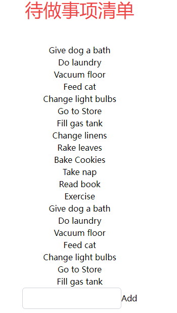

# 增

## 新增函数`addData`

首先我们需要在`src\store\useData.jsx`中新增`addData`函数，其作用就是，传入一个todo，令其添加到data中
```jsx
const useData = create((set) => ({
  data: data,
  addData: (item) =>
    set((state) => {
      // 找到当前 data 数组中最大的 id 值
      const maxId = Math.max(...state.data.map((dataItem) => dataItem.id));

      // 构建新的任务项对象
      const newTask = {
        id: maxId + 1, // 设置新的 id
        task: item,
        complete: false,
      };

      // 返回更新后的状态
      return {
        data: [...state.data, newTask], // 将新的任务项添加到 data 数组中
      };
    }),
}));

```
<!-- TODO: 这里关于状态管理的讲的不是很清楚-->

当调用 `addData` 函数时，它会执行一系列操作，将新的任务项添加到任务数据数组中，然后更新状态。
   - `addData` 是一个函数，它接受一个参数 `item`，这个参数是要添加到任务数据数组中的新任务的文本内容。
   - 在函数体内，我们使用 `set` 函数来更新状态。`set` 函数接受一个回调函数，这个回调函数会返回一个新的状态对象，用于更新当前状态。
   - 首先，我们在任务数据数组中找到当前最大的 `id` 值，这样可以为新任务项生成一个唯一的 `id`。
   - 然后，我们创建一个新的任务项对象 `newTask`，其中包含了新的 `id`（上面找到的最大 `id` 值加 1）、`task`（传入的 `item`）以及 `complete` 属性设置为 `false`。
   - 最后，我们返回一个新的状态对象，其中的 `data` 属性是原来的任务数据数组加上新的任务项 `newTask`。

## 新建组件

在`src\components`中新建文件`AddButtom.jsx`，输入

```jsx
import React from "react";
import { useData } from "../store/useData";

const AddButton = () => {
  const [data, setData] = React.useState("");
  const addData = useData((state) => state.addData);

  const handleInputChange = (event) => {
    setData(event.target.value); // 更新 data 状态
  };

  const handleAddTask = () => {
    addData(data);
    setData(""); // 清空输入框
  };

  return (
    <div>
      <input
        type="text"
        className="border border-gray-300 p-2 rounded-md"
        onChange={handleInputChange}
        value={data} // 将输入框的值与 data 状态同步
      />
      <button onClick={handleAddTask}>Add</button>
    </div>
  );
};

export default AddButton;
```

### 代码解释

实现了在输入框中输入新任务并点击按钮来添加到任务列表的功能。`AddButton` 组件逻辑如下：

1. ```jsx
   const [data, setData] = React.useState("");
   ```
   在组件中使用 `useState` 来创建 `data` 状态，初始值为空字符串。

2. ```jsx
   const handleInputChange = (event) => {
     setData(event.target.value); // 更新 data 状态
   };
   ```
   `handleInputChange` 函数用于在输入框内容发生变化时更新 `data` 状态，以便将用户输入的文本保存。

3. ```jsx
   const handleAddTask = () => {
     addData(data); // 调用 addData 方法将新任务添加到任务列表
     setData(""); // 清空输入框
   };
   ```
   `handleAddTask` 函数在点击 "Add" 按钮时被调用。它首先调用 `addData` 方法，将输入框中的文本作为新任务项添加到任务列表中。然后，它使用 `setData("")` 将输入框内容清空，以便用户可以输入新的任务。

4. ```jsx
   <input
     type="text"
     className="border border-gray-300 p-2 rounded-md"
     onChange={handleInputChange}
     value={data} // 将输入框的值与 data 状态同步
   />
   ```
   这里是输入框元素，它使用之前定义的 `handleInputChange` 函数来处理输入变化，并通过 `value` 属性将输入框的值与 `data` 状态同步。

5. ```jsx
   <button onClick={handleAddTask}>Add</button>
   ```
   这是 "Add" 按钮，当点击时会触发 `handleAddTask` 函数，将输入框中的文本作为新任务项添加到任务列表中，并清空输入框。

## 调用组件

在`src\components\MyToDoListBody.jsx`中写入

```jsx
import React from "react";
import { useData } from "../store/useData";
import AddButtom from "./AddButtom";

const MyToDoListBody = () => {
  const data = useData((state) => state.data);
  return (
    <div className="text-center">
      {data.map((item) => (
        <div>{item.task}</div>
      ))}
      <AddButtom />
    </div>
  );
};

export default MyToDoListBody;
```
## 效果




增加了一个输入框与按钮，并且可以实现添加功能