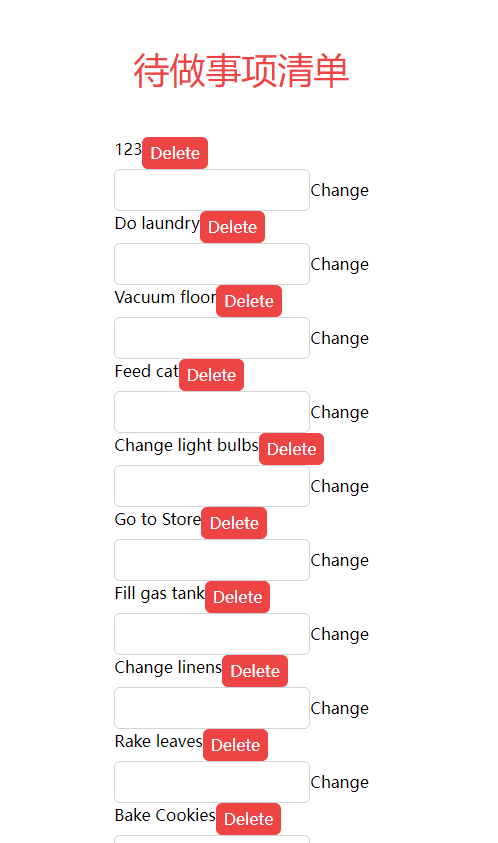

# 改
与之前一样，先新建函数

## 新建函数

`src\store\useData.jsx`，新建`changeData`函数

```jsx
import { create } from "zustand";

const data = [
  {
    id: 1,
    task: "Give dog a bath",
    complete: true,
  },
  {
    id: 2,
    task: "Do laundry",
    complete: true,
  },
  {
    id: 3,
    task: "Vacuum floor",
    complete: false,
  },
  {
    id: 4,
    task: "Feed cat",
    complete: true,
  },
  {
    id: 5,
    task: "Change light bulbs",
    complete: false,
  },
  {
    id: 6,
    task: "Go to Store",
    complete: true,
  },
  {
    id: 7,
    task: "Fill gas tank",
    complete: true,
  },
  {
    id: 8,
    task: "Change linens",
    complete: false,
  },
  {
    id: 9,
    task: "Rake leaves",
    complete: true,
  },
  {
    id: 10,
    task: "Bake Cookies",
    complete: false,
  },
  {
    id: 11,
    task: "Take nap",
    complete: true,
  },
  {
    id: 12,
    task: "Read book",
    complete: true,
  },
  {
    id: 13,
    task: "Exercise",
    complete: false,
  },
  {
    id: 14,
    task: "Give dog a bath",
    complete: false,
  },
  {
    id: 15,
    task: "Do laundry",
    complete: false,
  },
  {
    id: 16,
    task: "Vacuum floor",
    complete: false,
  },
  {
    id: 17,
    task: "Feed cat",
    complete: true,
  },
  {
    id: 18,
    task: "Change light bulbs",
    complete: false,
  },
  {
    id: 19,
    task: "Go to Store",
    complete: false,
  },
  {
    id: 20,
    task: "Fill gas tank",
    complete: false,
  },
];

const useData = create((set) => ({
  data: data,
  addData: (item) =>
    set((state) => {
      // 找到当前 data 数组中最大的 id 值
      const maxId = Math.max(...state.data.map((dataItem) => dataItem.id));

      // 构建新的任务项对象
      const newTask = {
        id: maxId + 1, // 设置新的 id
        task: item,
        complete: false,
      };

      // 返回更新后的状态
      return {
        data: [...state.data, newTask], // 将新的任务项添加到 data 数组中
      };
    }),
  deleteData: (id) =>
    set((state) => {
      // 返回更新后的状态
      return {
        data: state.data.filter((dataItem) => dataItem.id !== id), // 过滤掉 id 不等于传入 id 的任务项
      };
    }),
  changeData: ({ id, task }) =>
    set((state) => {
      // 返回更新后的状态
      return {
        data: state.data.map((dataItem) =>
          dataItem.id === id ? { ...dataItem, task } : dataItem
        ), // 将 id 等于传入 id 的任务项的 task 属性修改为传入的 task
      };
    }),
}));

export { useData };
```

### 代码解读

- `changeData` 是一个函数，接受一个对象参数，包含 `id` 和 `task`，表示要修改的任务项的 `id` 和新的任务内容。
- 在函数体内，我们使用 `set` 函数来更新状态。`set` 函数接受一个回调函数，这个回调函数返回一个新的状态对象，用于更新当前状态。
- 在回调函数中，我们返回一个新的状态对象，其中的 `data` 属性是原来的任务数据数组经过 `map` 方法映射后的结果。
- `map` 方法用于映射数组中的每个元素，返回一个新数组，其中的元素是根据指定规则进行处理的。在这里，我们遍历 `data` 数组的每个任务项，如果 `dataItem.id === id`，则将该任务项的 `task` 属性替换为传入的新任务内容 `task`，否则保持原任务项不变。

## 新建组件

`src\components\ChangeButtom.jsx`:

```jsx
import React from "react";
import { useData } from "../store/useData";

const ChangeButton = ({ id }) => {
  const changeData = useData((state) => state.changeData);
  const [data, setData] = React.useState("");

  const handleInputChange = (event) => {
    setData(event.target.value); // 更新 data 状态
  };

  const handleAddTask = () => {
    changeData({ id, task: data });
    setData(""); // 清空输入框
  };

  return (
    <div>
      <input
        type="text"
        className="border border-gray-300 p-2 rounded-md"
        onChange={handleInputChange}
        value={data} // 将输入框的值与 data 状态同步
      />
      <button onClick={handleAddTask}>Change</button>
    </div>
  );
};

export default ChangeButton;
```

## 调用

`src\components\MyToDoListBody.jsx`:

```jsx
import React from "react";
import { useData } from "../store/useData";
import AddButtom from "./AddButtom";
import DeleteButtom from "./DeleteButtom";
import ChangeButtom from "./ChangeButtom";
const MyToDoListBody = () => {
  const data = useData((state) => state.data);
  return (
    <div className="flex flex-col text-center items-center">
      {data.map((item) => (
        <div>
          <div className="flex flex-row">
            {item.task}
            <DeleteButtom id={item.id} />
          </div>
          <ChangeButtom id={item.id} />
        </div>
      ))}
      <AddButtom />
    </div>
  );
};

export default MyToDoListBody;
```

## 效果



## 为何需要划分组件

划分组件是一种良好的软件开发实践，它可以带来多种好处，提高代码的可维护性、可重用性和可扩展性。以下是一些划分组件的重要原因和好处：

1. **模块化和可维护性：** 划分组件可以将应用程序分割成更小的、独立的模块。每个组件负责特定的功能或UI元素，使得代码更易于理解和维护。当需要对某个功能进行修改或修复时，只需要关注特定的组件，而不需要涉及整个应用。

2. **可重用性：** 组件化的代码可以在不同的部分和项目中进行重用。如果你在一个地方实现了一个强大、通用的组件，你可以在其他地方多次使用它，从而减少重复编写代码的工作量。

3. **团队协作：** 在大型项目中，多人协作变得更加容易。每个开发者可以专注于开发自己负责的组件，而不会影响其他组件。这有助于减少冲突和协作问题。

4. **可测试性：** 组件可以更容易地进行单元测试，因为每个组件都是独立的、可测试的单元。这样可以更轻松地编写测试用例，检查组件在各种情况下的行为是否正确。

5. **可扩展性：** 通过划分组件，你可以更容易地扩展和添加新功能。你可以单独开发和集成新的组件，而无需修改现有代码。

6. **性能优化：** 组件可以更精细地控制渲染和更新。React 等框架使用虚拟DOM来最小化对实际DOM的操作，组件的划分有助于更准确地确定何时重新渲染组件以提高性能。

7. **代码复杂性管理：** 当应用逐渐增长并变得复杂时，划分组件可以将复杂性分解为更小、更易管理的部分。这有助于保持代码的清晰度和可读性。

可以发现，我们现在新建了`AddButtom`,`ChangeButtom`,`DeleteButtom`,在这之中，代码的重用很明显，主体都是

```jsx
<button></button>
```

以及 

```jsx
<input></input>
```

其中不同的只是`handleInputChange`以及`handleAddTask`，因此我们可以新建
`Button`以及`Input`组件,通过传入`handleInputChange`或`handleAddTask`，来实现组件化，并在`AddButtom`,`ChangeButtom`,`DeleteButtom`中调用他们

**请自己完成**

## 文件结构

```
frontend
├─ .eslintrc.cjs
├─ .gitignore
├─ index.html
├─ package-lock.json
├─ package.json
├─ postcss.config.js
├─ public
│  └─ vite.svg
├─ README.md
├─ src
│  ├─ App.jsx
│  ├─ assets
│  ├─ components
│  │  ├─ AddButtom.jsx
│  │  ├─ ChangeButtom.jsx
│  │  ├─ DeleteButtom.jsx
│  │  ├─ MyToDoListBody.jsx
│  │  └─ MyToDoListHead.jsx
│  ├─ index.css
│  ├─ main.jsx
│  └─ store
│     └─ useData.jsx
├─ tailwind.config.js
└─ vite.config.js

```