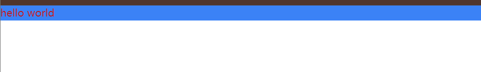

# Hello world 组件


## 你编写的第一个React组件

VS Code 打开 `src/App.jsx` 文件，将其中代码替换成如下内容:

```jsx
<template>
  <div class="text-red-700  bg-blue-500">
    hello world
  </div>
</template>
```


`<template> `是 Vue.js 中的模板标签，用于定义组件的模板结构。

**更多请仔细学习JavaScript的基础语法**

VS Code 打开 `src/main.js` 文件，便可看到如下代码：

```jsx
import { createApp } from "vue";
import App from "./App.vue";
import "./index.css";
createApp(App).mount("#app");

```


VS Code 打开 `index.html`，便可看到如下代码：

```jsx
<!doctype html>
<html lang="en">
  <head>
    <meta charset="UTF-8" />
    <link rel="icon" type="image/svg+xml" href="/vite.svg" />
    <meta name="viewport" content="width=device-width, initial-scale=1.0" />
    <title>Vite + Vue</title>
  </head>
  <body>
    <div id="app"></div>
    <script type="module" src="/src/main.js"></script>
  </body>
</html>
```

上述是我们整个应用程序的HTML入口文件，其中定义了ID为root的DOM元素，以及引入了`src/main.js`文件，
因此我们整个应用程序需要进行coding的部分是从`src/main.js`开始的。

我们可以像在 HTML 中一样，给元素标签加上属性，只不过我们需要遵守[驼峰式命名](https://baike.baidu.com/item/%E9%A9%BC%E5%B3%B0%E5%91%BD%E5%90%8D%E6%B3%95/7560610?fromtitle=%E9%AA%86%E9%A9%BC%E5%91%BD%E5%90%8D%E6%B3%95&fromid=7794053)法则，

<!-- ## JSX 语法

首先我们来看一下 React 引以为傲的特性之一 -- JSX。
它允许我们在 JS 代码中使用 XML 语法来编写用户界面，使得我们可以充分的利用 JS 的强大特性来操作用户界面。

一个React函数式组件的 return 的内容就为这个组件所将渲染的内容。比如说如下代码：

```jsx
function App() {
  return (
    <div>Hello, World
  	</div>
  );
}
```

这里的 `<div>Hello, World</div>` 是一段 JSX 代码，它最终会被 Babel 转译成下面这段 JS 代码:

```javascript
import { jsx as _jsx } from "react/jsx-runtime";
function App() {
  return /*#__PURE__*/ _jsx("div", {
    children: "Hello world"
  });
}
```

React会将如上代码使用ReactDOM 的 render 方法渲染，最终显示在屏幕上的就是 Hello, World" 内容。

### JSX 变量使用

因为 JSX 最终会被编译成一个 JS 对象，所以我们可以把它当做一个 JS 对象使用，
它享有和一个 JS 对象同等的地位，比如可以将其赋值给一个变量，我们修改上面代码中如下：

```jsx
function App() {
  const element = <div> Hello world </div>
  return element;
}
```

### 在 JSX 中使用变量

我们可以使用大括号 {} 在 JSX 中动态的插入变量值，我们修改上面代码中如下：

```jsx
function App() {
  const content = "World";
  const element = <div>Hello, {content}</div>;
  return element;
}
```

### JSX 中使用 JSX

我们可以在 JSX 中再包含 JSX，这样我们编写任意层次的 HTML 结构：

```jsx
function App() {
const element = <li>Hello, World</li>;
  return (
    <div>
      <ul>
        {element}
      </ul>
    </div>
  );
}
```

### JSX 中添加节点属性

我们可以像在 HTML 中一样，给元素标签加上属性，只不过我们需要遵守[驼峰式命名](https://baike.baidu.com/item/%E9%A9%BC%E5%B3%B0%E5%91%BD%E5%90%8D%E6%B3%95/7560610?fromtitle=%E9%AA%86%E9%A9%BC%E5%91%BD%E5%90%8D%E6%B3%95&fromid=7794053)法则，

```jsx
const element = <div dataIndex="0">Hello, World</div>;
```

:::caution

在 JSX 中所有的属性都要更换成驼峰式命名，比如 `onclick` 要改成 `onClick`，
唯一比较特殊的就是 `class`，因为在 JS 中 `class` 是保留字，我们要把 `class` 改成 `className` 。

```jsx
const element = <div className="app">Hello, World</div>;
```

::: -->
<!-- TODO:解释基本语法？ -->
