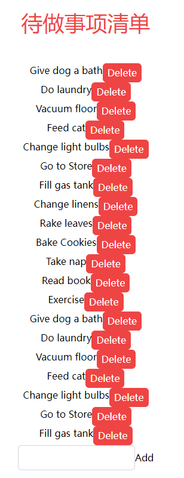

# 删

与增一样，首先需要在`src\store\useData.jsx`中定义删的函数

## 创建函数

```jsx
const useData = create((set) => ({
  data: data,
  addData: (item) =>
    set((state) => {
      // 找到当前 data 数组中最大的 id 值
      const maxId = Math.max(...state.data.map((dataItem) => dataItem.id));

      // 构建新的任务项对象
      const newTask = {
        id: maxId + 1, // 设置新的 id
        task: item,
        complete: false,
      };

      // 返回更新后的状态
      return {
        data: [...state.data, newTask], // 将新的任务项添加到 data 数组中
      };
    }),
  deleteData: (id) =>
    set((state) => {
      // 返回更新后的状态
      return {
        data: state.data.filter((dataItem) => dataItem.id !== id), // 过滤掉 id 不等于传入 id 的任务项
      };
    }),
}));
```

### 代码解释

- `deleteData` 是一个函数，接受一个 `id` 参数，表示要删除的任务项的 `id`。
- 在函数体内，我们使用 `set` 函数来更新状态。`set` 函数接受一个回调函数，这个回调函数返回一个新的状态对象，用于更新当前状态。
- 在回调函数中，我们返回一个新的状态对象，其中的 `data` 属性是原来的任务数据数组经过 `filter` 方法过滤后的结果。
- `filter` 方法用于过滤数组，返回一个新数组，其中包含满足指定条件的元素。在这里，我们使用 `dataItem.id !== id` 条件来过滤掉 `id` 不等于传入的 `id` 的任务项，从而删除了指定 `id` 的任务项。

## 新建组件

在`src\components`中新建`DeleteButtom.jsx`文件,输入

```jsx
import React from "react";
import { useData } from "../store/useData";

const DeleteButton = ({ id }) => {
  const deleteData = useData((state) => state.deleteData);
  const handleDeleteTask = () => {
    deleteData(id);
  };

  return (
    <button
      className="bg-red-500 text-white px-2 py-1 rounded-md"
      onClick={handleDeleteTask}
    >
      Delete
    </button>
  );
};

export default DeleteButton;
```

## 调用

`src\components\MyToDoListBody.jsx`
```jsx
import React from "react";
import { useData } from "../store/useData";
import AddButtom from "./AddButtom";
import DeleteButtom from "./DeleteButtom";

const MyToDoListBody = () => {
  const data = useData((state) => state.data);
  return (
    <div className="flex flex-col text-center items-center">
      {data.map((item) => (
        <div className="flex flex-row">
          {item.task}
          <DeleteButtom id={item.id} />
        </div>
      ))}
      <AddButtom />
    </div>
  );
};

export default MyToDoListBody;
```

## 效果
