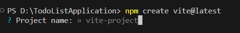
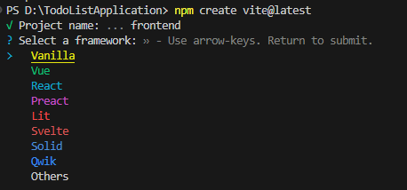
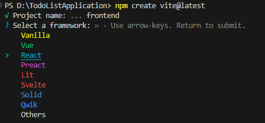
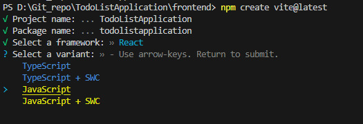
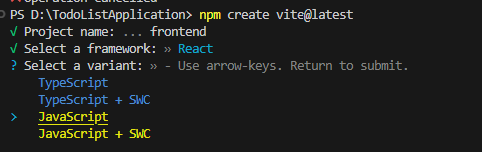
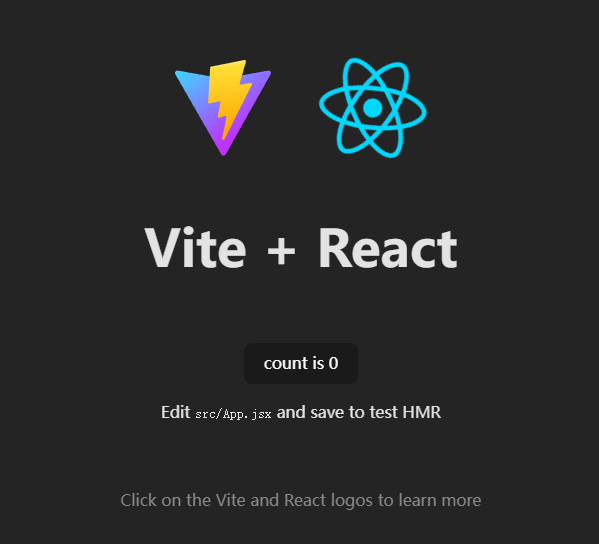
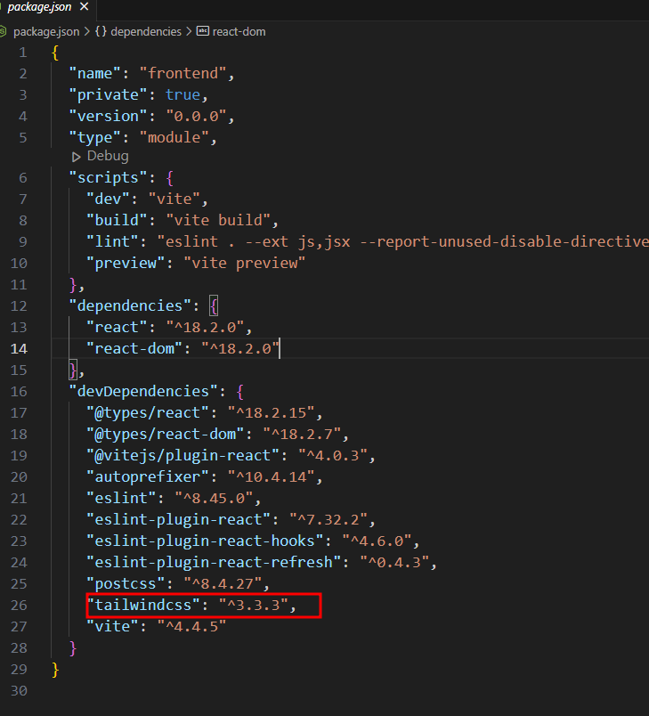
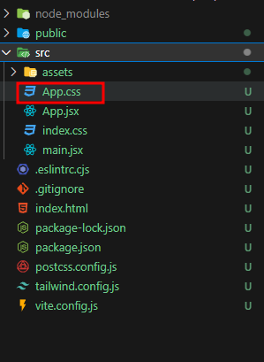
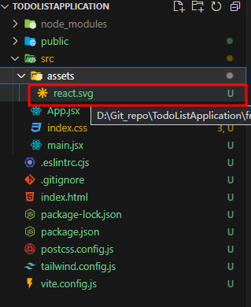
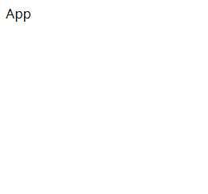

# 初始化项目

## Vite

首先进行以下操作

1. 新建文件夹，命名为TodoListApplication。
2. 在VScode中打开TodoListApplication，并打开终端。

我们使用[Vite](https://cn.vitejs.dev/guide/#scaffolding-your-first-vite-project)来初始化前端项目。

在命令行中输入
```bash
npm create vite@latest
```


在这里输入frontend，回车






用键盘的上下键选择，我们选择`React`框架，回车



选择用Javascript，回车



此时已经初始化成功，按照它的提示，输入

```bash
code frontend
```

然后会跳出新的vscode窗口，打开命令行，输入
```bash
npm install
npm run dev
```
:::tip
`npm install`是按照所需要的依赖

`npm run dev`是启动项目
:::


此时本地服务器已经启动,浏览器输入http://localhost:5173/，即可看到我们的项目



## 安装所需要的包

### tailwind css


接下来我们新建终端，输入
```bash
npm install -D tailwindcss postcss autoprefixer
npx tailwindcss init -p
```
我们将使用[Tailwind](https://tailwindcss.com/docs/guides/vite)作为样式

:::tip
[Tailwind](https://www.tailwindcss.cn/)是什么？
只需书写 HTML 代码，无需书写 CSS，即可快速构建美观的网站。
:::


### 查看是否安装



打开**package.json**文件，可以看到已经安装好了所需要的包

:::tip
package.json 是一个用于描述和管理项目的配置文件，通常位于项目的根目录下。它是 Node.js 项目的一部分，用于定义项目的元数据、依赖关系和脚本命令等信息。

在 package.json 文件中，可以包含以下信息：

1. 项目名称 (`name`)：指定项目的名称。
2. 项目版本 (`version`)：指定项目的版本号。
3. 项目描述 (`description`)：对项目进行简要描述。
4. 作者 (`author`)：指定项目的作者。
5. 许可证 (`license`)：指定项目的许可证。
6. 依赖关系 (`dependencies`)：指定项目所依赖的外部包或库。
7. 开发依赖关系 (`devDependencies`)：指定项目在开发过程中所需要的依赖项。
8. 脚本命令 (`scripts`)：定义一些自定义的脚本命令，可以通过 `npm run` 或 `yarn run` 来执行这些命令。
9. 其他自定义配置项：可以根据项目的需要添加其他自定义的配置项。

通过编辑和维护 package.json 文件，开发人员可以管理项目的依赖、运行自定义的脚本命令，以及描述项目的基本信息。这对于项目的开发、构建和部署非常有用。
:::

## 配置Tailwind



删除该文件，因为我们有了Tailwind css就不需要自己写css了



删除文件src\assets\react.svg

将src\index.css文件中的代码替换为

```css
@tailwind base;
@tailwind components;
@tailwind utilities;
```

将tailwind.config.js替代为
```jsx
/** @type {import('tailwindcss').Config} */
export default {
  content: [
    "./index.html",
    "./src/**/*.{js,ts,jsx,tsx}",
  ],
  theme: {
    extend: {},
  },
  plugins: [],
}

```
:::tip
tailwind.config.js 是 Tailwind CSS 的配置文件。它用于自定义和配置 Tailwind CSS 的各种选项和样式。

在 tailwind.config.js 文件中，可以进行以下配置：

1. 主题（Theme）：通过配置颜色、字体、边框、间距等参数来定义项目的主题样式。
2. 变体（Variants）：配置哪些 CSS 类名的变体应该生成，例如响应式类名、伪类、状态类等。
3. 插件（Plugins）：引入和配置各种插件来扩展 Tailwind CSS 的功能，例如自定义样式、添加第三方库、优化工具等。
4. 样式（Styles）：配置自定义的 CSS 类名和样式，可以使用原生 CSS 或预处理器语法。
5. PurgeCSS：配置用于清除未使用的 CSS 的选项，以减小生成的 CSS 文件大小。

通过编辑和配置 tailwind.config.js 文件，可以根据项目的需要自定义和调整 Tailwind CSS 的样式和功能。这样可以使得 Tailwind CSS 更加适应项目的需求，并提供一致的设计风格和样式规范。
:::


打开src\App.jsx文件，将其中的代码替换为

```jsx
function App() {
  return <div>App</div>;
}

export default App;

```

打开网页可以看到网页的左上角


此时的文件结构为

```
frontend
├─ .eslintrc.cjs
├─ .gitignore
├─ index.html
├─ package-lock.json
├─ package.json
├─ postcss.config.js
├─ public
│  └─ vite.svg
├─ README.md
├─ src
│  ├─ App.jsx
│  ├─ assets
│  ├─ index.css
│  └─ main.jsx
├─ tailwind.config.js
└─ vite.config.js
```

## 新建组件文件夹等

在/src下新建components文件夹


### 测试Tailwind css

将APP.jsx中的代码替换为

```jsx
function App() {
  return <div className="container py-16 px-6 min-h-screen mx-auto">App</div>;
}

export default App;
```
返回网页，发现


说明css样式生效了
