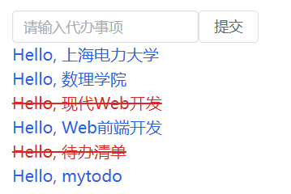

# State和事件处理

## pinia

Pinia 起始于 2019 年 11 月左右的一次实验，其目的是设计一个拥有组合式 API 的 Vue 状态管理库。

[pinia官网地址](https://pinia.vuejs.org/zh/introduction.html)

Pinia安装如下，在命令行中输入

```bash
npm install pinia
```

## 状态

[什么是状态](https://cn.vuejs.org/guide/scaling-up/state-management.html)


## 使用

在```src\main.js```中输入以下代码

```js
import { createApp } from "vue";
import App from "./App.vue";
import "./index.css";
import { createPinia } from "pinia";

const app = createApp(App);
app.use(createPinia());
app.mount("#app");
```
<!-- TODO:解释何为插件，怎么使用 -->

在```/src```文件夹下新建```store```文件夹,在store文件夹下新建```todoData.js```文件


在```src\store\todoData.js```写入代码

```js
import { defineStore } from "pinia";

export const useTodoDataStore = defineStore("todoData", {
  state: () => ({
    todoList: [
      {
        id: 1,
        content: "上海电力大学",
        isDone: false,
      },
      {
        id: 2,
        content: "数理学院",
        isDone: false,
      },
      {
        id: 3,
        content: "现代Web开发",
        isDone: true,
      },
      {
        id: 4,
        content: "Web前端开发",
        isDone: false,
      },
      {
        id: 5,
        content: "待办清单",
        isDone: true,
      },
    ],
  }),
  getters: { allTodos: (state) => state.todoList },
  actions: {},
});

```

这段代码使用 `Pinia`，它是一个 Vue.js 的状态管理库,在这个代码中，通过 `defineStore` 函数创建了一个名为 `useTodoDataStore` 的状态管理仓库。

1. **state:**
   在 Pinia 中，`state` 是用于存储数据的地方。在这个例子中，`state` 函数返回一个对象，其中包含一个名为 `todoList` 的数组。这个数组存储了待办事项的信息，每个事项是一个包含 `id`、`content` 和 `isDone` 属性的对象。

   ```javascript
   state: () => ({
     todoList: [
       // ... todo items ...
     ],
   }),
   ```

2. **getters:**
   `getters` 允许你在仓库中计算派生状态或对 `state` 进行一些逻辑操作。在这个例子中，定义了一个名为 `allTodos` 的 getter 函数，它返回当前存储在 `state` 中的所有待办事项。

   ```javascript
   getters: { 
     allTodos: (state) => state.todoList 
   },
   ```

3. **actions:**
   `actions` 是用于处理异步逻辑或对 `state` 进行更改的地方。在这个例子中，`actions` 没有被定义，因此在这个仓库中没有异步操作或对 `state` 的更改逻辑。

   ```javascript
   actions: {},
   ```

这个 `Pinia` 仓库用于管理应用程序中的待办事项数据。`state` 存储数据，`getters` 提供对数据的访问，而 `actions` 可以在需要时执行一些逻辑操作。在应用中，你可以使用 `useTodoDataStore` 来访问或更改待办事项的状态。


在```src\components\Todo.vue```中写入代码
```vue
<script setup>
import Todo from "./components/Todo.vue";
import { useTodoDataStore } from "./stores/todoData";
const todoData = useTodoDataStore();
const todoList = todoData.allTodos;
</script>

<template>
  <div className="bg-white text-black p-4">
    <ul v-for="todo in todoList">
      <Todo :todo="todo" :keys="todo.id" />
    </ul>
  </div>
</template>
```
此时网页效果没有改变


## 增加功能

### Element Plus

[Element Plus官网](https://element-plus.org/zh-CN/guide/installation.html)

```bash
npm install element-plus --save
npm install -D unplugin-vue-components unplugin-auto-import
```
[安装配置](https://element-plus.org/zh-CN/guide/quickstart.html#%E6%8C%89%E9%9C%80%E5%AF%BC%E5%85%A5)


Element Plus 是一个基于 Vue 3 的 UI 组件库，是对原本 Vue 2.x 版本的 Element UI 的升级和重构。Element Plus 提供了一套丰富的、现代化的 UI 组件，可用于构建用户界面。该组件库以易用性和美观为目标，广泛用于 Vue.js 的项目中。

在`vite.config.js`中写入
```js
import { defineConfig } from "vite";
import AutoImport from "unplugin-auto-import/vite";
import Components from "unplugin-vue-components/vite";
import { ElementPlusResolver } from "unplugin-vue-components/resolvers";
import vue from "@vitejs/plugin-vue";
export default defineConfig({
  plugins: [
    [vue()],
    AutoImport({
      resolvers: [ElementPlusResolver()],
    }),
    Components({
      resolvers: [ElementPlusResolver()],
    }),
  ],
});
```

### 添加Todo
在``src\stores\todoData.js``中写入代码
```js
import { defineStore } from "pinia";

export const useTodoDataStore = defineStore("todoData", {
  state: () => ({
    todoList: [
      {
        id: 1,
        content: "上海电力大学",
        isDone: false,
      },
      {
        id: 2,
        content: "数理学院",
        isDone: false,
      },
      {
        id: 3,
        content: "现代Web开发",
        isDone: true,
      },
      {
        id: 4,
        content: "Web前端开发",
        isDone: false,
      },
      {
        id: 5,
        content: "待办清单",
        isDone: true,
      },
    ],
  }),
  getters: { allTodos: (state) => state.todoList },
  actions: {
    addTodo(content) {
      const newTodo = {
        id: this.todoList.length + 1,
        content: content,
        isDone: false,
      };
      this.todoList.push(newTodo);
    },
  },
});
```

在``src\App.vue``中写入代码
```vue
<script setup>
// 导入 Todo 组件、todoData 数据仓库和 ref 函数
import Todo from "./components/Todo.vue";
import { useTodoDataStore } from "./stores/todoData";
import { ref } from "vue";

// 创建一个 ref 对象，用于存储输入框的值
const input = ref("");

// 获取名为 todoData 的数据仓库实例
const todoData = useTodoDataStore();

// 从 todoData 中获取名为 allTodos 的响应式数据
const todoList = todoData.allTodos;

// 获取名为 addTodo 的 action 函数，用于添加新的 todo
const addTodo = todoData.addTodo;

// 定义一个名为 AddTodo 的函数，用于添加新的 todo
const AddTodo = () => {
  // 调用 addTodo action，将输入框的值作为参数传递
  addTodo(input.value);
  
  // 将输入框的值重置为空
  input.value = "";
};
</script>

<template>
  <div class="bg-white text-black p-4">
    <el-row>
      <el-col :span="6">
        <el-input v-model="input" placeholder="请输入代办事项" />
      </el-col>
      <el-button @click="AddTodo">提交</el-button>
    </el-row>
    <ul v-for="todo in todoList">
      <Todo :todo="todo" :keys="todo.id" />
    </ul>
  </div>
</template>
```
此时效果如下


在输入框输入`mytodo`可以看到


