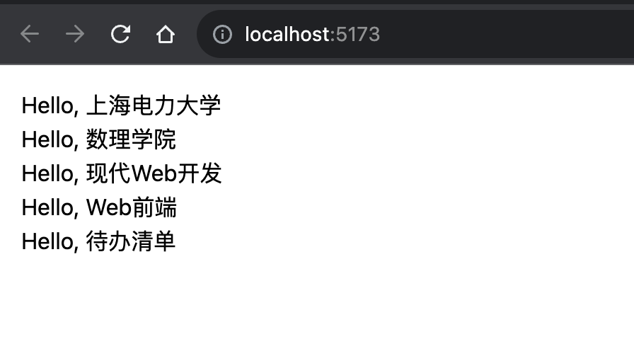
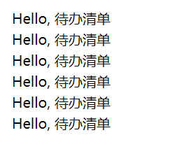
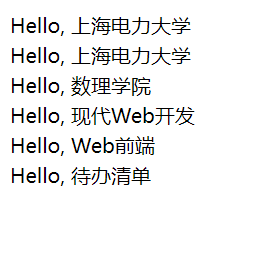
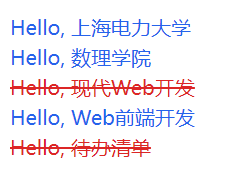

# Todo List组件

## 待办清单

请用 VS Code 打开 `src/app.vue`，输入如下代码:

```vue
<script setup>
  const todoList = [
    "上海电力大学",
    "数理学院",
    "现代Web开发",
    "Web前端",
    "待办清单",
  ];
</script>

<template>
    <div className="bg-white text-black p-4">
      <ul>
        <li>Hello, {{todoList[0]}}</li>
        <li>Hello, {{todoList[1]}}</li>
        <li>Hello, {{todoList[2]}}</li>
        <li>Hello, {{todoList[3]}}</li>
        <li>Hello, {{todoList[4]}}</li>
      </ul>
    </div>
</template>


```
可以看到，我们使用 const 定义了一个 todoList 数组常量，
并且在 vue 中使用 \{\{\}\} 进行动态插值，插入了数组的四个元素。

在项目root路径下运行如下命令（*如果之前已经运行并且没有杀掉该进程则无需运行该命令*）：
<!-- TODO:可能不懂root是什么 -->

```bash
npm run dev
```
浏览器中的效果应该是这样的：




:::tip

请一直打开`npm run dev`，不要关闭。这样修改代码后，浏览器中的内容将会自动刷新！

:::


## 一个新的组件

新建一个文件 `src/components/Todo.vue`，VS Code打开后输入如下代码：

```vue
<template >
    <li>Hello, 待办清单</li>
</template>
```

请用 VS Code 打开 `src/app.vue`，将代码更改成如下:

```vue
<script setup>
import Todo from "./components/Todo.vue"
</script>

<template>
    <div className="bg-white text-black p-4">
      <ul>
        <Todo />
        <Todo />
        <Todo />
        <Todo />
        <Todo />
        <Todo />
      </ul>
    </div>
</template>
```

我们定义了一个新的组件`Todo`，然后在组件的 `render` 中返回了 `<li>Hello,待办清单</li>`
在`app.vue`使用了6个相同的 Todo 组件，于是浏览器中会渲染6个 "Hello, 待办清单"。



## props —— 组件间共享数据

你可能注意到我们暂时没有使用之前定义的 todoList 数组，而是使用了6个相同的 Todo 组件。
现在6个待办事项都是一样的内容，这有点单调，你可能会想，
如果可以像调用函数那样可以通过传参对组件进行个性化定制就好了，你的想法是对的！
React 为组件提供了 Props，使得在使用组件时，可以给组件传入属性进行个性化渲染。

更改 `src/components/Todo.vue`代码如下：

```vue
<script setup>
const props = defineProps(["content"]);
</script>
<template>
  <a> Hello, {{ props.content }} </a>
</template>
```

`Todo`组件默认接收 `props` 参数，它是一个对象，用于保存父组件传递下来的内容，
在这里我们使用 `content` 变量对 `props` 进行了解构赋值。这段代码等价与如下代码：

```vue
<script setup>
const props = defineProps(["content"]);
const {content} = props
</script>
<template>
  <a> Hello, {{ content }} </a>
</template>
```


更改 `src/app.vue`代码如下：

```vue
<script setup>
import Todo from "./components/Todo.vue"

const todoList = [
    "上海电力大学",
    "数理学院",
    "现代Web开发",
    "Web前端",
    "待办清单",
  ];
</script>

<template>
    <div className="bg-white text-black p-4">
      <ul>
        <Todo content="上海电力大学"/>
        <Todo :content=todoList[0] />
        <Todo :content=todoList[1] />
        <Todo :content=todoList[2] />
        <Todo :content=todoList[3] />
        <Todo :content=todoList[4] />
      </ul>
    </div>
</template>
```

我们给 `Todo` 组件传递了一个 `content` 属性， 它的值为 `TodoList` 里面的属性，
所有传递的属性都会合并进 `props` 对象中，然后传递给 `Todo` 组件，
这里 `props` 对象是这样的 `props = { content: "上海电力大学" }` 。
于是浏览器渲染效果又回到我们想要的。

在Vue的模板语法中，使用冒号 : 用于绑定动态数据，而不使用冒号则表示传递的是静态数据。

```vue
  <!-- 静态内容 -->
  <Todo content="上海电力大学"/>
  
  <!-- 动态绑定，content属性的值为 todoList[0] 的内容 -->
  <Todo :content="todoList[0]" />
```



:::tip
如果我们再传递一个属性该怎么做呢？其实很简单，代码如下：

```jsx
<Todo content="上海电力大学" from="从App组件传递" />
``` 

最终 `props` 对象就会变成这样：`props={ content: "上海电力大学",  from = "从App组件传递" }`

:::

## 列表和 Key

目前我们有5个 Todo 组件，我们是一个一个取值然后渲染，这显得有点原始，
并且不可扩展，因为当我们的 todoList 数组很大的时候（比如 100 个元素），
一个一个获取就显得不切实际了，这个时候我们就需要循环介入了。

### 渲染组件列表

vue 允许我们渲染一个列表，于是我们可以将 `src/app.vue` 的代码更改成如下:

```vue
<script setup>
import Todo from "./components/Todo.vue"

const todoList = [
    "上海电力大学",
    "数理学院",
    "现代Web开发",
    "Web前端",
    "待办清单",
  ];
</script>

<template>
    <div className="bg-white text-black p-4">
      <ul v-for="todo in todoList" :key="todo.id">
        <Todo :content=todo />
      </ul>
    </div>
</template>
```

<!-- 我们通过对 todoList 进行 map 遍历，返回了一个 Todo 列表，然后使用 {} 插值语法渲染这个列表。 -->
`v-for` 是 Vue.js 提供的一个指令，用于迭代数组或对象的每一项，生成相应的元素。在这个例子中，`v-for="todo in todoList"` 表示遍历 `todoList` 数组中的每一项，并为每一项都渲染一个 `<ul>` 元素，其中 `:key="todo.id"` 是为了给每一项指定一个唯一的标识符，以便 Vue.js 在更新时能够高效地追踪每个项的变化。

在每次迭代中，`todo` 变量都代表数组中的当前项，然后通过 `:content="todo"` 将 `todo` 对象传递给 `Todo` 组件。这样，`Todo` 组件就能够使用 `todo` 对象中的数据进行渲染和展示。

<!-- TODO:vue对key没有要求？ -->

## 条件渲染

在 vue 中，我们可以根据不同的情况，渲染不同的内容，这也被成为条件渲染。

### if-else 条件渲染

将 `src/App.vue` 的代码更改如下：

```vue
<script setup>
import Todo from "./components/Todo.vue"

const todoList = [
    {
      id: 1,
      content: "上海电力大学",
      isDone: false,
    },
    {
      id: 2,
      content: "数理学院",
      isDone: false,
    },
    {
      id: 3,
      content: "现代Web开发",
      isDone: true,
    },
    {
      id: 4,
      content: "Web前端开发",
      isDone: false,
    },
    {
      id: 5,
      content: "待办清单",
      isDone: true,
    },
  ];
</script>

<template>
    <div className="bg-white text-black p-4">
      <ul v-for="todo in todoList :key="todo.id"">
        <Todo  :todo="todo" />
      </ul>
    </div>
</template>
```

将 `src/components/Todo.vue` 的代码更改如下:

```vue
<script setup>
import { toRefs } from "vue";
const props = defineProps({
  todo: { id: Number, content: String, isDone: Boolean },
});
const { id, content, isDone } = toRefs(props.todo);
</script>
<template>
  <a :class="isDone ? 'text-red-600 line-through' : 'text-blue-600'">
    Hello, {{ content }}
  </a>
</template>
```
:::tip
`defineProps` 是 Vue 3 Composition API 中提供的一个函数，用于声明和定义组件的 props。在代码中，`defineProps` 用于声明和设置 `todo` 这个 prop 的类型。


```javascript
const props = defineProps({
  todo: { id: Number, content: String, isDone: Boolean },
});
```

- `defineProps`：这是一个用于声明组件 props 的函数，它接受一个对象作为参数，对象中包含了每个 prop 的名称和对应的类型。

- `todo: { id: Number, content: String, isDone: Boolean }`：这表示组件有一个名为 `todo` 的 prop，其类型是一个对象，这个对象包含三个属性：`id`、`content`、`isDone`，分别指定了它们的类型。

通过这样的声明，Vue 会在组件中验证传递给 `todo` prop 的值是否符合声明的类型。在这个例子中，Vue 期望传递的 `todo` 是一个对象，且这个对象有 `id`、`content` 和 `isDone` 这三个属性，分别对应着 `Number`、`String` 和 `Boolean` 类型。

这样的声明有助于提高组件的可维护性和可读性，同时也可以帮助 Vue 在开发过程中进行更好的类型检查。如果传递的 prop 类型不符合声明，Vue 会在开发环境下发出警告，有助于及早发现并修复问题。
:::

在上面的代码中，我们判断 `todo.isDone` 的内容，当为false时，证明该待办事项没有完成，设置成蓝色。
当为true时，证明该待办事项已完成，于是增加中划线和字体变为红色的CSS样式。
`text-rose-600` 和 `line-through` 请仔细阅读Tailwind CSS的文档。

效果如下：



:::tip
`toRefs` 函数用于将一个带有响应式属性的对象转换成一个普通对象，其中的每个属性都是一个引用。通过使用 `toRefs(props.todo)`，确保 `id`、`content` 和 `isDone` 的每个属性都保持响应式。

在组合式 API 中，props 不会自动变成响应式。因此，通过使用 `toRefs`，使得 `props.todo` 的每个属性都具备了响应式。这在你想以一种从响应式中受益的方式使用这些属性时很有用，比如在计算属性或模板中。

如果直接使用 `props.todo` 而不使用 `toRefs`，这些属性就不会是响应式的，对它们的更改可能不会触发响应系统更新你的组件。
:::

### 三元表达式

当使用三元表达式时，你可以将类对象的写法转换为如下：

```html
<a :class="isDone ? 'text-red-600 line-through' : 'text-blue-600'">
  Hello, {{ content }}
</a>
```

这使用了三元运算符，如果 `isDone` 为 `true`，那么应用 `'text-red-600 line-through'` 类，否则应用 `'text-blue-600'` 类。这样可以更加简洁地表达条件样式的逻辑。