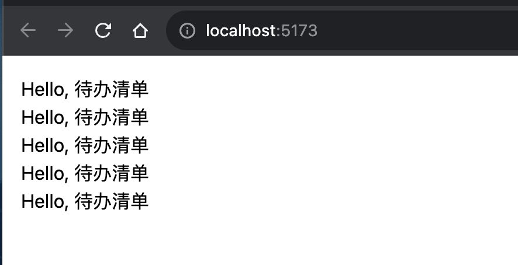
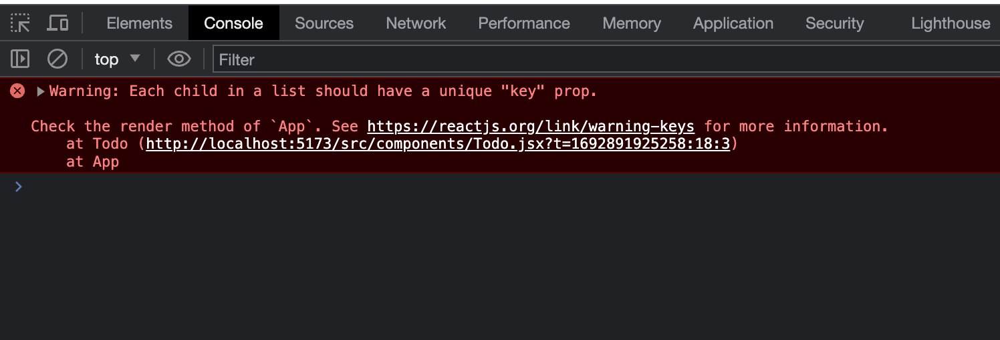
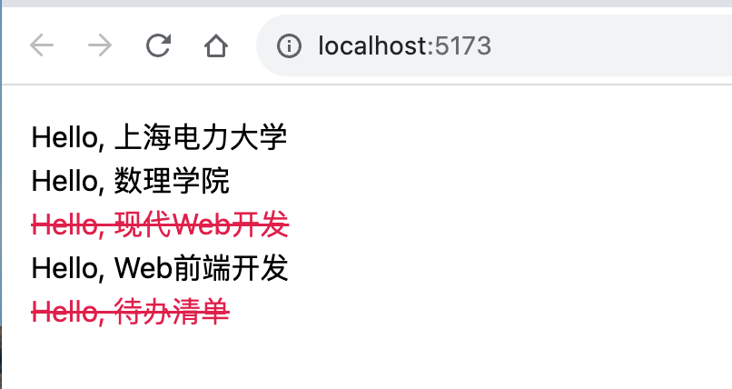

# Todo List组件

## 待办清单

请用 VS Code 打开 `src/App.jsx`，输入如下代码:

```jsx
function App() {
  const todoList = [
    "上海电力大学",
    "数理学院",
    "现代Web开发",
    "Web前端",
    "待办清单",
  ];
  return (
    <div className="bg-white text-black p-4">
      <ul>
        <li>Hello, {todoList[0]}</li>
        <li>Hello, {todoList[1]}</li>
        <li>Hello, {todoList[2]}</li>
        <li>Hello, {todoList[3]}</li>
        <li>Hello, {todoList[4]}</li>
      </ul>
    </div>
  );
}

export default App;
```
可以看到，我们使用 const 定义了一个 todoList 数组常量，
并且在 JSX 中使用 {} 进行动态插值，插入了数组的四个元素。

在项目root路径下运行如下命令（*如果之前已经运行并且没有杀掉该进程则无需运行该命令*）：

```bash
npm run dev
```
浏览器中的效果应该是这样的：


:::tip

请一直打开`npm run dev`，不要关闭。这样修改代码后，浏览器中的内容将会自动刷新！

:::


## 一个新的组件

新建一个文件 `src/components/Todo.jsx`，VS Code打开后输入如下代码：

```jsx
function Todo() {
  return <li>Hello, 待办清单</li>;
}

export default Todo;
```

请用 VS Code 打开 `src/App.jsx`，将代码更改成如下:

```jsx
import Todo from "./components/Todo";

function App() {
  const todoList = [
    "上海电力大学",
    "数理学院",
    "现代Web开发",
    "Web前端",
    "待办清单",
  ];
  return (
    <div className="bg-white text-black p-4">
      <ul>
        <Todo />
        <Todo />
        <Todo />
        <Todo />
        <Todo />
      </ul>
    </div>
  );
}

export default App;
```

我们定义了一个新的组件`Todo`，然后在组件的 `render` 中返回了 `<li>Hello,待办清单</li>`
在`App.jsx`使用了5个相同的 Todo 组件，于是浏览器中会渲染5个 "Hello, 待办清单"。



## props —— 组件间共享数据

你可能注意到我们暂时没有使用之前定义的 todoList 数组，而是使用了5个相同的 Todo 组件。
现在5个待办事项都是一样的内容，这有点单调，你可能会想，
如果可以像调用函数那样可以通过传参对组件进行个性化定制就好了，你的想法是对的！
React 为组件提供了 Props，使得在使用组件时，可以给组件传入属性进行个性化渲染。

更改 `src/components/Todo.jsx`代码如下：

```jsx
function Todo({ content }) {
  return <li>Hello, {content}</li>;
}

export default Todo;
```

`Todo`组件默认接收 `props` 参数，它是一个对象，用于保存父组件传递下来的内容，
在这里我们使用 `content` 变量对 `props` 进行了解构赋值。这段代码等价与如下代码：

```jsx
function Todo(props) {
  const { content } = props;
  return <li>Hello, {content}</li>;
}

export default Todo;
```


更改 `src/App.jsx`代码如下：
```jsx
import Todo from "./components/Todo";

function App() {
  const todoList = [
    "上海电力大学",
    "数理学院",
    "现代Web开发",
    "Web前端",
    "待办清单",
  ];
  return (
    <div className="bg-white text-black p-4">
      <ul>
        <Todo content={todoList[0]} />
        <Todo content={todoList[1]} />
        <Todo content={todoList[2]} />
        <Todo content={todoList[3]} />
        <Todo content={todoList[4]} />
      </ul>
    </div>
  );
}

export default App;
```

我们给 `Todo` 组件传递了一个 `content` 属性， 它的值为 `TodoList` 里面的属性，
所有传递的属性都会合并进 `props` 对象中，然后传递给 `Todo` 组件，
这里 `props` 对象是这样的 `props = { content: "上海电力大学" }` 。
于是浏览器渲染效果又回到我们想要的。


:::tip
如果我们再传递一个属性该怎么做呢？其实很简单，代码如下：

```jsx
<Todo content="上海电力大学" from="从App组件传递" />
```

最终 `props` 对象就会变成这样：`props={ content: "上海电力大学",  from = "从App组件传递" }`

:::

## 列表和 Key

目前我们有5个 Todo 组件，我们是一个一个取值然后渲染，这显得有点原始，
并且不可扩展，因为当我们的 todoList 数组很大的时候（比如 100 个元素），
一个一个获取就显得不切实际了，这个时候我们就需要循环介入了。

### 渲染组件列表

JSX 允许我们渲染一个列表，于是我们可以将 `src/App.jsx` 的代码更改成如下:

```jsx
import Todo from "./components/Todo";

function App() {
  const todoList = [
    "上海电力大学",
    "数理学院",
    "现代Web开发",
    "Web前端",
    "待办清单",
  ];
  return (
    <div className="bg-white text-black p-4">
      <ul>
        {todoList.map((todo) => (
          <Todo content={todo} />
        ))}
      </ul>
    </div>
  );
}

export default App;
```

我们通过对 todoList 进行 map 遍历，返回了一个 Todo 列表，然后使用 {} 插值语法渲染这个列表。
但是不要以为这样写你就可以万事大吉了，请打开浏览器的终端，便可以看到如下报错：



### 加上Key

React 要求给列表中每个组件加上 key 属性，用于标志在列表中这个组件的身份，
这样当列表内容进行了修改：
增加或删除了元素时，React 可以根据 key 属性高效的对列表组件进行创建和销毁操作。
于是我们应将 `src/App.jsx` 的代码更改成如下:

```jsx
import Todo from "./components/Todo";

function App() {
  const todoList = [
    "上海电力大学",
    "数理学院",
    "现代Web开发",
    "Web前端",
    "待办清单",
  ];
  return (
    <div className="bg-white text-black p-4">
      <ul>
        {todoList.map((todo, index) => (
          <Todo content={todo} key={index} />
        ))}
      </ul>
    </div>
  );
}

export default App;
```

请再一次打开浏览器的终端，相信刚才的报错已经没有了。

:::tip

这里我们使用了列表的 `index` 作为组件的 `key` 值，
React 社区推荐的最佳实践方式是使用列表数据元素的唯一标识符作为 `key` 值，
如果你的数据是来自数据库获取，那么列表元素数据的主键可以作为 `key`。

这里的 `key` 值不会作为 `props` 传递给子组件，
React 会在编译组件时将 `key` 值从 `props` 中排除，
即最终我们的第一个 `Todo` 组件的 `props` 如下：

```js
props = { content: "上海电力大学" }
```

而不是我们认为的：

```js
props = { content: "上海电力大学", key: 0 }
```

:::


## 条件渲染

在 React 中，我们可以根据不同的情况，渲染不同的内容，这也被成为条件渲染。

### if-else 条件渲染

将 `src/App.jsx` 的代码更改如下：

```jsx
import Todo from "./components/Todo";

function App() {
  const todoList = [
    {
      id: 1,
      content: "上海电力大学",
      isDone: false,
    },
    {
      id: 2,
      content: "数理学院",
      isDone: false,
    },
    {
      id: 3,
      content: "现代Web开发",
      isDone: true,
    },
    {
      id: 4,
      content: "Web前端开发",
      isDone: false,
    },
    {
      id: 5,
      content: "待办清单",
      isDone: true,
    },
  ];

  return (
    <div className="bg-white text-black p-4">
      <ul>
        {todoList.map((todo) => (
          <Todo todo={todo} key={todo.id} />
        ))}
      </ul>
    </div>
  );
}

export default App;
```

将 `src/components/Todo.jsx` 的代码更改如下:

```jsx
function Todo({ todo }) {
  const { id, content, isDone } = todo;
  if (!isDone) {
    return <li>Hello, {content}</li>;
  } else {
    return <li className="text-rose-600 line-through">Hello, {content}</li>;
  }
}

export default Todo;
```

在上面的代码中，我们判断 `todo.isDone` 的内容，当为false时，证明该待办事项没有完成，无需特殊处理。
当为true时，证明该待办事项已完成，于是增加中划线和字体变为红色的CSS样式。
`text-rose-600` 和 `line-through` 请仔细阅读Tailwind CSS的文档。

效果如下：




### 三元表达式条件渲染

我们可以使用JavaScript提供的三元表达式对 `src/components/Todo.jsx` 的代码进行更改:

```jsx
function Todo({ todo }) {
  const { id, content, isDone } = todo;
  return (
    <li className={isDone ? "text-rose-600 line-through" : ""}>
      Hello, {content}
    </li>
  );
}

export default Todo;
```