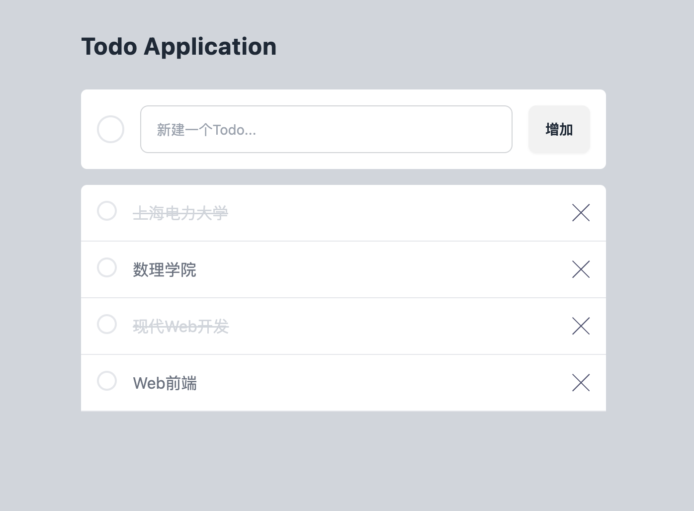
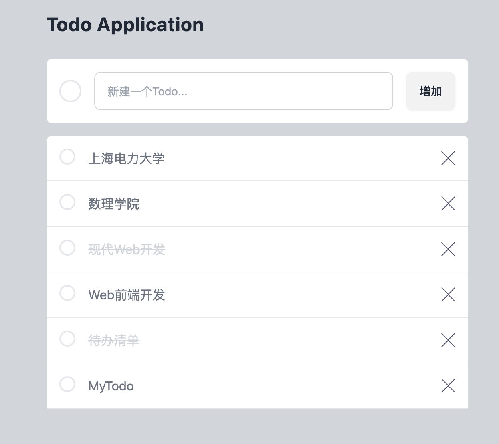

# Web前端：状态管理和事件处理

:::tip

本课程网站内容请仔细阅读后再进行实操。因未仔细阅读内容，出现任何错误后果自负（逃～～～逃～～～逃

**所有的代码请不要复制粘贴，请手敲每一行代码。复制粘贴不会让你动脑子，而手敲每一个行代码会让你自然而然地去动脑子会想每一行代码的含义和原理**
:::

## 什么是状态？

理论上来说，每一个 Vue 组件实例都已经在“管理”它自己的响应式状态了。
我们以一个简单的计数器组件为例：


```html
<script setup>
import { ref } from 'vue'

// 状态
const count = ref(0)

// 动作
function increment() {
  count.value++
}
</script>

<!-- 视图 -->
<template>{{ count }}</template>
```

它是一个独立的单元，由以下几个部分组成：

- 状态：驱动整个应用的数据源；
- 视图：对状态的一种声明式映射；
- 交互：状态根据用户在视图中的输入而作出相应变更的可能方式。

下面是“单向数据流”这一概念的简单图示：


然而，当我们有多个组件共享一个共同的状态时，就没有这么简单了：

1. 多个视图可能都依赖于同一份状态。
2. 来自不同视图的交互也可能需要更改同一份状态。

对于情景 1，一个可行的办法是将共享状态“提升”到共同的祖先组件上去，再通过 props 传递下来。
然而在深层次的组件树结构中这么做的话，很快就会使得代码变得繁琐冗长。
这会导致另一个问题：Prop 逐级透传问题。

对于情景 2，我们经常发现自己会直接通过模板引用获取父/子实例，
或者通过触发的事件尝试改变和同步多个状态的副本。
但这些模式的健壮性都不甚理想，很容易就会导致代码难以维护。

一个更简单直接的解决方案是抽取出组件间的共享状态，放在一个全局单例中来管理。这样我们的组件树就变成了一个大的“视图”，而任何位置上的组件都可以访问其中的状态或触发动作。

## pinia

Pinia 就是一个实现了上述需求的状态管理库，由 Vue 核心团队维护，对 Vue 2 和 Vue 3 都可用。

现有用户可能对 Vuex 更熟悉，它是 Vue 之前的官方状态管理库。由于 Pinia 在生态系统中能够承担相同的职责且能做得更好，因此 Vuex 现在处于维护模式。它仍然可以工作，但不再接受新的功能。对于新的应用，建议使用 Pinia。

[pinia官网地址](https://pinia.vuejs.org/zh/introduction.html)

Pinia安装如下，在命令行中输入

```bash
npm install pinia
```

## 如何使用 `pinia`

为了使用`pinia`这个插件，我们需要先挂载它

在```src\main.js```中输入以下代码

```js
import { createApp } from 'vue'
import './style.css'
import App from './App.vue'
import { createPinia } from "pinia"

const app = createApp(App);
app.use(createPinia());
app.mount('#app');
```
<!-- TODO:解释何为插件，怎么使用 -->

:::tip

`app.use(createPinia())` 初始化了 Pinia 状态管理系统，使其可在Vue应用中使用。

`app.mount("#app")` 将整个Vue应用挂载到HTML文档中ID为 "app" 的元素上。

这确保了Pinia状态管理系统能够管理Vue应用的状态，并且Vue应用能够正确地在指定的HTML元素上启动。

这是在Vue.js应用中使用插件的方式。在Vue.js中，插件是一种扩展应用功能的方式，可以在应用中全局注册插件以提供额外的特性或功能。，`createPinia` 函数用于创建一个 Pinia 的状态管理实例，并通过 `app.use(createPinia())` 将其注册为Vue.js应用的插件。

使用插件的方式，可以使应用具有额外的功能或能力，而不必在每个组件中重复配置相同的逻辑。

:::

我们需要定义一个全局的状态管理器，用来在整个 Vue.js 应用中使用 

在```/src```文件夹下新建```stores```文件夹,在store文件夹下新建```todo.js```文件

:::tip
将相关的代码组织到单独的文件夹中，这样可以更容易地查找和管理相关的代码。

`todo.js` 文件被放置在 `stores` 文件夹中，表明它包含与状态管理有关的代码。

`TodoList.vue` 文件被放置在 `components` 文件夹内，表明它是组件。
:::

在```src\stores\todo.js```写入代码

```js
import { defineStore } from "pinia";

export const todoStore = defineStore("todo", {
  state: () => ({
    todos: [
      {
        id: 1,
        content: "上海电力大学",
        is_done: false,
      },
      {
        id: 2,
        content: "数理学院",
        is_done: false,
      },
      {
        id: 3,
        content: "现代Web开发",
        is_done: true,
      },
      {
        id: 4,
        content: "Web前端开发",
        is_done: false,
      },
      {
        id: 5,
        content: "待办清单",
        is_done: true,
      },
    ],
  }),
  getters: {},
  actions: {},
});

```

这段代码使用 `Pinia`，它是一个 Vue.js 的状态管理库,在这个代码中，通过 `defineStore` 函数创建了一个名为 `useTodoDataStore` 的状态管理仓库。

1. **state:**
   在 Pinia 中，`state` 是用于存储数据的地方。`state` 函数返回一个对象，其中包含一个名为 `todoList` 的数组。这个数组存储了待办事项的信息，每个事项是一个包含 `id`、`content` 和 `isDone` 属性的对象。

   ```javascript
   state: () => ({
     todos: [
       // ... todo items ...
     ],
   }),
   ```

2. **getters:**
   `getters` 允许你在仓库中计算派生状态或对 `state` 进行一些逻辑操作。在这个例子中，定义了一个名为 `allTodos` 的 getter 函数，它返回当前存储在 `state` 中的所有待办事项。

   ```javascript
   getters: { 
     allTodos: (state) => state.todos 
   },
   ```

3. **actions:**
   `actions` 是用于处理异步逻辑或对 `state` 进行更改的地方。在这个例子中，`actions` 没有被定义，因此在这个仓库中没有异步操作或对 `state` 的更改逻辑。

   ```javascript
   actions: {},
   ```

这个 `Pinia` 仓库用于管理应用程序中的待办事项数据。`state` 存储数据，
`getters` 提供对数据的访问，而 `actions` 可以在需要时执行一些逻辑操作。
在应用中，你可以使用 `todoStore` 来访问或更改待办事项的状态。

有了状态管理后，我们需要改进先前的代码，使用pinia来管理状态。

我们可以将 `src/components/TodoList.vue` 的代码更改成如下:

```html showLineNumbers title="src/components/TodoList.vue"
<script setup>
import { computed } from "vue";

import TodoItem from "./TodoItem.vue";
import { todoStore } from "../stores/todo";

const useTodoStore = todoStore();
const todos = computed(()=> useTodoStore.todos);
</script>
<template>
  <div 
    class="mt-4 rounded-t-md bg-white transition-all duration-75"
  >
    <div v-for="todo in todos" :key="todo.id">
      <TodoItem :todo="todo"/>
    </div>
  </div>
</template>
<style></style>
```

- `import { computed } from "vue"`: 从Vue中导入computed函数，用于创建计算属性。计算属性是响应式的，当它们依赖的数据发生变化时会自动更新。
- `const todos = computed(() => useTodoStore.todos)`: 定义一个计算属性`todos`，其值是从`useTodoStore`中的`todos`属性获取的。
这样，当`todos`发生变化时，`todos`计算属性也会自动更新。

此时网页效果没有改变，这说明已经成功使用pinia。




## Web页面新增一个Todo

接下来我们要完成"添加Todo的功能"，首先现在`pinia`增加`actions`,这是接下来需要调用的函数。

在``src\stores\todo.js``中写入代码
```js
import { defineStore } from "pinia";

export const todoStore = defineStore("todos", {
  state: () => ({
    todos: [
      {
        id: 1,
        content: "上海电力大学",
        is_done: false,
      },
      {
        id: 2,
        content: "数理学院",
        is_done: false,
      },
      {
        id: 3,
        content: "现代Web开发",
        is_done: true,
      },
      {
        id: 4,
        content: "Web前端开发",
        is_done: false,
      },
      {
        id: 5,
        content: "待办清单",
        is_done: true,
      },
    ],
  }),
  getters: {},
  actions: {
    addTodo(content) {
      const newTodo = {
        id: this.todos.length + 1,
        content: content,
        isDone: false,
      };
      this.todos.push(newTodo);
    },
  },
});
```

我们的目标是完成一个输入框，一个确认按钮，当点击时，调用`addTodo`函数，
将输入框输入的内容添加到`todos`这个状态里，然后设置输入框的内容为空，
因为`todos`这个状态更新了，
所以网页的内容更新了。

我们可以将 `src/components/TodoCreate.vue` 的代码更改成如下:

```html showLineNumbers title="src/components/TodoCreate.vue"
<script setup>
import { todoStore } from '../stores/todo';
import { ref } from 'vue';

const inputValue = ref("");

const useTodoStore = todoStore();

const addTodo = () => {
  if(inputValue.value != "") {
    useTodoStore.addTodo(inputValue.value);
    inputValue.value = "";
  }
}
</script>
<template>
  <form
    v-on:submit.prevent="addTodo"
    class="mt-7 flex items-center gap-4 overflow-hidden rounded-md bg-white p-4 transition-all duration-700"
  >
    <span
      class="inline-block h-7 w-7 rounded-full border-2 transition-all duration-700"
    ></span>

    <input
      v-model="inputValue"
      type="text"
      placeholder="新建一个Todo..."
      class="input input-bordered input-md w-96"
    />
    <button class="btn">增加</button>
  </form>
</template>
<style></style>
```

1. `import { ref } from 'vue'`: 导入`ref`函数，用于创建响应式引用。

2. `const inputValue = ref("")`: 创建一个名为`inputValue`的响应式引用，初始值为空字符串，用于存储输入框的值。

3. `const addTodo = () => { ... }`: 定义一个`addTodo`函数，
用于向待办事项列表中添加新的待办事项。
它从`inputValue.value`获取输入框的当前值，
调用`useTodoStore`中的`addTodo`方法进行添加，
并在添加完成后将输入框的值重置为空字符串。

1. `<form v-on:submit.prevent="addTodo" ...>`: 使用`v-on:submit.prevent`指令监听表单提交事件，并调用`addTodo`函数。`.prevent`修饰符阻止表单的默认提交行为。

2. `<input v-model="inputValue" ... />`: 使用`v-model`指令将输入框的值与`inputValue`

在输入框输入`MyTodo`可以看到


