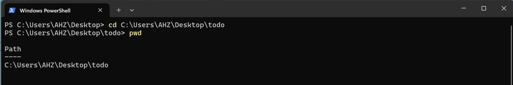
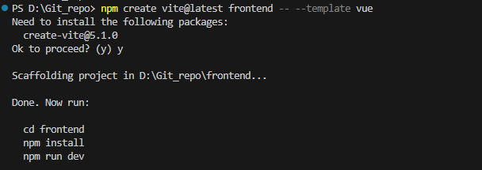
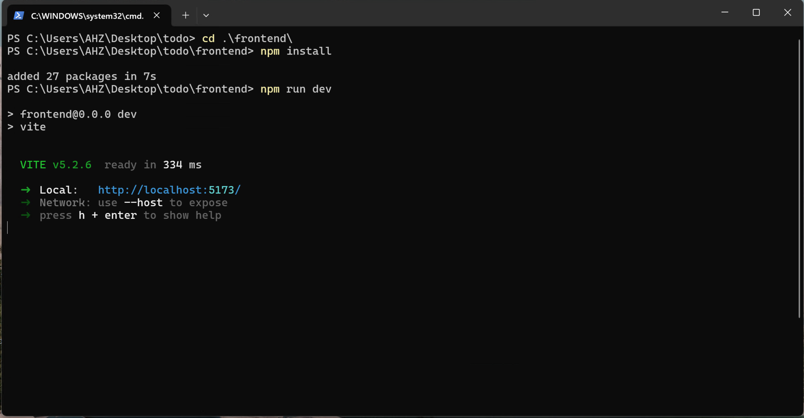
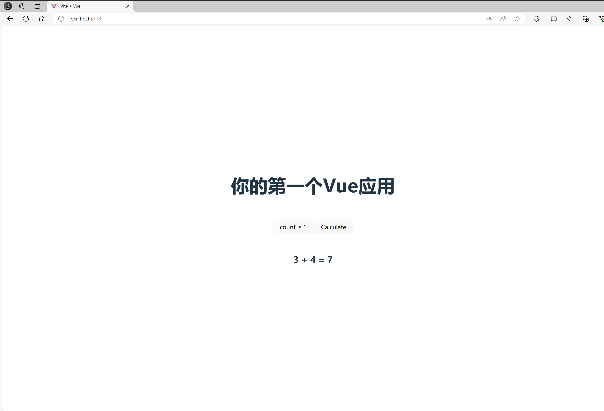

# Web前端：你的第一个Vue.js的程序

:::tip

本课程网站内容请仔细阅读后再进行实操。因未仔细阅读内容，出现任何错误后果自负（逃～～～逃～～～逃

**所有的代码请不要复制粘贴，请手敲每一行代码。复制粘贴不会让你动脑子，而手敲每一个行代码会让你自然而然地去动脑子会想每一行代码的含义和原理**
:::

随着互联网的不断发展，前端技术也从早期的HTML、CSS，到现代前端框架的兴起。前端框架是一种用于构建复杂网站的工具。它们为开发人员提供了强大的功能，例如组件化、状态管理、路由等等。前端框架的兴起标志着前端技术的进一步成熟和发展。现代前端框架中最为流行的是[**Vue**](https://cn.vuejs.org/)和[**React**](https://zh-hans.react.dev/)，它们不断地被开发和完善，成为了开发人员的首选工具。


随着Web前端框架的不断发展和演进，现代Web开发呈现出了前后端分离的趋势。这种分离技术将前端（通常指浏览器端）和后端（通常指服务器端）彻底分开，通过HTTP的API实现二者之间的通信，从而架构出更加灵活、可维护、可扩展的Web应用。

前后端分离技术的出现带来了许多优势：

- 提高开发效率和灵活性： 前端和后端团队可以独立开发、测试和部署他们各自的模块，无需相互依赖，从而提高了开发效率和灵活性。

- 更好的团队协作： 分离的架构使得前端和后端团队可以专注于各自的领域，减少了彼此之间的沟通和协调成本，提高了团队的协作效率。

- 提高了系统的可维护性： 前后端分离可以使得代码更加模块化，降低了系统的耦合度，便于单独对前端或后端进行修改、更新和维护。

- 更好的性能和用户体验： 前后端分离可以通过异步加载数据和页面片段来优化性能，提高了Web应用的响应速度和用户体验。

- 支持跨平台开发： 前后端分离使得前端可以独立于后端进行开发，因此可以更容易地实现跨平台开发，例如Web、移动端和桌面端。

在前后端分离的架构中，前端通常由一种或多种前端框架（如React、Angular、Vue.js等）来负责用户界面的渲染和交互逻辑，而后端则负责业务逻辑的处理和数据的存储，通过提供RESTful API或GraphQL等方式向前端提供数据和服务。

## 安装Nodejs以及中国镜像加速

请根据[Nodejs安装教程](/category/nodejs安装)安装Nodejs，并且**请设置NPM镜像加速**

:::note NPM镜像中国加速

由于众所周知的原因，中国地区访问 npm 的镜像仓库速度较慢。因此请一定要设置镜像加速，否则安装软件包的时候可能会出现很慢或者卡死的情况，导致程序不能运行。

如果忘了，命令如下：

```bash
npm config set registry https://registry.npmmirror.com
```

:::


## Vite 新建Vue项目

打开终端，通过 `cd` 命令进入一个合适的目录下，例如我的目录是：*`C:\Users\AHZ\Desktop\todo`*

**强烈建议路径中不要出现中文，不要出现中文，不要出现中文**

```bash
cd C:\Users\AHZ\Desktop\todo
```

通过 `pwd` 命令查看当前所在的目录的路径

```bash
pwd
```




我们使用[Vite](https://cn.vitejs.dev/guide/#scaffolding-your-first-vite-project)来新建并初始化前端项目。

在命令行中输入

```bash
npm create vite@latest frontend -- --template vue
```



在命令行中输入如下命令

```bash
cd frontend
npm install
npm run dev
```



:::tip

`npm install`用来安装所需要的包依赖，只需在初始化项目后或者增减包依赖时执行。

`npm run dev`是启动开发模式，这样便可在浏览器上看到代码实际执行后的效果。
**开发代码时若浏览器打开网址没反应，则注意一下命令行中是否运行该命令**
:::


此时本地服务器已经启动，浏览器输入[http://localhost:5173/](http://localhost:5173/)，即可看到我们的项目


🎉🎉🎉 恭喜你！你已经搭建好你的第一个Vue.js应用的开发环境。


## Demo 代码案例

请用VS Code 打开 `frontend` 文件夹中的`src`文件夹，将`App.vue`中的代码修改成如下代码：

```html showLineNumbers title="App.vue"
<script setup>
import HelloWorld from './components/HelloWorld.vue'
</script>

<template>
  <HelloWorld />
</template>

<style scoped>

</style>

```

将 `src/components/HelloWorld.vue`中的代码修改成如下代码：

```html showLineNumbers title="components/HelloWorld.vue"
<script setup>
import { ref } from 'vue';

const count = ref(0);

const result = ref("?");

function add(x, y) {
  let value = x + y;
  return value;
}

function calculate() {
  let a = 3;
  let b = 4;
  result.value = add(a, b);
  console.log(`${a} + ${b} = ${result.value}`);
}

</script>

<template>
  <h1>你的第一个Vue应用</h1>
  
  <div class="card">
    <button type="button" @click="count++">count is {{ count }}</button>
    <button type="button" @click="calculate">Calculate</button>
  </div>
  <h2>3 + 4 = {{ result }}</h2>
</template>

<style scoped>
.read-the-docs {
  color: #888;
}
</style>

```

浏览器输入[http://localhost:5173/](http://localhost:5173/) 便可看到代码更新后的效果。
（*此时需要你的`npm run dev`这个命令仍在命令行中运行着，如果被关闭了，请重新在 `frontend` 目录中运行`npm run dev`命令*



你可以点击 `count is 0`和 `Calculate`这两个button，然后观察Web页面的变化。

