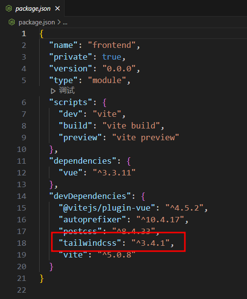
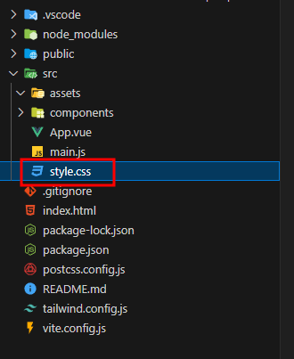
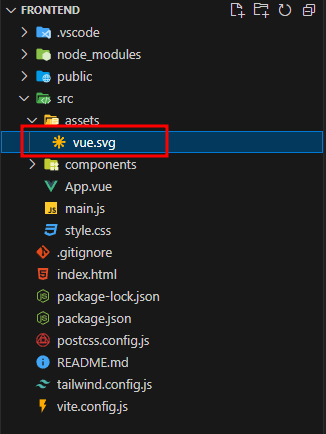
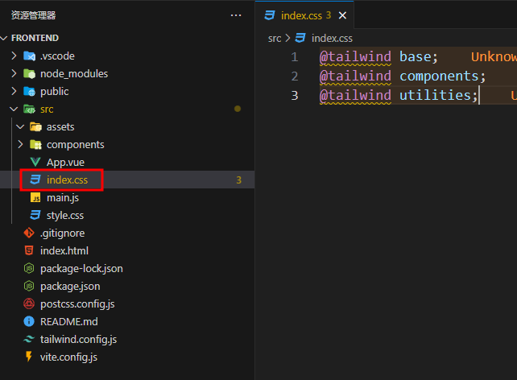
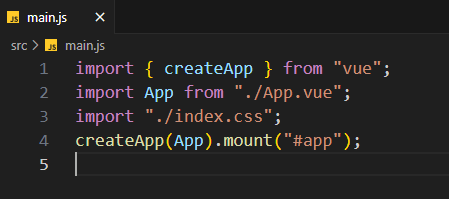

# Web前端：使用 Tailwind CSS

:::tip

本课程网站内容请仔细阅读后再进行实操。因未仔细阅读内容，出现任何错误后果自负（逃～～～逃～～～逃

**所有的代码请不要复制粘贴，请手敲每一行代码。复制粘贴不会让你动脑子，而手敲每一个行代码会让你自然而然地去动脑子会想每一行代码的含义和原理**
:::

## 什么是Tailwind CSS

Tailwind CSS 是一个基于实用程序的 CSS 框架，旨在加速网页设计和开发。与传统的 CSS 框架（例如 Bootstrap 或 Foundation）相比，Tailwind CSS 采用了不同的方法，强调直接在 HTML 中使用预定义的 CSS 类来构建样式，而不是通过预先构建的组件或模板。

**只需书写 HTML 代码，无需书写 CSS，即可快速构建美观的网站。**

Tailwind在构建生产文件时会自动删除所有未使用的CSS，所以它在实际生产环境上的体积非常小，它被认为是最富有设计感的CSS样式库。并且，连Vue的作者[尤雨溪尤大](https://zh.wikipedia.org/wiki/%E5%B0%A4%E9%9B%A8%E6%BA%AA)都fork了，我们还不行动起来嘛。

## 为什么是Tailwind CSS

通常我们在使用传统的CSS编写方式的时候，我们会花很多时间给ID选择器等取名字，
如果名字取的不好，不仅与你合作的同学不知道你写的代码意思，
而且几个月以后你回来修改实现新的样式排版，
我想如果没有个见名知义的名字你也很难立刻会想起自己写的代码的意思。

Tailwind 提供大量预定义的实用程序类，这样可以省去你取名字的烦恼，并且我们也可以通过这些类快速构建界面。
例如，要给元素添加一个背景颜色，传统的 CSS 可能需要定义一个类并将样式应用到该类：

```css
.my-background {
  background-color: red;
}
```

然后在 HTML 中使用这个类：

```html
<div class="my-background">Content</div>
```

在 Tailwind 中，可以直接在 HTML 中应用实用程序类，而无需单独定义 CSS 类：

```html
<div class="bg-red-500">Content</div>
```

这简化了开发流程，减少了书写和维护 CSS 的时间。

在传统的 CSS 中，可能会遇到全局样式冲突或级联问题。因为 Tailwind 使用大量的实用程序类，样式的范围更加局限。这可以减少不同组件之间的样式冲突，降低调试和维护的复杂性。

## Vue项目中安装Tailwin CSS

首先如果开发环境还在运行的话，请在终端中按 ctrl + c 关闭正在运行的开发环境，
然后在终端中依次输入如下的命令。

```bash
npm install -D tailwindcss postcss autoprefixer
npx tailwindcss init -p
```

如果安装速度较慢，可以使用国内npm镜像加速
```bash
npm config set registry https://registry.npmmirror.com
```

:::tip

这里推荐可以学习Tailwind CSS 写的样式模板合集————[**HyperUI**](https://www.hyperui.dev/)，
可以通过一行一行将模版中的代码敲出来，然后体会每一个CSS的样式意义。

**请务必打开HyperUI网站，对一些比较常用的UI的HTML+Tailwind的源代码进行学习。请务必学习！！！请务必学习！！！请务必学习！！！**

CSS其实不难，就是刚开始写的网页布局太少，不会融会贯通，唯一的办法就是唯手熟尔，多写多练，自然而然就会掌握CSS如何写。

同时在自己的项目中推荐大家使用最流行的Tailwind CSS组件库[**daisyUI**](https://daisyui.com/)。

**组件库虽好，但作为初学者还是要自己实现一遍功能，掌握底层原理后就算再复杂的组件库，对你来说其原理都不是黑盒子，而是透明的**
:::

### 查看是否正确安装



打开**package.json**文件，可以看到已经安装好了所需要的包。(*你的Tailwind 以及React等包的版本号可能和教程不一致，
请不要慌，我们的教程里面的代码支持最新的版本，版本号不一致不影响后续的学习*)

:::tip
package.json 是一个用于描述和管理项目的配置文件，通常位于项目的根目录下。它是 Node.js 项目的一部分，用于定义项目的元数据、依赖关系和脚本命令等信息。

在 package.json 文件中，可以包含以下信息：

1. 项目名称 (`name`)：指定项目的名称。
2. 项目版本 (`version`)：指定项目的版本号。
3. 项目描述 (`description`)：对项目进行简要描述。
4. 作者 (`author`)：指定项目的作者。
5. 许可证 (`license`)：指定项目的许可证。
6. 依赖关系 (`dependencies`)：指定项目所依赖的外部包或库。
7. 开发依赖关系 (`devDependencies`)：指定项目在开发过程中所需要的依赖项。
8. 脚本命令 (`scripts`)：定义一些自定义的脚本命令，可以通过 `npm run` 或 `yarn run` 来执行这些命令。
9. 其他自定义配置项：可以根据项目的需要添加其他自定义的配置项。

通过编辑和维护 package.json 文件，开发人员可以管理项目的依赖、运行自定义的脚本命令，以及描述项目的基本信息。这对于项目的开发、构建和部署非常有用。
:::

### 配置Tailwind CSS



删除`style.css`文件，因为我们有了Tailwind css就不需要自己写css了



删除文件`src\assets\vue.svg`

新建文件`src\index.css`，写入代码

```css
@tailwind base;
@tailwind components;
@tailwind utilities;
```


将`tailwind.config.js`替代为
```jsx
/** @type {import('tailwindcss').Config} */
module.exports = {
  content: ["./index.html", "./src/**/*.{vue,js,ts,jsx,tsx}"],
  theme: {
    extend: {},
  },
  plugins: [],
};


```

在main.js 中加入 ```import "./index.css";```，删除 ```import "./style.css";```



## 如何使用 Tailwind CSS


## 增加 daisyUI 组件库

虽然我们前面推荐了大家一款组件库，但是本项目实际会使用目前越来越火的Tailwind编写的组件库 [**daisyUI**](https://daisyui.com/)

安装 daisyUI 其实很简单，只要在命令行中输入：

```bash
npm i -D daisyui@latest
```

在你的 `tailwind.config.js` 里追加 daisyUI 的设置:

```js
export default {
  content: ["./index.html", "./src/**/*.{vue,js,ts,jsx,tsx}"],
  theme: {
    extend: {},
  },
  plugins: [
    require('daisyui'),
  ],
  daisyui: {
    themes: ["light"],
  },
};
```