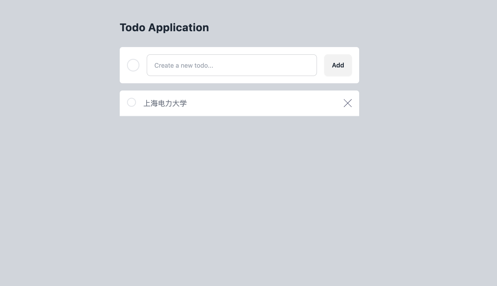
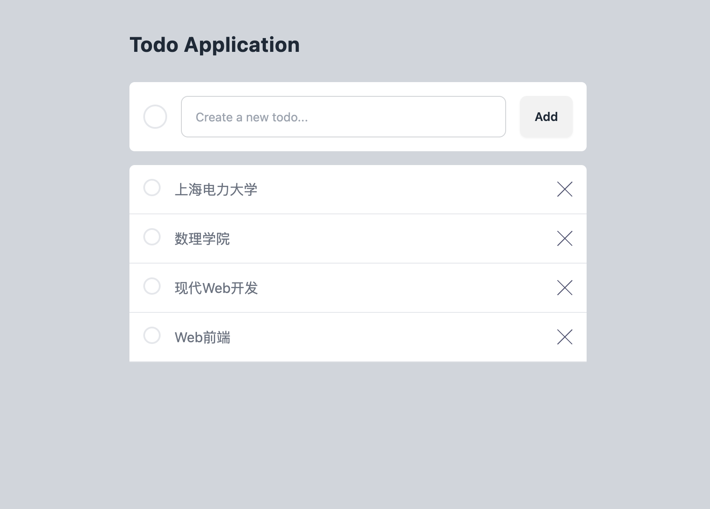

# Web前端：Todo List应用

:::tip

本课程网站内容请仔细阅读后再进行实操。因未仔细阅读内容，出现任何错误后果自负（逃～～～逃～～～逃

**所有的代码请不要复制粘贴，请手敲每一行代码。复制粘贴不会让你动脑子，而手敲每一个行代码会让你自然而然地去动脑子会想每一行代码的含义和原理**
:::

我们先来设计最基础的功能，Todo List 一般用来记录备忘的，最简单的功能包括：

1. 新增一条备忘。
2. 修改该条备忘。
3. 选择/全选删除某条备忘。
4. 将某条备忘设置成已完成。
5. 快速删除已完成的备忘。


## 完成基础UI部分

1. 新建 `src/views/`文件夹；
2. 新建 `src/components/icons`文件夹；


请用 VS Code 新建 `src/components/icons/XMark.vue` 文件，输入如下代码：

```html showLineNumbers title="src/components/icons/XMark.vue"
<script setup></script>
<template>
  <svg xmlns="http://www.w3.org/2000/svg" width="18" height="18">
    <path
      fill="#494C6B"
      fillRule="evenodd"
      d="M16.97 0l.708.707L9.546 8.84l8.132 8.132-.707.707-8.132-8.132-8.132 8.132L0 16.97l8.132-8.132L0 .707.707 0 8.84 8.132 16.971 0z"
    />
  </svg>
</template>
<style></style>
```

关于ICON的SVC代码，你可以重这个网站找到：https://heroicons.com/


请用 VS Code 新建 `src/components/Header.vue` 文件，输入如下代码：

```html showLineNumbers title="src/components/Header.vue"
<script setup></script>
<template>
  <header class="container mx-auto px-6 pt-11 md:max-w-xl">
    <div class="flex justify-between">
      <h1 class="text-2xl font-bold tracking-wide">Todo Application</h1>
    </div>
  </header>
</template>

<style></style>
```

请用 VS Code 新建 `src/components/TodoCreate.vue` 文件，输入如下代码：

```html showLineNumbers title="src/components/TodoCreate.vue"
<script setup></script>
<template>
  <form
    class="mt-7 flex items-center gap-4 overflow-hidden rounded-md bg-white p-4 transition-all duration-700"
  >
    <span
      class="inline-block h-7 w-7 rounded-full border-2 transition-all duration-700"
    ></span>

    <input
      type="text"
      placeholder="新建一个Todo..."
      class="input input-bordered input-md w-96"
    />
    <button class="btn">增加</button>
  </form>
</template>
<style></style>
```
:::note daisyUI

此处的`input` 和 `button` 使用了 daisyUI 组件库，相关文档可见如下链接：

- `input` : https://daisyui.com/components/input/
- `button` : https://daisyui.com/components/button/

:::

请用 VS Code 新建 `src/components/TodoList.vue` 文件，输入如下代码：

```html showLineNumbers title="src/components/TodoList.vue"
<script setup>
import XMark from "./icons/XMark.vue";
</script>
<template>
  <div class="mt-4 rounded-t-md bg-white transition-all duration-75">
    <article class="flex gap-4 border-b border-gray-200 p-4">
      <button
        class="h-5 w-5 rounded-full border-2 transition-all duration-700"
      ></button>
      <p class="flex-auto text-gray-500 transition-all duration-700">
        上海电力大学
      </p>
      <button>
        <XMark />
      </button>
    </article>
  </div>
</template>

<style></style>
```

请用 VS Code 新建 `src/views/TodoView.vue` 文件，输入如下代码：

```html showLineNumbers title="src/views/TodoView.vue"
<script setup>
import Header from "../components/Header.vue";
import TodoCreate from "../components/TodoCreate.vue";
import TodoList from "../components/TodoList.vue";
</script>

<template>
  <div class="min-h-screen bg-gray-300">
    <Header />
    <main class="container mx-auto px-6 md:max-w-xl">
      <TodoCreate />
      <TodoList />
    </main>
  </div>
</template>

<style></style>
```

请用 VS Code 修改 `src/App.vue` 文件，代码如下：

```html showLineNumbers title="src/App.vue"
<script setup>
import TodoView from "./views/TodoView.vue";
</script>

<template>
  <TodoView />
</template>

<style scoped></style>
```

上述修改后有如下目录树：

```bash
src/
├── App.vue
├── assets
│   └── vue.svg
├── components
│   ├── Header.vue
│   ├── TodoCreate.vue
│   ├── TodoList.vue
│   └── icons
│       └── XMark.vue
├── main.js
├── style.css
└── views
    └── TodoView.vue
```

浏览器显示效果如下所示：




## 列出Todo List

请用 VS Code 打开 `src/components/TodoList.vue`，输入如下代码:

```html showLineNumbers title="src/components/TodoList.vue"
<script setup>
import { ref } from "vue";
import XMark from "./icons/XMark.vue";

const todos = ref([]);

const initTodoDatas = ["上海电力大学", "数理学院", "现代Web开发", "Web前端"];

function uuid() {
  let uuid = "";
  for (let i = 0; i < 32; i++) {
    let random = (Math.random() * 16) | 0;

    if (i === 8 || i === 12 || i === 16 || i === 20) uuid += "-";

    uuid += (i === 12 ? 4 : i === 16 ? (random & 3) | 8 : random).toString(16);
  }
  return uuid;
}

initTodoDatas.forEach((todo) => {
  todos.value.push({
    id: uuid(),
    content: todo,
    is_done: false,
  });
});
</script>

<template>
  <div class="mt-4 rounded-t-md bg-white transition-all duration-75">
    <article class="flex gap-4 border-b border-gray-200 p-4">
      <button
        class="h-5 w-5 rounded-full border-2 transition-all duration-700"
      ></button>
      <p class="flex-auto text-gray-500 transition-all duration-700">
        {{ todos[0].content }}
      </p>
      <button>
        <XMark />
      </button>
    </article>
        <article class="flex gap-4 border-b border-gray-200 p-4">
      <button
        class="h-5 w-5 rounded-full border-2 transition-all duration-700"
      ></button>
      <p class="flex-auto text-gray-500 transition-all duration-700">
        {{ todos[1].content }}
      </p>
      <button>
        <XMark />
      </button>
    </article>
        <article class="flex gap-4 border-b border-gray-200 p-4">
      <button
        class="h-5 w-5 rounded-full border-2 transition-all duration-700"
      ></button>
      <p class="flex-auto text-gray-500 transition-all duration-700">
        {{ todos[2].content }}
      </p>
      <button>
        <XMark />
      </button>
    </article>
        <article class="flex gap-4 border-b border-gray-200 p-4">
      <button
        class="h-5 w-5 rounded-full border-2 transition-all duration-700"
      ></button>
      <p class="flex-auto text-gray-500 transition-all duration-700">
        {{ todos[3].content }}
      </p>
      <button>
        <XMark />
      </button>
    </article>
  </div>
</template>
```


- `const todos = ref([])`: 这行代码创建了一个名为todos的响应式变量，并初始化为空数组。
`ref([])`将普通的JavaScript数组转换为Vue响应式对象，这样当数组发生变化时，相关的Vue组件会自动更新。

- `function uuid() {...}`: 这是一个用于生成UUID（通用唯一标识符）的函数，用于生成每一个Todo的唯一性ID。

- `initTodoDatas.forEach((todo) => {...})`: 这是一个forEach循环，用于遍历初始待办事项数据数组。
在循环中，对于每个待办事项，都会调用uuid()函数生成一个唯一的ID，并将该待办事项对象推入todos.value数组中，该数组是一个响应式对象。

浏览器中的效果应该是这样的：




## 分离组件和共享数据


你可能注意到我们暂时没有使用之前定义的 todos 数组，而是使用了6个相同的 Todo 组件。
现在6个待办事项都是一样的内容，这有点单调，你可能会想，
如果可以像调用函数那样可以通过传参对组件进行个性化定制就好了，你的想法是对的！
Vue 为组件提供了 `props`，使得在使用组件时，可以给组件传入属性进行个性化渲染。

请用 VS Code 新建 `src/components/TodoItem.vue` 文件，输入如下代码：

```html showLineNumbers title="src/components/TodoItem.vue"
<script setup>
import XMark from "./icons/XMark.vue";
const props = defineProps(["todo"])
const { todo } = props
const { id, content , is_done} = todo
</script>
<template>
  <article class="flex gap-4 border-b border-gray-200 p-4">
    <button
      class="h-5 w-5 rounded-full border-2 transition-all duration-700"
    ></button>
    <p class="flex-auto text-gray-500 transition-all duration-700">
      {{ content }}
    </p>
    <button>
      <XMark />
    </button>
  </article>
</template>
```


`TodoItem`组件默认接收 `props` 参数，它是一个对象，
用于保存父组件传递下来的内容，
在这里我们使用 `todo` 变量对 `props` 进行了解构赋值，
并且也用了 `id`, `content`, `is_done` 变量对 `todo` 进行了解构赋值。


更改 `src/components/TodoList.vue`代码如下：

```html showLineNumbers title="src/components/TodoList.vue"
<script setup>
import { ref } from "vue";
import TodoItem from "./TodoItem.vue";

const todos = ref([]);
const initTodoDatas = ["上海电力大学", "数理学院", "现代Web开发", "Web前端"];

function uuid() {
  let uuid = "";
  for (let i = 0; i < 32; i++) {
    let random = (Math.random() * 16) | 0;

    if (i === 8 || i === 12 || i === 16 || i === 20) uuid += "-";

    uuid += (i === 12 ? 4 : i === 16 ? (random & 3) | 8 : random).toString(16);
  }
  return uuid;
}

initTodoDatas.forEach((todo) => {
  todos.value.push({
    id: uuid(),
    content: todo,
    is_done: false,
  });
});
</script>
<template>
  <div class="mt-4 rounded-t-md bg-white transition-all duration-75">
    <TodoItem :todo="todos[0]"/>
    <TodoItem :todo="todos[1]"/>
    <TodoItem :todo="todos[2]"/>
    <TodoItem :todo="todos[3]"/>
  </div>
</template>
<style></style>
```

我们给 `TodoItem` 组件传递了一个 `todo` 属性， 它的值为 `todos` 里面的属性，
所有传递的属性都会合并进 `props` 对象中，然后传递给 `TodoItem` 组件，
这里 `props` 对象是这样的 `props = { todo: { "id": "9afb8cb6-42b1-41fe-8d82-03e508b776a7", "content": "上海电力大学", "is_done": false} }` 。
于是浏览器渲染效果又回到我们想要的。

在Vue的模板语法中，使用冒号 `:` 用于绑定动态数据，而不使用冒号则表示传递的是静态数据。

```html
  <!-- 静态内容 -->
  <TodoItem todo="上海电力大学"/>
  
  <!-- 动态绑定，content属性的值为 todoList[0] 的内容 -->
  <TodoItem :todo="todos[0]" />
```


:::tip
如果我们再传递一个属性该怎么做呢？其实很简单，代码如下：

```html
<TodoItem content="上海电力大学" from="从App组件传递" />
``` 

最终 `props` 对象就会变成这样：`props={ content: "上海电力大学",  from = "从App组件传递" }`

:::

## 列表和 Key

目前我们有4个 Todo 组件，我们是一个一个取值然后渲染，这显得有点原始，
并且不可扩展，因为当我们的 todoList 数组很大的时候（比如 100 个元素），
一个一个获取就显得不切实际了，这个时候我们就需要循环介入了。

### 渲染组件列表

vue 允许我们循环渲染，于是我们可以将 `src/components/TodoList.vue` 的代码更改成如下:

```html showLineNumbers title="src/components/TodoList.vue"
<script setup>
import { ref } from "vue";
import TodoItem from "./TodoItem.vue";

const todos = ref([]);
const initTodoDatas = ["上海电力大学", "数理学院", "现代Web开发", "Web前端"];

function uuid() {
  let uuid = "";
  for (let i = 0; i < 32; i++) {
    let random = (Math.random() * 16) | 0;

    if (i === 8 || i === 12 || i === 16 || i === 20) uuid += "-";

    uuid += (i === 12 ? 4 : i === 16 ? (random & 3) | 8 : random).toString(16);
  }
  return uuid;
}

initTodoDatas.forEach((todo) => {
  todos.value.push({
    id: uuid(),
    content: todo,
    is_done: false,
  });
});
</script>
<template>
  <div 
    class="mt-4 rounded-t-md bg-white transition-all duration-75"
  >
    <div v-for="todo in todos" :key="todo.id">
      <TodoItem :todo="todo"/>
    </div>
  </div>
</template>
<style></style>
```

`v-for` 是 Vue.js 提供的一个指令，用于迭代数组或对象的每一项，生成相应的元素。
在这个例子中，`v-for="todo in todos"` 表示遍历 `todos` 数组中的每一项，并为每一项都渲染一个 `<div>` 元素，
其中 `:key="todo.id"` 是为了给每一项指定一个唯一的标识符，以便 Vue.js 在更新时能够高效地追踪每个项的变化。
除了 `<div>`元素， `li`等都可以循环渲染。

在每次迭代中，`todo` 变量都代表数组中的当前项，
然后通过 `:todo="todo"` 将 `todo` 对象传递给 `Todo` 组件。
这样，`Todo` 组件就能够使用 `todo` 对象中的数据进行渲染和展示。

<!-- TODO:vue对key没有要求？ -->

## 条件渲染

现在我们的TODOs还显示不出来其待办事项是否完成，所以通过为其渲染不同的内容来显示是否完成。

在 vue 中，我们可以根据不同的情况，渲染不同的内容，这也被成为条件渲染。

### if-else 条件渲染

我们可以将 `src/components/TodoList.vue` 的代码更改成如下:

```html showLineNumbers title="src/components/TodoList.vue"
<script setup>
import { ref } from "vue";
import TodoItem from "./TodoItem.vue";

const todos = ref([]);
const initTodoDatas = ["上海电力大学", "数理学院", "现代Web开发", "Web前端"];

function uuid() {
  let uuid = "";
  for (let i = 0; i < 32; i++) {
    let random = (Math.random() * 16) | 0;

    if (i === 8 || i === 12 || i === 16 || i === 20) uuid += "-";

    uuid += (i === 12 ? 4 : i === 16 ? (random & 3) | 8 : random).toString(16);
  }
  return uuid;
}

initTodoDatas.forEach((todo) => {
  todos.value.push({
    id: uuid(),
    content: todo,
    is_done: false,
  });
});
</script>
<template>
  <div 
    class="mt-4 rounded-t-md bg-white transition-all duration-75"
  >
    <div v-for="todo in todos" :key="todo.id">
      <TodoItem :todo="todo"/>
    </div>
  </div>
</template>
<style></style>
```

将 `src/components/TodoItem.vue` 的代码更改如下:

```html showLineNumbers title="src/components/TodoItem.vue"
<script setup>
import { toRefs } from "vue";
import XMark from "./icons/XMark.vue";
const props = defineProps({
  todo: { id: Number, content: String, is_done: Boolean },
});
const { id, content , is_done} = toRefs(props.todo)
</script>
<template>
  <article class="flex gap-4 border-b border-gray-200 p-4">
    <button
      class="h-5 w-5 rounded-full border-2 transition-all duration-700"
    ></button>
    
    <p v-if="is_done" class="flex-auto text-gray-300 line-through transition-all duration-700">
      {{ content }}
    </p>
    <p v-else class="flex-auto text-gray-500 transition-all duration-700">
      {{ content }}
    </p>

    <button>
      <XMark />
    </button>
  </article>
</template>
```

:::tip
`defineProps` 是 Vue 3 Composition API 中提供的一个函数，用于声明和定义组件的 props。
在代码中，`defineProps` 用于声明和设置 `todo` 这个 prop 的类型。


```javascript
const props = defineProps({
  todo: { id: Number, content: String, isDone: Boolean },
});
```

- `defineProps`：这是一个用于声明组件 props 的函数，它接受一个对象作为参数，对象中包含了每个 prop 的名称和对应的类型。

- `todo: { id: Number, content: String, is_done: Boolean }`：这表示组件有一个名为 `todo` 的 prop，其类型是一个对象，
这个对象包含三个属性：`id`、`content`、`is_done`，分别指定了它们的类型。

通过这样的声明，Vue 会在组件中验证传递给 `todo` prop 的值是否符合声明的类型。
在这个例子中，Vue 期望传递的 `todo` 是一个对象，且这个对象有 `id`、`content` 和 `is_done` 这三个属性，
分别对应着 `Number`、`String` 和 `Boolean` 类型。

这样的声明有助于提高组件的可维护性和可读性，
同时也可以帮助 Vue 在开发过程中进行更好的类型检查。
如果传递的 `prop` 类型不符合声明，Vue 会在开发环境下发出警告，有助于及早发现并修复问题。
:::


效果如下：


:::tip `toRefs` 

`toRefs` 函数用于将一个带有响应式属性的对象转换成一个普通对象，其中的每个属性都是一个引用。通过使用 `toRefs(props.todo)`，确保 `id`、`content` 和 `is_done` 的每个属性都保持响应式。

在组合式 API 中，props 不会自动变成响应式。因此，通过使用 `toRefs`，使得 `props.todo` 的每个属性都具备了响应式。这在你想以一种从响应式中受益的方式使用这些属性时很有用，比如在计算属性或模板中。

如果直接使用 `props.todo` 而不使用 `toRefs`，这些属性就不会是响应式的，对它们的更改可能不会触发响应系统更新你的组件。

:::

### 三元表达式

当使用三元表达式时，你可以将类对象的写法转换为如下：

```html showLineNumbers title="src/components/TodoItem.vue"
<script setup>
import { toRef } from "vue";
import XMark from "./icons/XMark.vue";
const props = defineProps({
  todo: { id: Number, content: String, is_done: Boolean },
});
const { id, content , is_done} = toRef(props.todo)
</script>
<template>
  <article class="flex gap-4 border-b border-gray-200 p-4">
    <button
      class="h-5 w-5 rounded-full border-2 transition-all duration-700"
    ></button>
    <p :class=" is_done? 
    'flex-auto text-gray-300 line-through transition-all duration-700 ' :
    'flex-auto text-gray-500 transition-all duration-700'
    " >
      {{ content }}
    </p>
    <button>
      <XMark />
    </button>
  </article>
</template>
```

这使用了三元运算符，如果 `is_done` 为 `true`，那么应用 `'text-red-600 line-through'` 类，否则应用 `'text-blue-600'` 类。这样可以更加简洁地表达条件样式的逻辑。
