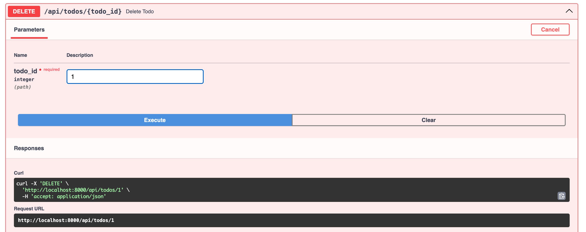
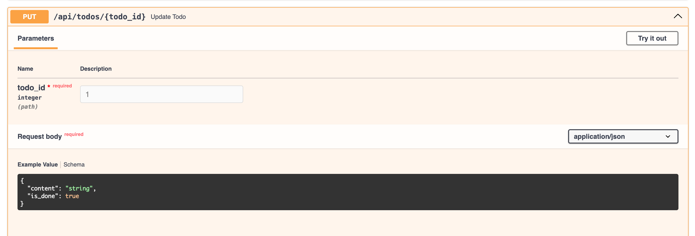

# Web前端：完成Todo剩下的删除和修改

:::tip

本课程网站内容请仔细阅读后再进行实操。因未仔细阅读内容，出现任何错误后果自负（逃～～～逃～～～逃

**所有的代码请不要复制粘贴，请手敲每一行代码。复制粘贴不会让你动脑子，而手敲每一个行代码会让你自然而然地去动脑子会想每一行代码的含义和原理**
:::

## 删除功能

在`src\stores\todo.js`中，修改代码如下：

```js showLineNumbers title="src\stores\todo.js"

import { defineStore } from "pinia";
import axios from 'axios';

import { FASTAPI_BASE_URL } from "../constant";

export const todoStore = defineStore("todo", {
  state: () => ({
    todos: [],
  }),
  actions: {
    async loadTodos() {
      try {
        const response = await axios.get(`${FASTAPI_BASE_URL}/api/todos`);
        this.todos = response.data;
        console.log(this.todos);
      } catch (error) {
        console.error(error);
      }
    },
    async addTodo(content) {
      const newTodo = { content, is_done: false };
      try {
        const response = await axios.post(`${FASTAPI_BASE_URL}/api/todos`, newTodo);
        this.todos.push(response.data);
      } catch (error) {
        console.error(error);
      } finally {
        console.log(this.todos);
      }
    },
    async deleteTodo(id) {
      try {
        const response = await axios.delete(`${FASTAPI_BASE_URL}/api/todos/${id}`);
        this.todos = this.todos.filter(todo => todo.id !== id);
      } catch (error) {
        console.error(error);
      }
    },
  },
});

```

- `const response = await axios.delete(.../${id})`: `axios.delete`：这是axios库提供的一个函数，用于发送DELETE请求。

- `${FASTAPI_BASE_URL}/api/todos/${id}`：这是一个模板字符串，用于构建 DELETE 请求的 URL。`\${FASTAPI_BASE_URL}` 是一个常量，
表示后端 API 的基础 URL，`\api\todos\${id}` 是特定的 API 端点路径，`${id}`是待删除资源的标识符。

我们可以看到FastAPI程序中的**Delete Todo**这个API不仅要求HTTP请求是DELETE，还要求在URL中传入指定的Todo的ID, 此ID是MySQL todos表中主键，不可乱传。




我们可以将 `src/components/TodoItem.vue` 的代码更改成如下:

```html showLineNumbers title="src/components/TodoItem.vue"
<script setup>
import { toRefs } from "vue";
import { todoStore } from "../stores/todo";
const useTodoStore = todoStore();
import XMark from "./icons/XMark.vue";
const props = defineProps({
  todo: { id: Number, content: String, is_done: Boolean },
});

const { id, content, is_done } = toRefs(props.todo);

const deleteTodo = (id) => {
  useTodoStore.deleteTodo(id);
}
</script>
<template>
  <article class="flex gap-4 border-b border-gray-200 p-4">
    <button
      class="h-5 w-5 rounded-full border-2 transition-all duration-700"
    ></button>
    <p :class=" is_done? 
    'flex-auto text-gray-300 line-through transition-all duration-700 ' :
    'flex-auto text-gray-500 transition-all duration-700'
    " >
      {{ content }}
    </p>
    <button @click="() => deleteTodo(id)">
      <XMark />
    </button>
  </article>
</template>

```

-  `<button @click="() => deleteTodo(id)">`: 在 Vue 组件中，使用 `@click` 绑定事件时，可以直接调用方法，并传递参数

## 修改功能

在`src\stores\todo.js`中，修改代码如下：

```js showLineNumbers title="src\stores\todo.js"
import { defineStore } from "pinia";
import axios from 'axios';

import { FASTAPI_BASE_URL } from "../constant";

export const todoStore = defineStore("todo", {
  state: () => ({
    todos: [],
  }),
  actions: {
    async loadTodos() {
      try {
        const response = await axios.get(`${FASTAPI_BASE_URL}/api/todos`);
        this.todos = response.data;
        console.log(this.todos);
      } catch (error) {
        console.error(error);
      }
    },
    async addTodo(content) {
      const newTodo = { content, is_done: false };
      try {
        const response = await axios.post(`${FASTAPI_BASE_URL}/api/todos`, newTodo);
        this.todos.push(response.data);
      } catch (error) {
        console.error(error);
      } finally {
        console.log(this.todos);
      }
    },
    async deleteTodo(id) {
      try {
        const response = await axios.delete(`${FASTAPI_BASE_URL}/api/todos/${id}`);
        this.todos = this.todos.filter(todo => todo.id !== id);
      } catch (error) {
        console.error(error);
      }
    },
    async changeIsDone(id) {
      const todo = this.todos.find(todo => todo.id === id);
      todo.is_done = !todo.is_done;
      try {
        const response = await axios.put(`${FASTAPI_BASE_URL}/api/todos/${id}`, todo);
      } catch (error) {
        console.error(error);
      }
    },
});
```


我们可以看到FastAPI程序中的**Update Todo**这个API不仅要求HTTP请求是PUT方法，
还要求在URL中传入指定的Todo的ID, 并且还需要在HTTP body 体里面增加需要修改的两个 `content`和 `is_done`字段的内容。



由于我们只是想更改`is_done`的状态，于是代码就实现成如下方法：

```js
const todo = this.todos.find(todo => todo.id === id);
todo.is_done = !todo.is_done;
const response = await axios.put(`${FASTAPI_BASE_URL}/api/todos/${id}`, todo);
```


我们可以将 `src/components/TodoItem.vue` 的代码更改成如下:

```html showLineNumbers title="src/components/TodoItem.vue"
<script setup>
import { toRefs } from "vue";
import { todoStore } from "../stores/todo";
const useTodoStore = todoStore();
import XMark from "./icons/XMark.vue";
const props = defineProps({
  todo: { id: Number, content: String, is_done: Boolean },
});

const { id, content, is_done } = toRefs(props.todo);

const deleteTodo = (id) => {
  useTodoStore.deleteTodo(id);
}

const changeIsDone = (id) => {
  useTodoStore.changeIsDone(id);
}
</script>
<template>
  <article class="flex gap-4 border-b border-gray-200 p-4">
    <button
      @click="() => changeIsDone(id)"
      class="h-5 w-5 rounded-full border-2 transition-all duration-700"
    ></button>
    <p :class=" is_done? 
    'flex-auto text-gray-300 line-through transition-all duration-700 ' :
    'flex-auto text-gray-500 transition-all duration-700'
    " >
      {{ content }}
    </p>
    <button @click="() => deleteTodo(id)">
      <XMark />
    </button>
  </article>
</template>
```